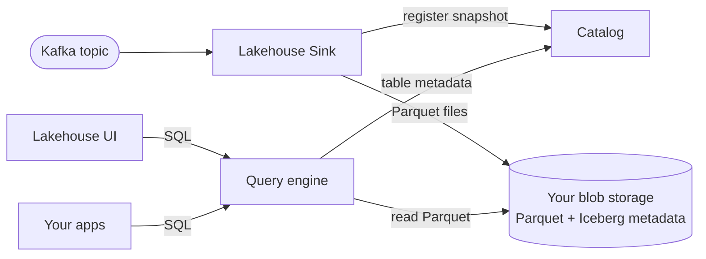

# Lakehouse overview

**Lakehouse** is the **query-first** option in [Quix Lake](../overview.md). It persists Kafka topic data as **Apache Iceberg tables** on your blob storage, with a Quix-managed catalog and a SQL query engine — so you can run **interactive SQL** and **time-series analytics** without standing up a separate warehouse.

If you need byte-for-byte replay fidelity rather than query access, see **[Data Lake](../data-lake/overview.md)**. Not sure which to pick? Read [Choosing between them](../overview.md#choosing-between-them) in the Quix Lake overview.

## What you get

* **SQL access** — query historical topic data with standard SQL; no warehouse to manage
* **Apache Iceberg tables** — open table format on your bucket. The Parquet files and Iceberg metadata are readable by external Iceberg-aware engines as well
* **Time-series friendly** — Iceberg partitioning + columnar Parquet means range scans and aggregates prune aggressively
* **Catalog-backed** — schemas, partitions, snapshots, and statistics tracked by a Quix-managed catalog so the Query engine and UI never have to scan storage
* **Yours** — Parquet lives in your blob storage; only catalog metadata lives in Quix-managed services

!!! info "Prerequisites"
    A [blob storage connection](../blob-storage.md) must be configured for the cluster. The same connection can be shared with the [Data Lake Sink](../data-lake/sink.md) if you want both.

## Components

A Lakehouse provisioning is shared across all workspaces that use the same blob storage connection. Once it's set up, you interact with two surfaces:

| Surface | What it does |
|---|---|
| **[Lakehouse Sink](./sink.md)** | Connector you deploy per Kafka topic. Writes Iceberg tables to your bucket and registers them with the catalog. |
| **[UI](./ui.md)** | In-portal page to browse tables, inspect schemas, and run SQL interactively. |

Behind the scenes, the Lakehouse runs a small set of managed services — see **[Catalog](./catalog.md)**, **[Query](./query.md)**, and **[Database](./database.md)** if you want to understand how it fits together. You don't deploy or configure these directly; Quix provisions and operates them for you.

## How it works

1. **Ingest** — the [Lakehouse Sink](./sink.md) consumes from Kafka and writes Parquet into an Iceberg table on your bucket.
2. **Register** — the [Catalog](./catalog.md) commits the new files into a new Iceberg snapshot, tracking schema, partition specs, and file statistics.
3. **Query** — the [Query](./query.md) engine plans SQL against the latest snapshot, prunes files by partition + column statistics, and reads only the relevant Parquet.
4. **Explore** — use the [UI](./ui.md) to browse tables and run queries in the portal, or call the Query service directly from your own apps.

## Multi-workspace sharing

* The Lakehouse backend is **provisioned per blob storage connection**. Workspaces that share a connection share the Lakehouse and its tables.
* Sinks are **deployed per workspace** and bind to the Lakehouse automatically when they detect that a Lakehouse exists for the workspace's blob storage.

## Operational behavior

* **Concurrent writers** — multiple sink replicas, and sinks from different workspaces that share the blob storage, all commit through Iceberg. Optimistic concurrency handles the merge.
* **Read isolation** — Iceberg snapshot isolation; in-flight writes don't change a query mid-flight.
* **Schema evolution** — Iceberg's standard rules (additive columns, nullable widening) work by default.

## Security

* Sinks and the Query engine authenticate against the Catalog with a Quix-managed bearer token. You don't configure auth tokens manually.
* Your data lives in your bucket; Quix never copies the Parquet anywhere outside it.
* Workspace boundaries are enforced at the portal layer.

## See also

* [Lakehouse Sink](./sink.md) — persist a topic as an Iceberg table
* [UI](./ui.md) — browse and query in the portal
* [Query](./query.md) — SQL surface for your apps
* [Catalog](./catalog.md) — how table metadata is tracked
* [Database](./database.md) — backing storage for the Catalog
* [Blob storage connections](../blob-storage.md)
* [Data Lake overview](../data-lake/overview.md) — replay-first alternative
