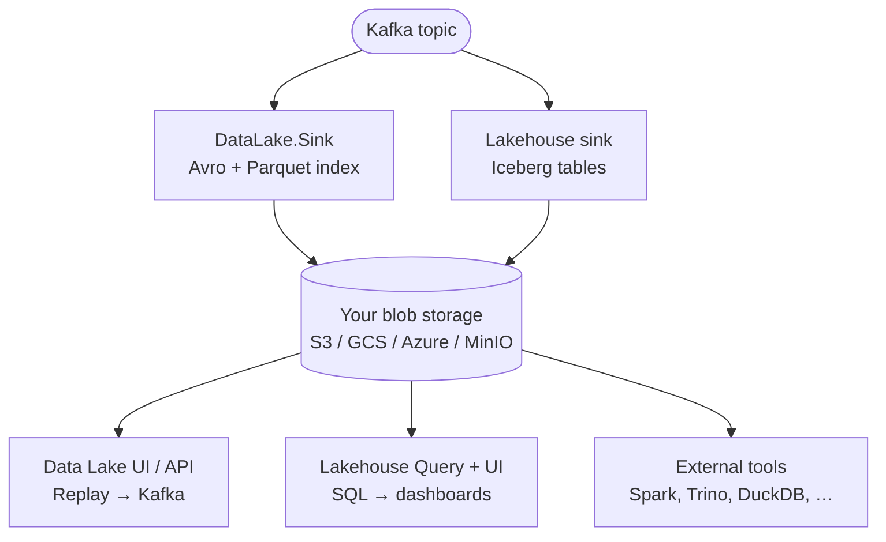

# Quix Lake overview

**Quix Lake** is the persistence layer of **Quix Cloud**. It captures Kafka topic data into your own cloud storage (Amazon S3, Azure Blob, Google Cloud Storage, or MinIO) in open formats — so you keep full control of the bytes and can reuse them across replay, analytics, and ad-hoc query workloads.

Quix Lake ships **two complementary storage options**, each with its own managed sink:

| Option | Writes | Best for |
|---|---|---|
| **[Data Lake](./data-lake/overview.md)** | Raw Kafka messages as **Avro segments + Parquet index** | High-fidelity **Replay**, audit/compliance, append-only forensic record |
| **[Lakehouse](./lakehouse/overview.md)** | **Apache Iceberg tables** (Parquet + snapshots) registered in a Catalog | SQL analytics, dashboards, time-series queries |

You can run **either**, **both**, or fan a single topic out to both — they share the same blob storage connection but are independent connectors with independent consumer groups.

## Choosing between them

Pick based on **what you want to do with the data after it lands**:

=== "Use Data Lake when…"

    - You need **Replay** to push historical data back into Kafka, byte-for-byte, with original timestamps, partitions, offsets, headers, and gaps preserved.
    - You need a **forensic record** of every message — audit, regulatory, or incident-replay use cases.
    - Your payloads are **arbitrary bytes** (binary, mixed schemas, encrypted) and you don't want the platform to interpret them.
    - You want to point external tools at the raw Avro and do your own indexing.

    **[Data Lake docs →](./data-lake/overview.md)**

=== "Use Lakehouse when…"

    - You want to **query** topic data with SQL without standing up your own warehouse.
    - You have **structured payloads** (the Lakehouse sink auto-discovers schema from Kafka messages).
    - You need **time-series queries** (range scans, aggregations) at interactive speed.
    - You're building dashboards, reports, or analytics features that consume historical data.

    **[Lakehouse docs →](./lakehouse/overview.md)**

=== "Use both when…"

    - You want **Replay fidelity** for ops/incident response **and** **SQL access** for analytics over the same topic.
    - You're starting with Data Lake (replay) today and plan to layer analytics on top later.

    Run a Data Lake Sink and a Lakehouse Sink deployment side-by-side with **different consumer groups** on the same topic. Storage cost roughly doubles for that topic.

## Two distinct sinks

The two storage options have **separate connector applications** — they don't share an image, configuration surface, or library:

| | [Data Lake Sink](./data-lake/sink.md) | [Lakehouse Sink](./lakehouse/sink.md) |
|---|---|---|
| **Output** | Raw Kafka messages as Avro + Parquet index | Apache Iceberg tables (Parquet + snapshots) |
| **Schema-aware?** | No — bytes pass through | Yes — schema auto-discovered from messages |
| **Iceberg support** | No | Yes |
| **Primary consumer** | Replay, external tools | SQL via the Lakehouse Query engine |

Both share these traits:

- Consume from a **single Kafka topic** per deployment (run more than one for multiple topics).
- Use the cluster's [blob storage connection](./blob-storage.md) — you don't paste credentials into the sink.
- Are **managed services** — Quix hosts and updates them; you provide configuration only.
- Honor your cloud's IAM, encryption, and retention controls.

## Architecture at a glance

## Prerequisites

Both options require a **blob storage connection** configured for the cluster. See [Blob storage connections](./blob-storage.md). The Lakehouse is then provisioned on top of that connection — see the [Lakehouse overview](./lakehouse/overview.md) for what gets set up.

## Where to next

- **[Data Lake overview](./data-lake/overview.md)** — replay-first storage, raw Kafka fidelity, open Avro/Parquet
- **[Lakehouse overview](./lakehouse/overview.md)** — SQL via DuckDB over Iceberg tables
- **[Blob storage connections](./blob-storage.md)** — wire up the bucket or container that both use
