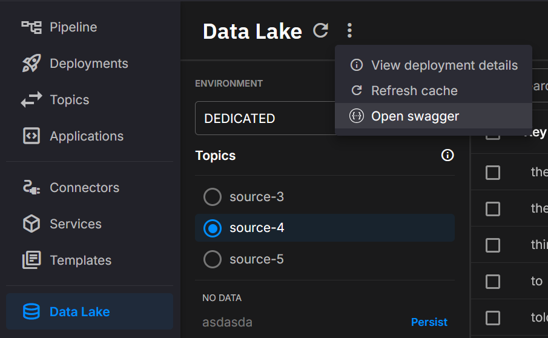

---

title: Quix Lake API
description: Programmatic access to Quix Lake for search, metadata, file discovery, and lifecycle operations. Backend for the Quix Lake UI; Metadata endpoints are the primary integration surface for your applications.
---

# Overview

The Quix Lake API powers the **Quix Lake User Interface** and also exposes a clean surface for your own applications to **tag datasets, search, discover files, and perform safe deletes/restores**.
See the UI page: [Quix Lake User Interface](./user-interface.md).

## Connection

* Authenticate with a **Bearer** JWT in the `Authorization` header.
* Most routes are namespaced by **workspace** and **topic**.
* You can open the in-product Swagger from the Catalog header in the UI.

  

## Catalog

These routes back the catalog’s topic/key lists, facets, and search results.

### Search stream metadata

`POST /{workspaceId}/{topic}/search`
Searches stream metadata and returns matches with a total count for paging and analytics. Results mirror the catalog grid. Supports free text, exact/prefix/suffix/fuzzy matching, time windows, sorting, paging, and optional inclusion of all tag fields.

**Behavior notes**

* Results reflect the latest indexed state; use the refresh endpoints below if you need to surface brand-new data immediately.
* Soft-deleted items can be included or excluded based on flags in the request.

### Refresh workspace caches

`POST /{workspaceId}/refresh-cache`
Refreshes metadata/index caches so newly ingested datasets become visible promptly.

### Refresh topic caches

`POST /{workspaceId}/{topic}/refresh-cache`
Refreshes caches scoped to a single topic. Useful after large backfills or when onboarding a new topic.

### Get topic keys

`GET /{workspaceId}/{topic}/keys`
Lists all keys for a topic (the same values used by the key filter).

### List existing topics

`GET /{workspaceId}/topics`
Returns all topics detected in a workspace so clients can drive topic pickers and filters.

### Get workspace topic metadata keys

`GET /{workspaceId}/{topic}/metadata-keys`
Returns distinct metadata keys seen for a topic (drives metadata facets for that topic).

### Get workspace metadata keys

`GET /{workspaceId}/metadata-keys`
Returns distinct metadata keys across a workspace.

### Get all metadata keys

`GET /metadata-keys`
Returns all known metadata keys across all accessible workspaces.

### List accessible workspaces

`GET /all-workspaces`
Returns workspace identifiers that have discoverable data for the caller.

!!! note
    The search response includes a total-count header so clients can page results consistently with the UI.

## Data

Programmatic visibility into raw objects and time bounds—useful for exports, verification, and operational tooling.

### Get timestamped file descriptors

`GET /data/raw/{workspaceId}/{topic}/files`
Returns descriptors of Avro segments (paths, counts, offsets, sizes) filtered by window, keys, and partitions. Use this to enumerate exactly which objects comprise a selection.

### List files affected by deletion

`GET /data/{workspaceId}/{topic}/{key}/all-files`
Returns every storage path that would be touched by deleting a specific key. Helpful for previews, audits, or impact analysis.

### Compute temporal bounds for keys

`POST /metadata/{workspaceId}/{topic}/range-info`
Reports minimum/maximum timestamps and observed partitions for a set of keys. Useful for building sensible default windows.

!!! tip
    A common flow is to use **search** to find candidate keys, then use **files** to enumerate exact object paths.

## Data Deletion

Safe lifecycle operations. Defaults are **soft delete** to protect data; hard delete removes both metadata and files.

### Delete metadata/files for a single key

`DELETE /data/{workspaceId}/{topic}/{key}`
Marks or permanently removes data for one key depending on the delete mode.

### Batch delete metadata/files

`POST /data/{workspaceId}/{topic}/delete`
Marks or permanently removes data for multiple keys in one call.

### Restore a soft-deleted stream

`POST /data/{workspaceId}/{topic}/{key}/restore`
Clears the soft-delete marker for a single key.

### Batch restore soft-deleted streams

`POST /data/{workspaceId}/{topic}/restore`
Clears soft-delete markers for multiple keys.

!!! warning
    Use hard delete only when retention and compliance requirements allow it.

## Metadata

Attach custom **key/value properties** to datasets and query by those properties. This is intended for your applications to enrich datasets created by the [Quix Lake Sink (managed)](../managed-services/sink.md), so they’re easy to group, filter, and audit across API and UI.

**Good examples of properties:** machine id, sensor range, driver, concrete batch, simple JSON flattened to strings, experiment or run identifiers, quality tiers.

### Upsert metadata entries

`PATCH /metadata/{workspaceId}/{topic}/{key}`
Adds new properties or updates existing ones for a key. Idempotent and safe to call frequently from your systems.

### Get metadata for a key

`GET /metadata/{workspaceId}/{topic}/{key}`
Returns all properties associated with a key for verification, lineage, and governance.

### Soft-delete all metadata for a key

`DELETE /metadata/{workspaceId}/{topic}/{key}`
Marks all metadata entries for a key as deleted without touching raw files.

### Delete specific metadata keys

`POST /metadata/{workspaceId}/{topic}/{key}/delete`
Removes only the listed property names.

!!! tip
    When searching, you can request the full tag set per result to drive rules without extra reads.

## Security

* Authenticate with **Bearer** JWT.
* Authorization is enforced per workspace.
