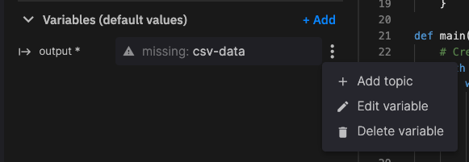
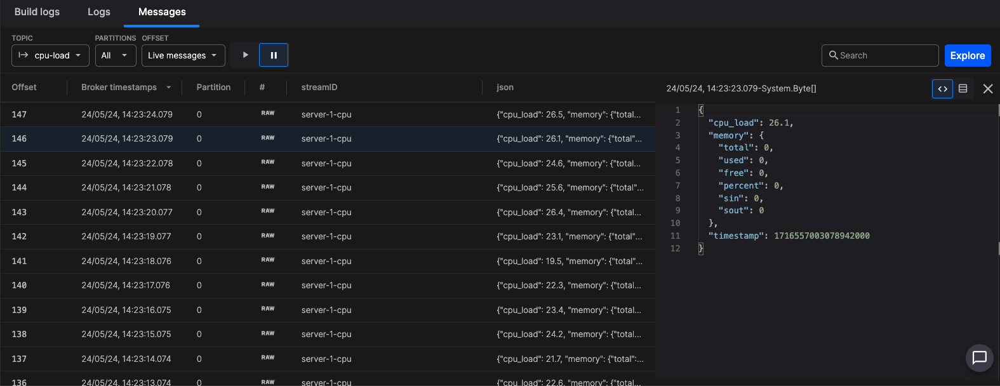

# Ingest data

In this part of the tour you'll get some data flowing into your pipeline. You do this by reading CPU load on your service and publishing it to a topic.

## Step 1: Sign in to Quix Cloud

??? info "Start for free"
    [Book a session](https://quix.io/book-a-demo) with us to start for free.
    
    We will create a time-limited free account for you, and our experts will help you get started with your specific use case. 

After signing up using the method of your choice, you'll be taken to the `Welcome to Quix` dialog, where you can create a new project, as shown in the next step.

## Step 2: Create your first project

You're now ready to create your first project. 

1. Give your project a suitable name, such as "Quix Cloud Tour".
2. Select the `Quix advanced configuration` option.
3. Click `Let's get started`.
4. Select `Quix managed Git`.
5. Click `Create project`.
6. Now create an environment. Enter an environment name of "PRODUCTION".
7. Make sure the `main` branch is selected.
8. Click `Continue`.
9. Select the Quix managed broker (which is the default option).
10. Click `Create environment`. After the environment is fully created you are taken to your pipeline view.

## Step 3: Create a source

To create a source:

1. Click on your environment to be taken to its pipeline view.
2. Click `Code samples` on the left-hand sidebar.
3. Click `Starter Source` and then click `Save to your repo`. You can leave the default name and path.
4. You are taken to the code view.

## Step 4: Write your code

Replace the code in `main.py` with the following:

``` python 
import psutil, time, os, json
from quixstreams import Application

app = Application()

output_topic = app.topic(os.environ["output"])
    
def get_cpu_load():
    cpu_load = psutil.cpu_percent(interval=1)
    memory = psutil.swap_memory()
    return {
        "cpu_load": cpu_load,
        "memory": memory._asdict(),
        "timestamp": int(time.time_ns()),
    }

def main():
    # Create a Producer to send data to the topic
    with app.get_producer() as producer:
        while True:                
            # Get the current CPU and memory usage
            message = get_cpu_load()
            print("CPU load: ", message["cpu_load"])

            # Produce message to the topic
            producer.produce(
            topic=output_topic.name,
                key="server-1-cpu",
                value=json.dumps(message)
            )

if __name__ == '__main__':
    main()
```

Commit your changes.

## Step 5: Set the output topic

To set the output topic to which you publish data:

1. Click your output variable edit menu and select `Edit variable`. 

    

    The `Edit Variable` dialog is displayed.

2. Click `new topic` to display the `New topic` dialog. Enter a `Name` of `cpu-load` and then click `Create`.

## Step 6: Modify requirements.txt

Edit the `requirements.txt` to make sure it includes `psutil`. Your file should be similar to the following:

```
quixstreams==2.5.0
python-dotenv
psutil
```

Commit your changes.

## Step 7: Run your code

Run your code by clicking the `Run` button. Make sure there are no errors. After a moment the CPU load of your service is displayed.

## Step 8: Deploy your code

First, tag your code as `ingest-v1` by clicking the tag button:


Now, click the `Deploy` button, and `Deploy` again to deploy the service to your pipeline.

## Step 9: Examine the messages

In the deployments view, click on the `Messages` tab. There is only one topic for this service, so the output topic `cpu-load` is selected by default. 

Click on any message to see the JSON of the message:



Note the real-time stream of messages is no longer updated in real time. To resume real-time display of messages, click the play button.

## 🏃‍♀️ Next step

[Process your data :material-arrow-right-circle:{ align=right }](./process-threshold.md)
