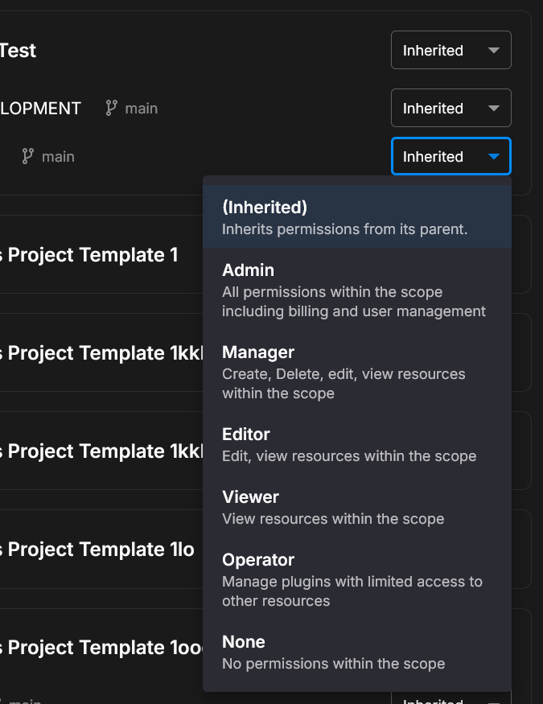

# Roles

Quix Cloud uses roles to control what users can do. You can assign different roles at different levels - organisation, project, or environment - giving you fine-grained control over access.

You can manage roles using the Quix Cloud UI or programmatically via the [Quix CLI](#managing-roles-with-the-cli).

## Available roles

Quix Cloud provides six roles, each granting different levels of access:

{width=50%}

| Role | Description | Use when... |
|------|-------------|-------------|
| Admin | Full control including billing and user management | The user needs complete control of the organisation |
| Manager | Manage resources and users (read-only billing) | The user needs to manage resources but not billing |
| Editor | Create and manage resources (read-only user access) | The user needs to work with resources but not manage users |
| Viewer | Read-only access to view resources | The user only needs to observe (stakeholders, auditors) |
| Operator | Full plugin access only | The user only needs to manage plugins |
| None | No permissions - blocks access at this scope | You want to explicitly block access to a specific scope |

## Permissions matrix

The following table shows what each role can do with different resource types:

| Resource | Admin | Manager | Editor | Viewer | Operator |
|----------|:-----:|:-------:|:------:|:------:|:--------:|
| **Organisation** | ✅ | ❌ | ❌ | ❌ | ❌ |
| **Billing** | ✅ | read | ❌ | ❌ | ❌ |
| **Users** | ✅ | ✅ | read | ❌ | ❌ |
| **Profile** | ✅ | ✅ | ✅ | read | read |
| **Workspace** | ✅ | ✅ | ✅ | read | ❌ |
| **Repository** | ✅ | ✅ | ✅ | read | ❌ |
| **Deployments** | ✅ | ✅ | ✅ | read | ❌ |
| **Plugins** | ✅ | ✅ | ✅ | read | ✅ |

**Legend:**

- ✅ Full access (create, read, update, delete)
- `read` Read-only access
- ❌ No access

!!! note
    The Operator role is designed for users who only need to manage plugins (e.g., external monitoring tools or dashboards). See the [Plugin system](./plugin.md) documentation for details.

??? info "Looking for Kafka access?"
    Roles control access to Quix Cloud features. For Kafka/streaming access in your applications, use a [Streaming Token](../develop/authentication/streaming-token.md) instead.

## Permission levels

Permissions are applied at three hierarchical levels, from broadest to most specific:

| Level | Scope | Example use case |
|-------|-------|------------------|
| Organisation | Role applies to everything in the organisation | Give a team lead oversight of all projects |
| Project | Role applies to all environments in that project | Give a developer access to a specific project |
| Environment | Role applies only to that specific environment | Restrict production access to senior engineers |

## Inheritance

Roles cascade down the hierarchy, so you don't need to set permissions on every resource individually. When you set a role at a higher level, it automatically applies to everything below it. You can override this by setting a different role at a lower level.

**Example:**
- Set a user as **Viewer** at the organisation level
- Override with **Editor** for a specific project
- Override with **Admin** for a specific environment

The user will have:
- Admin access in that one environment
- Editor access in other environments within that project
- Viewer access everywhere else

You can also select **Inherited** to keep the role from the parent level.

## Best practices

Follow these guidelines to maintain a secure and manageable permission structure:

- **Start with Viewer**: Give new users read-only access, then increase as needed
- **Use inheritance**: Set a base role at organisation level, override only where needed
- **Limit Admin access**: Only give Admin to users who need billing and user management
- **Use None to restrict**: If someone should see most projects but not a sensitive one, set None on that project

## Managing roles with the CLI

You can manage user permissions using the Quix CLI. The following commands are available:

```bash
# List all users and their permissions
quix cloud users permissions list

# Get permissions for a specific user
quix cloud users permissions get <user-id>

# Set a user's role at a specific scope
quix cloud users permissions set <user-id> --scope <scope> --role <role>

# Edit a single permission assignment
quix cloud users permissions edit <user-id> --permission-assignments "[{Scope, Role}]"

# Remove a permission
quix cloud users permissions delete <user-id> --scope <scope>

# Copy permissions from one user to another
quix cloud users permissions copy <source-user-id> --to <target-user-id>
```

**Scope format:**

- Organisation: `Organisation:myorg`
- Project: `Project:myorg-projectname`
- Environment: `Workspace:myorg-projectname-environmentname`

**Available roles:** `Admin`, `Manager`, `Editor`, `Viewer`, `Operator`, `None`

For full CLI documentation, see the [Quix CLI reference](../quix-cli/cli-reference/cloud/users/permissions/index.md).

## Advanced: How permissions work

This section explains the technical details of how permissions are evaluated. For most users, the information above is sufficient.

### Permission format

Each role grants a set of permissions. Permissions follow the format `resource:action`:

| Format | Example | Description |
|--------|---------|-------------|
| `resource:action` | `workspace:read` | Specific action on a resource |
| `resource:*` | `deployment:*` | All actions on a resource |

When you assign a role to a user, they receive all the permissions associated with that role.

### Available resources

| Resource | resourceId | Description |
|----------|------------|-------------|
| `organisation` | organisation ID | Organisation-level settings |
| `billing` | organisation ID | Billing and subscription management |
| `user` | user ID | User account management |
| `profile` | user ID | User profile information |
| `repository` | repository ID | Git repository access |
| `workspace` | workspace ID | Environment access |
| `topic` | workspace ID | Kafka topic management |
| `stream` | workspace ID | Data streaming operations |
| `plugin` | workspace ID | Plugin access |
| `audit` | organisation ID | Audit log access (read-only) |

### Available actions

| Action | Description |
|--------|-------------|
| `create` | Create new resources |
| `read` | View resources |
| `update` | Modify resources |
| `delete` | Remove resources |
| `write` | Write data (streaming only) |
| `*` | All actions |

### Permission resolution

When checking permissions, the system looks at the three [permission levels](#permission-levels) from most specific to broadest: Environment → Project → Organisation. If a permission isn't found at the environment level, the system checks the project level, then the organisation level.

### Personal Access Tokens

When using [Personal Access Tokens](../develop/authentication/personal-access-token.md) (PATs), the effective permissions are the **intersection** of:

- The user's permissions (based on their role)
- The token's configured permissions

This means a PAT can only have equal or fewer permissions than the user who created it. This is useful for creating tokens with limited scope, such as read-only tokens for monitoring.

## See also

- [Checking permissions programmatically](./plugin.md#checking-permissions-programmatically) - API endpoint to query permissions
- [Plugin system](./plugin.md) - Build embedded UIs with permission-aware authentication
- [Security](./security.md) - Overview of Quix Cloud security
- [Personal Access Tokens](../develop/authentication/personal-access-token.md) - Token-based authentication
- [Quix CLI](../quix-cli/overview.md) - Command-line interface documentation
