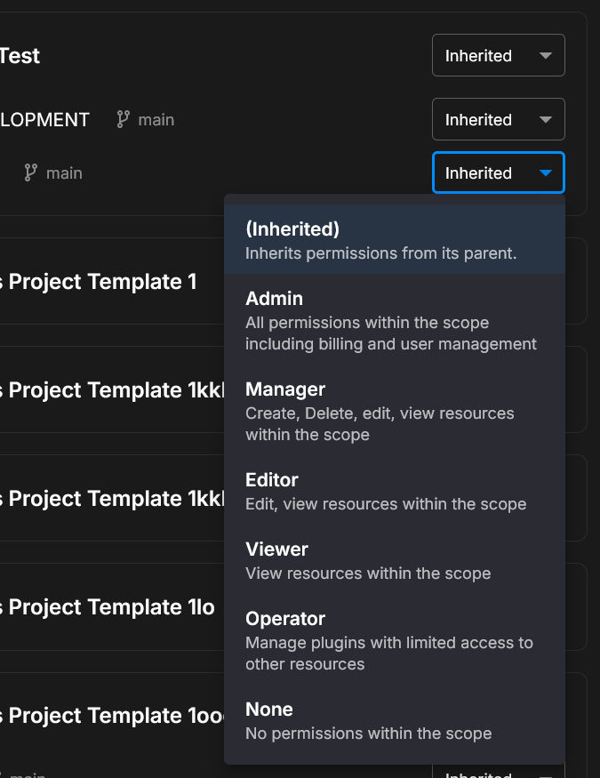
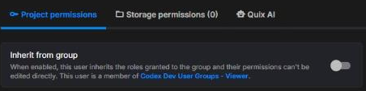

# Roles and permissions

Quix Cloud uses roles to control what users can do. You can assign different roles at different levels - organisation, project, or environment - giving you fine-grained control over access.

A role can be assigned to a user directly, or to a [user group](#user-groups). Members who have **Inherit from group** turned on get the group's roles in place of their own.

You can manage roles using the Quix Cloud UI or programmatically via the [Quix CLI](#managing-roles-with-the-cli).

## Available roles

Quix Cloud provides six roles, each granting different levels of access:

{width=50%}

| Role | Description | Shown in the role picker |
|------|-------------|-------------|
| Admin | Full control including global variables, user and group management, and deployment sizes | All permissions within the scope including billing and user management |
| Manager | Manage resources, and create and view global variables (read-only user access) | Create, Delete, edit, view resources within the scope |
| Editor | Edit projects and environments, and manage deployments (read-only user access) | Edit, view resources within the scope |
| Viewer | Read-only access to view resources | View resources within the scope |
| Operator | Plugin access, plus read-only access to global variables | Manage plugins with limited access to other resources |
| None | No permissions - blocks access at this scope | No permissions within the scope |

The same six roles apply whether you assign them to a user or to a user group.

## Permissions matrix

The following table shows what each role can do with different resource types:

| Resource | Admin | Manager | Editor | Viewer | Operator |
|----------|:-----:|:-------:|:------:|:------:|:--------:|
| **Organisation** | read/update | read | read | read | ❌ |
| **Global Variables** | ✅ | create/read | create/read | read | read |
| **Users** | ✅ | read | read | read | ❌ |
| **User Groups** | ✅ | read | read | read | ❌ |
| **Workspace** (environment) | ✅ | ✅ | read/update | read | ❌ |
| **Repository** (project) | ✅ | ✅ | read/update | read | ❌ |
| **Deployments** | ✅ | ✅ | ✅ | read | ❌ |
| **Plugins** | ✅ | ✅ | ✅ | read | ✅ |

**Legend:**

- ✅ Full access (create, read, update, delete)
- read/update: view and change existing items, but not create or delete them
- create/read: create new items and view them
- read: view only
- ❌ No access

Every user can view and update their own profile, whatever their role.

Organisation, Global Variables, Users and User Groups use your role at the organisation level. Creating a project is checked against your organisation-level role, and creating an environment against your role on its project.

A Manager or Editor who creates a variable group can also change it, including its variables, value sets and assignments. Changing a group someone else created, or deleting any group, needs Admin. See [Global variables](./deployments/global-variables.md).

The Plugins row is what the [permissions API](./services/plugin.md#checking-permissions-programmatically) reports to plugins. Creating, changing or deleting a plugin deployment follows the Deployments row, so Operators can view plugin deployments but not change them.

Creating, editing and deleting user groups, managing their members, and [restricting deployment sizes](./deployments/deployment-sizes.md#restrict-a-size-to-users-and-groups) are organisation-level settings, so they need the Admin role at the organisation level.

!!! note
    The Operator role is designed for users who only need to manage plugins (e.g., external monitoring tools or dashboards). See the [Plugin system](./services/plugin.md) documentation for details.

??? info "Looking for Kafka access?"
    Roles control access to Quix Cloud features. For Kafka/streaming access in your applications, use a [Streaming Token](./access-security/streaming-token.md) instead.

## Permission levels

Permissions are applied at three hierarchical levels, from broadest to most specific:

| Level | Scope | Example use case |
|-------|-------|------------------|
| Organisation | Role applies to everything in the organisation | Give a team lead oversight of all projects |
| Project | Role applies to all environments in that project | Give a developer access to a specific project |
| Environment | Role applies only to that specific environment | Restrict production access to senior engineers |

The same three levels are available when you assign roles to a user group.

## Inheritance

Roles cascade down the hierarchy, so you don't need to set permissions on every resource individually. When you set a role at a higher level, it automatically applies to everything below it. You can override this by setting a different role at a lower level.

**Example:**
- Set a user as **Viewer** at the organisation level
- Override with **Editor** for a specific project
- Override with **Admin** for a specific environment

The user will have:
- Admin access in that one environment
- Editor access in other environments within that project
- Viewer access everywhere else

You can also select **Inherited** to keep the role from the parent level.

Inheritance works the same way for a group's role assignments: set a base role for the group at the organisation level and override it for individual projects or environments.

## User groups

A [user group](./access-security/user-groups.md) can have its own role assignments, which its members can inherit. You assign roles to the group once, at the same [levels](#permission-levels) and with the same [inheritance](#inheritance) as for a single user, and add users as members. A member gets the group's roles only while their **Inherit from group** toggle is on. A user can be a member of one group at a time.

Creating groups and managing members are covered in [User groups](./access-security/user-groups.md), and restricting deployment sizes to groups in [Deployment sizes and resources](./deployments/deployment-sizes.md#restrict-a-size-to-users-and-groups). This section explains how a group's roles combine with a user's own.

### How group roles and user roles combine

Each user has a single **permission source**: either their own role assignments or their group's. An organisation Admin chooses the source per user with the **Inherit from group** toggle on the user's **Project permissions** tab. The toggle is only available for users who belong to a group.



| Inherit from group | Effective role assignments |
|--------------------|----------------------------|
| **Off** (default) | The user's own assignments. The group's role assignments are ignored. |
| **On** | The group's assignments **replace** the user's own assignments at every level. The user's own assignments are kept but ignored. They can't be edited in the Quix Cloud UI while the toggle is on; changes made with the CLI or API are stored but have no effect until the toggle is turned off. |

The two sets are never merged. If a user's direct role and their group's role disagree at the same level - say the user is **Admin** on a project and the group is **Viewer** on it - the permission source decides: with the toggle off the user is Admin there, with it on they are Viewer. The same applies at every other level, including levels where only one of the two sets has an assignment.

Other rules worth knowing:

- Adding a user to a group does not turn the toggle on. Removing a user from their group turns it off, so their own assignments apply again. Moving a user to another group in the Quix Cloud UI removes them from their old group first, so the toggle is turned off; turn it on again for them to inherit the new group's roles.
- If the toggle is on and the group grants no roles, the user has **no** permissions. Quix Cloud does not fall back to the user's own assignments.
- If you inherit your own permissions from a group, you cannot change that group's organisation-level role assignments. This mirrors the rule that stops you editing your own organisation-level role.
- Group membership still applies when the toggle is off: the member can still use [deployment sizes restricted to the group](./deployments/deployment-sizes.md#restrict-a-size-to-users-and-groups).

See [The users list](./access-security/users.md#the-users-list) for how roles appear on the Users page.

## Best practices

Follow these guidelines to maintain a secure and manageable permission structure:

- **Start with Viewer**: Give new users read-only access, then increase as needed
- **Use inheritance**: Set a base role at organisation level, override only where needed
- **Use groups for teams**: Put each team in a group, assign roles to the group, and turn on **Inherit from group** for its members so access changes in one place
- **Limit Admin access**: Only give Admin to users who need global variables and user management
- **Use None to restrict**: If someone should see most projects but not a sensitive one, set None on that project
- **Restrict large deployment sizes**: Limit expensive sizes to the users or groups that need them, and turn on **Enforce deployment size limits** so deployments can't exceed the CPU and memory of a user's allowed sizes - see [Restrict a size to users and groups](./deployments/deployment-sizes.md#restrict-a-size-to-users-and-groups)

## Managing roles with the CLI

You can manage user permissions using the Quix CLI. The following commands are available:

```bash
# List all users and their permissions
quix cloud users permissions list

# Get a user's own role assignments
quix cloud users permissions get <user-id>

# Set a user's role at a specific scope
quix cloud users permissions set <user-id> --scope <scope> --role <role>

# Remove a user's role at a specific scope
quix cloud users permissions delete <user-id> --scope <scope>

# Copy a user's role assignments to another user, replacing that user's own assignments
quix cloud users permissions copy <source-user-id> --to <target-user-id>
```

**Scope format:**

- Organisation: `Organisation:<organisation-id>`, for example `Organisation:myorg`
- Project: `Repository:<project-id>`, where the project ID is a GUID
- Environment: `Workspace:<environment-id>`, for example `Workspace:myorg-projectname-environmentname`

**Available roles:** `Admin`, `Manager`, `Editor`, `Viewer`, `Operator`, `None`

`get`, `set`, `delete` and `copy` read and change a user's **own** assignments. `list` shows each user's effective assignments, which are their group's when **Inherit from group** is on. User groups are managed in the Quix Cloud UI, or through the [Portal API](./apis/portal-api/overview.md) - see [User groups](./access-security/user-groups.md).

For full CLI documentation, see the [Quix CLI reference](../quix-cli/cli-reference/cloud/users/permissions/index.md).

## Advanced: How permissions work

This section explains the technical details of how permissions are evaluated. For most users, the information above is sufficient.

### Permission format

Each role grants a set of permissions. Permissions follow the format `resource:action`:

| Format | Example | Description |
|--------|---------|-------------|
| `resource:action` | `workspace:read` | Specific action on a resource |
| `resource:*` | `workspace:*` | All actions on a resource |

A role assignment gives every permission in that role, at the level where the role is assigned.

### Available resources

| Resource | Checked against | Description |
|----------|------------|-------------|
| `organisation` | organisation ID | Organisation-level settings, including user groups and deployment sizes |
| `globalVariable` | organisation ID | Global variable management |
| `user` | user ID | User account management |
| `profile` | user ID | User profile information |
| `repository` | project ID | Projects |
| `workspace` | workspace ID | Environment access |
| `topic` | workspace ID | Kafka topic management |
| `stream` | workspace ID | Data streaming operations |
| `plugin` | workspace ID | Plugin access |
| `audit` | organisation ID | Audit log access (read-only) |

### Available actions

| Action | Description |
|--------|-------------|
| `create` | Create new resources |
| `read` | View resources |
| `update` | Modify resources |
| `delete` | Remove resources |
| `write` | Write data (streaming only) |
| `*` | All actions |

### Permission resolution

The system first selects the user's permission source: their own role assignments, or their group's assignments when **Inherit from group** is on (see [How group roles and user roles combine](#how-group-roles-and-user-roles-combine)). Only that one set of assignments is used.

It then uses the most specific of the three [permission levels](#permission-levels) at which that set assigns a role: the environment, then the environment's project, then the organisation. The role at that level decides on its own: if it doesn't include the permission, access is denied, even when a role at a broader level would allow it. This is how **None** blocks access. A broader level is checked only when no role is assigned at the more specific one.

### Personal Access Tokens

A [Personal Access Token](./access-security/personal-access-token.md#pat-permissions) (PAT) can never do more than the user who created it.

## See also

- [Checking permissions programmatically](./services/plugin.md#checking-permissions-programmatically) - API endpoint to query permissions
- [Plugin system](./services/plugin.md) - Build embedded UIs with permission-aware authentication
- [Security](./security.md) - Overview of Quix Cloud security
- [Personal Access Tokens](./access-security/personal-access-token.md) - Token-based authentication
- [Users](./access-security/users.md) - Invite users, edit their details and group, and delete them
- [User groups](./access-security/user-groups.md) - Create groups, manage members, and restrict deployment sizes to groups
- [Deployment sizes and resources](./deployments/deployment-sizes.md) - Defining sizes, requests and limits
- [Quix CLI](../quix-cli/overview.md) - Command-line interface documentation
