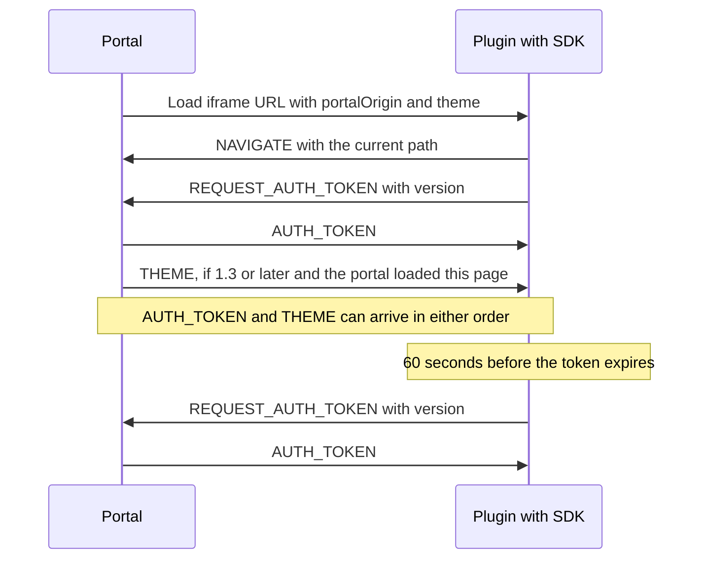

# How the Quix Plugin SDK works

This page explains what passes between the Quix portal and the [Quix Plugin SDK](plugin-sdk.md) running in your plugin's iframe. You need it if you audit the security of a plugin, debug the integration at the message level, or build your own integration instead of using the SDK. To build a plugin UI, start with the [Quix Plugin SDK](plugin-sdk.md) guide.

The SDK and the portal talk through [`window.postMessage`](https://developer.mozilla.org/en-US/docs/Web/API/Window/postMessage){target=_blank}. Every message is an object with a `type` field.

## Security model

Any page can embed your plugin in an iframe and post messages to it. The SDK decides which messages to trust based on the **portal origin**: the scheme, host and port of the portal that embeds your plugin, for example `https://portal.example.com`.

### How the SDK learns the portal origin

The portal adds a `portalOrigin` query parameter to your plugin's iframe URL. During `init()`, the SDK:

1. Reads `portalOrigin` from the current URL. It accepts the value only if it's a bare origin, with no path, query or fragment.
2. Saves a valid value in `sessionStorage` under the key `quix.plugin.portalOrigin`. Session storage belongs to one tab and to your plugin's origin, so another site can't write to it.
3. If the URL has no valid `portalOrigin`, for example because your app reloaded at a URL without the query string, uses the value saved in this tab, after checking it the same way. The console then shows `⚿ Portal origin restored from session cache`.
4. If neither source has a valid origin, treats the portal origin as unknown. The console shows `⚿ No portalOrigin param — inbound navigation disabled`.

A value in the URL always wins over the saved one. If `sessionStorage` isn't available, for example in some private browsing modes, the SDK works without the saved value.

### Which messages the SDK accepts

Every message must come from the window directly above your plugin, `window.parent`. The SDK ignores messages from any other window. It then checks each message type differently:

| Message | Origin check |
|---|---|
| `AUTH_TOKEN` | None |
| `NAVIGATE` | Must match the portal origin |
| `THEME` | Must match the portal origin |

`AUTH_TOKEN` has no origin check because a token works only against the portal that issued it. An origin check could also reject valid tokens: when two portals, for example staging and production, embed the same plugin in one browser tab, the saved origin can belong to the other portal. As a result, any page that embeds your plugin can hand it a token. Your backend must validate every token it receives. See [How to handle the token in the backend](plugin.md#how-to-handle-the-token-in-the-backend).

A page that isn't the portal must never drive your app's router or repaint your plugin, so `NAVIGATE` and `THEME` **fail closed**. When the portal origin is unknown, the SDK accepts no `NAVIGATE` or `THEME` messages from any sender. Your plugin still receives tokens and still reports its route to the portal, but portal navigation and live mode changes stop working.

A token from an origin that doesn't match doesn't change or clear the saved portal origin. Otherwise any page that embeds your plugin could turn off, or take over, inbound navigation.

The SDK also checks message content:

* A `NAVIGATE` path must start with `/`, must not start with `//`, and must not contain `..`. The SDK logs and ignores any other path.
* A `THEME` value must be `light` or `dark`. The SDK logs and ignores any other value.

### Where the SDK sends messages

The SDK posts its messages to the portal origin when it's known. When the portal origin is unknown, it posts with the target origin `*`, for compatibility with older portals. The outgoing messages hold only the handshake and your plugin's current path, query string and fragment. If the portal origin is unknown and a page other than the Quix portal embeds your plugin, that page can read those messages, so don't put secrets in your URLs.

### What the portal checks

The portal accepts messages only from the origin of your plugin's embedded view URL. It checks the sender's origin, not which window sent the message, so any window on your plugin's origin that can reach the portal window, such as a popup your plugin opened, is treated as your plugin.

The portal posts the token, navigation and mode only to that same origin. The token therefore never leaves the portal for any other origin, even if your plugin navigates to another site.

The portal ignores a reported path that doesn't start with `/` or that contains `..`. It also removes the `isIframe`, `portalOrigin` and `theme` parameters from its own address bar, and adds them to the iframe URL again every time it builds it.

## Message protocol

This section describes the messages the SDK exchanges with the portal. A hand-rolled integration must follow the same protocol.

### Messages

| Type | Direction | Payload | When it's sent |
|---|---|---|---|
| `REQUEST_AUTH_TOKEN` | Plugin to portal | `version`: string, the SDK version. Sent by 1.2.1 and later. | At `init()` and on every token refresh |
| `AUTH_TOKEN` | Portal to plugin | `token`: string, the user's current token | In reply to each `REQUEST_AUTH_TOKEN` |
| `NAVIGATE` | Plugin to portal | `path`: string, the plugin's `pathname`, query string and fragment | At `init()` and on every `pushState`, `replaceState`, `popstate` and `hashchange`, except while the SDK applies portal navigation |
| `NAVIGATE` | Portal to plugin | `path`: string, the sub-path and fragment, or `/` for the plugin root. Never a query string. | When a portal navigation changes only the page inside the same plugin and keeps the portal's query parameters, if the plugin reported version 1.2 or later |
| `THEME` | Portal to plugin | `theme`: `'light'` or `'dark'` | After the first handshake from a page the portal loaded, and whenever the portal's mode changes, if the plugin reported version 1.3 or later. See [When the portal sends THEME](#when-the-portal-sends-theme). |

Example payloads:

```js
{ type: 'REQUEST_AUTH_TOKEN', version: '1.3.0' }
{ type: 'AUTH_TOKEN', token: '<jwt>' }
{ type: 'NAVIGATE', path: '/runs?status=failed#latest' } // plugin to portal
{ type: 'NAVIGATE', path: '/alarms' }                    // portal to plugin
{ type: 'THEME', theme: 'light' }
```

This sequence shows a plugin page loading, and a later token refresh:



### The version field

The `version` field of `REQUEST_AUTH_TOKEN` is the only version negotiation in the protocol. The portal reads its major and minor numbers and decides what to send to that plugin page:

| Reported version | Portal navigation inside the plugin | `THEME` messages |
|---|---|---|
| None, older than 1.2, or not a valid version | Reloads the iframe at the new URL | Not sent |
| 1.2.x | Sends `NAVIGATE`, no reload | Not sent |
| 1.3 or later | Sends `NAVIGATE`, no reload | Sent |

The portal relies on the version rather than on whether a handshake arrives at all, because browsers can keep an old copy of the SDK file cached. It learns the version again from every handshake, and forgets it whenever it loads a new page into the iframe itself.

### When the portal sends THEME

The portal remembers the last mode it sent to the page in the iframe, and doesn't send the same mode again. It resets that memory only when it loads a new page into the iframe itself: on the first load, on `Reload app` in the plugin toolbar, when it switches to a different plugin, and when a portal navigation rewrites the iframe URL.

A page that your plugin loads on its own, for example through a plain link, `location.reload()`, a form post or a same-origin redirect, still handshakes, but the portal doesn't send `THEME` to it until the mode changes. That page uses the `theme` parameter in its own URL, or `dark` when there's none. See [Keep the mode after a full page load](plugin-sdk.md#keep-the-mode-after-a-full-page-load).

### What init() does

`init()` runs these steps, in this order:

1. Opens a collapsed console group headed `Quix Plugin SDK v<version>`.
2. Reads the portal origin from the `portalOrigin` query parameter, or from the per-tab cache. See [How the SDK learns the portal origin](#how-the-sdk-learns-the-portal-origin).
3. Reads the color mode from the `theme` query parameter, or uses `dark`, and, unless `applyTheme` is `false`, writes it to `<html>`. Callbacks registered with `onTheme` before `init()` receive the mode if it differs from `dark`.
4. Wraps `history.pushState` and `history.replaceState`, starts listening for `popstate` and `hashchange`, and reports the current location to the portal with `NAVIGATE`.
5. Starts listening for portal messages and sends `REQUEST_AUTH_TOKEN`.

The console group closes when the first token arrives.

### Token refresh schedule

When a token arrives, the SDK reads its expiry (`exp` claim) and schedules the next `REQUEST_AUTH_TOKEN`:

| Situation | When the SDK requests the next token |
|---|---|
| The token has a readable `exp` claim | 60 seconds before `exp` |
| The token isn't a JWT, or has no numeric `exp` claim | 4 minutes after the current token arrived |
| `exp` is less than 65 seconds away, or already passed | After 5 seconds |
| 60 seconds before `exp` is more than 24 hours away, for example for a long-lived token | After 24 hours, then the SDK checks again |

The SDK keeps only one refresh timer. Each new token replaces the pending timer. The portal replies with its own current token, so if that token is close to expiry, the SDK asks again every 5 seconds until the portal has renewed it.

The 24-hour limit exists because browsers store a `setTimeout` delay as a 32-bit integer. A delay longer than about 24.8 days overflows and the timer fires at once, which turns the refresh into a tight request loop.

### How navigation is applied

From plugin to portal, the SDK sends your plugin's `pathname`, query string and fragment. The portal appends the path to the plugin's portal URL and merges the query parameters into its own, without ever removing one. A hash-routed app reports a `pathname` of `/`, so the portal mirrors its route as a fragment of the plugin's portal URL.

From portal to plugin, the SDK first checks the path, then:

* **With `onNavigate` callbacks registered**, calls each one with the path. While they run, and until the next task, the SDK doesn't report route changes to the portal, so a `pushState` or a `hashchange` that your callback causes isn't echoed back.
* **With no callback registered**, calls `history.pushState()` with the path, keeping the current `history.state`, and dispatches a `popstate` event. For a fragment-only change on the current page, it sets `location.hash` instead. It also keeps the path and replays it to the first `onNavigate` callback registered later. That replay runs without echo suppression, so navigation it starts is reported to the portal, which does nothing when the URL doesn't change.

The portal reloads the iframe instead of sending `NAVIGATE` when it switches to a different plugin, when the portal's query parameters change, when the plugin reported a version older than 1.2 or hasn't handshaken yet, and when the iframe isn't rendered.

A portal URL that points to the plugin's root with only a fragment, such as `/apps/<deployment-id>#section`, is sent as the path `#section`. The SDK rejects it because it doesn't start with `/`, and the iframe doesn't reload, so nothing happens. The same applies to every portal navigation to a hash-routed app.

### Requirements for a hand-rolled integration

The portal side of the protocol is the same for the SDK and for a hand-rolled integration. If you keep your own `postMessage` code instead of the SDK, you must implement everything the SDK does for you:

* **Refresh the token.** Decode the token's `exp` claim and post a new `REQUEST_AUTH_TOKEN` before it passes. When you schedule that with `setTimeout`, limit the delay to 24 hours and check again when it fires.
* **Report a `version` only for what you handle.** Omitting `version` keeps you on the pre-1.2 behavior: every portal navigation inside your plugin reloads the iframe, and you receive no `THEME` messages. Reporting 1.2 or later tells the portal to stop reloading the iframe, so if you don't handle the inbound `NAVIGATE`, portal navigation inside your plugin does nothing. Reporting 1.3 or later also means you must handle `THEME`.
* **Validate inbound messages.** Accept messages only when `event.source` is `window.parent`, and accept `NAVIGATE` and `THEME` only when `event.origin` matches the `portalOrigin` query parameter.
* **Post to the portal origin** from `portalOrigin`, rather than to `*`.

To replace a hand-rolled integration with the SDK, see [Migrate from a manual postMessage integration](plugin-sdk.md#migrate-from-a-manual-postmessage-integration).

## Version history and compatibility

### Versions

| Version | New in this version | What the portal does for this version |
|---|---|---|
| 1.3.0 | Theme support: reads `?theme=` for the first paint, applies `THEME` messages, and writes `data-quix-theme` and `color-scheme` to `<html>`. Adds `init({ applyTheme })`, `onTheme()`, `QuixPlugin.theme` and `QuixPlugin.version`. | Sends `NAVIGATE` without reloading the iframe, and sends `THEME`. |
| 1.2.1 | Portal-to-plugin navigation: inbound `NAVIGATE` and `onNavigate()`, with the `pushState` fallback. Reads the portal origin from `?portalOrigin=` and saves it per tab. Accepts messages only from `window.parent`, and `NAVIGATE` only from the portal origin. Posts to the portal origin instead of `*` when it's known. Reports `version` in the handshake. Warns about hash routing. | Sends `NAVIGATE` without reloading the iframe. Doesn't send `THEME`. |
| 1.1.0 | Token refresh before expiry. A callback that throws no longer stops other callbacks or the refresh. | Reloads the iframe for portal navigation inside the plugin. Doesn't send `THEME`. |
| 1.0.0 | First release: `init()`, `onToken()`, the token handshake and plugin-to-portal URL sync. | Reloads the iframe for portal navigation inside the plugin. Doesn't send `THEME`. |

Every version receives the token and keeps the portal URL in step with the plugin's route. Older SDKs keep working with the current portal. They ignore the extra `portalOrigin` and `theme` query parameters.

For what changes for an existing plugin, see [Upgrade from an earlier SDK version](plugin-sdk.md#upgrade-from-an-earlier-sdk-version).

### Check which version is running

Look at the console group header, for example `Quix Plugin SDK v1.3.0`, or at the portal's `⟵ handshake — SDK <version>` line. From 1.3.0, you can also read `QuixPlugin.version` in code, or in the console with the plugin's frame selected.

### Old cached copies

The file name `quix-plugin.js` doesn't change between versions, and browsers can cache it for a long time. A browser can therefore run an old SDK after the portal has been updated. Because the portal decides what to send based on the version the SDK reports, a cached old copy silently loses newer features, such as theme support.

If the console header shows an older version than you expect, do a hard refresh of the page, or clear the browser cache for your portal's domain.

## See also

* [Quix Plugin SDK](plugin-sdk.md): add the SDK to your plugin's UI.
* [Plugin system](plugin.md): configure a deployment as a plugin and choose where it appears in the portal.
* [What the portal adds to the URL](plugin.md#what-the-portal-adds-to-the-url): the parameters on your plugin's iframe URL.
* [Authentication and authorization](plugin.md#authentication-and-authorization): validate the token on your backend.
