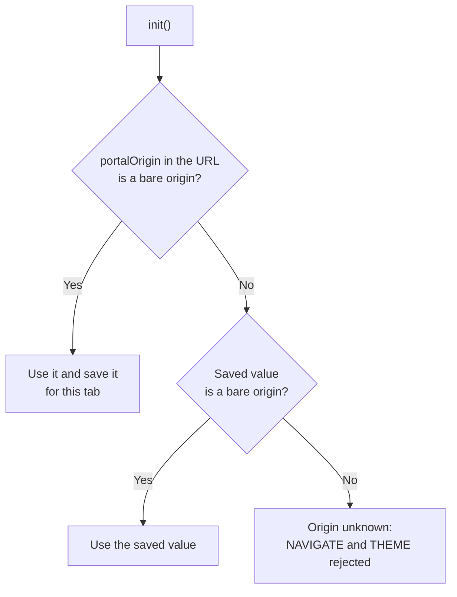
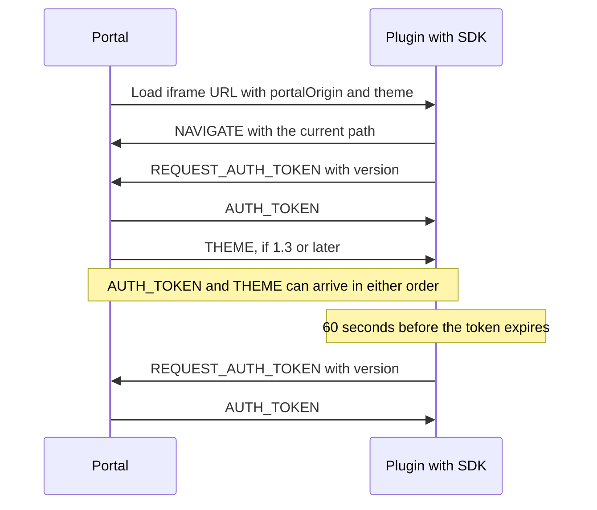

# How the Quix Plugin SDK works

The [Quix Plugin SDK](plugin-sdk.md) runs in your plugin's iframe and talks to the Quix portal through [`window.postMessage`](https://developer.mozilla.org/en-US/docs/Web/API/Window/postMessage){target=_blank}. This page describes that conversation: who the SDK trusts and why, the messages both sides exchange, and how the protocol has changed between versions.

You need this page if you review the security of a plugin, debug the integration at the message level, or build your own integration instead of using the SDK. To build a plugin UI, start with the [Quix Plugin SDK](plugin-sdk.md) guide.

## Security model

Any page can embed your plugin in an iframe and post messages to it. The SDK decides what to trust based on the **portal origin**: the scheme, host and port of the portal that embeds your plugin, for example `https://portal.example.com`. Messages that would change what your app shows are accepted only from that origin. When the SDK doesn't know the origin, it fails closed.

### Where the portal origin comes from

The portal adds a `portalOrigin` query parameter to the iframe URL it builds for your plugin. During `init()`, the SDK reads it and saves it in `sessionStorage` under `quix.plugin.portalOrigin`. If your app later reloads at a URL without the query string, the SDK uses the saved value instead. Session storage belongs to one tab and to your plugin's origin, so another site can't seed it.

```mermaid
flowchart TD
    A["init()"] --> B{"portalOrigin in the URL<br/>is a bare origin?"}
    B -->|Yes| C["Use it and save it<br/>for this tab"]
    B -->|No| D{"Saved value<br/>is a bare origin?"}
    D -->|Yes| E["Use the saved value"]
    D -->|No| F["Origin unknown:<br/>NAVIGATE and THEME rejected"]
```

A bare origin has no path, query or fragment. The SDK applies the same check to the saved value, so a stale or edited entry can't become trusted. If `sessionStorage` isn't available, for example in some private browsing modes, the SDK relies on the URL alone.

### Which messages are origin-checked

The SDK ignores every message that doesn't come from `window.parent`, the window directly above your plugin. It then checks each inbound type differently:

| Message | Must match the portal origin | Why |
|---|---|---|
| `AUTH_TOKEN` | No | A token works only against the portal that issued it. An origin check would also drop valid tokens when two portals, for example staging and production, embed the same plugin in one tab and the saved origin belongs to the other one. |
| `NAVIGATE` | Yes | A page that isn't the portal must never drive your app's router. |
| `THEME` | Yes | A page that isn't the portal must never repaint your plugin, and there's no compatibility case to protect. |

When the portal origin is unknown, the SDK accepts no `NAVIGATE` or `THEME` from any sender. Tokens and outbound route reporting keep working, but portal navigation and live mode changes stop. A token from a mismatched origin never changes or clears the saved origin, so an embedding page can't use one to switch inbound navigation off or claim it.

Because `AUTH_TOKEN` isn't origin-checked, any page that embeds your plugin can hand it a token. Your backend must validate every token it receives. See [How to handle the token in the backend](plugin.md#how-to-handle-the-token-in-the-backend).

The SDK also checks content. A `NAVIGATE` path must start with `/`, must not start with `//`, and must not contain `..`. A `THEME` value must be `light` or `dark`. The SDK logs and ignores anything else.

Outbound, the SDK posts to the portal origin when it knows it, and to `*` when it doesn't, for compatibility with older portals. Outbound messages carry only the handshake and your plugin's current path, query string and fragment. With an unknown origin, a page other than the portal can read them, so keep secrets out of your URLs.

### What the portal checks

The portal accepts messages only from the origin of your plugin's embedded view URL, and posts the token, navigation and mode only to that origin. The token never leaves the portal for another origin, even if your plugin navigates to another site. The portal checks the sender's origin, not the sending window, so any window on your plugin's origin that can reach the portal, such as a popup your plugin opened, counts as your plugin.

The portal ignores a reported path that doesn't start with `/` or that contains `..`.

## Message protocol

Every message is an object with a `type` field. The portal side is the same for the SDK and for a hand-rolled integration.

| Type | Direction | Payload | Sent |
|---|---|---|---|
| `REQUEST_AUTH_TOKEN` | Plugin to portal | `version`: the SDK version, from 1.2.1 | At `init()` and on every token refresh |
| `AUTH_TOKEN` | Portal to plugin | `token`: the user's current token | In reply to each `REQUEST_AUTH_TOKEN` |
| `NAVIGATE` | Plugin to portal | `path`: `pathname`, query string and fragment | At `init()` and on every route change |
| `NAVIGATE` | Portal to plugin | `path`: sub-path and fragment, or `/` for the plugin root, never a query string | When a portal navigation stays inside the same plugin, if the plugin reported 1.2 or later |
| `THEME` | Portal to plugin | `theme`: `light` or `dark` | After a handshake and when the portal's mode changes, if the plugin reported 1.3 or later |

```mermaid
sequenceDiagram
    participant Portal
    participant Plugin as Plugin with SDK
    Portal->>Plugin: Load iframe URL with portalOrigin and theme
    Plugin->>Portal: NAVIGATE with the current path
    Plugin->>Portal: REQUEST_AUTH_TOKEN with version
    Portal->>Plugin: AUTH_TOKEN
    Portal->>Plugin: THEME, if 1.3 or later
    Note over Portal,Plugin: AUTH_TOKEN and THEME can arrive in either order
    Note over Plugin: 60 seconds before the token expires
    Plugin->>Portal: REQUEST_AUTH_TOKEN with version
    Portal->>Plugin: AUTH_TOKEN
```

The `version` in `REQUEST_AUTH_TOKEN` is the protocol's only capability negotiation. The portal reads its major and minor numbers from every handshake and decides what it may send to that page. See [Version history and compatibility](#version-history-and-compatibility).

### Navigation in both directions

From plugin to portal, the portal appends the reported path to the plugin's portal URL and merges the query parameters into its own, without removing any. A hash-routed app always reports a `pathname` of `/`, so the portal URL can't follow its route. The SDK warns about this in the console.

From portal to plugin, the portal sends `NAVIGATE` only when the target is in the same plugin, the portal's own query parameters are unchanged, and the plugin has reported 1.2 or later. In every other case it reloads the iframe at the new URL. The SDK then hands the path to your `onNavigate` callbacks, and doesn't report route changes until the next task, so the navigation isn't echoed back. With no callback registered, it calls `history.pushState()` and dispatches `popstate`, or sets `location.hash` for a fragment-only change.

A portal URL that points at the plugin root with only a fragment, such as `/apps/<deployment-id>#section`, arrives as `#section`. The SDK rejects it because it doesn't start with `/`, and the iframe doesn't reload, so nothing happens. Portal navigation into a hash-routed app therefore doesn't work.

### When the portal sends THEME

The portal remembers the last mode it sent to the page in the iframe and doesn't repeat it. It forgets that mode only when it loads a new page into the iframe itself: on first load, on `Reload app`, when it switches plugin, and when a portal navigation rewrites the iframe URL.

A page that your plugin loads on its own, through a plain link, `location.reload()`, a form post or a redirect, still handshakes, but receives no `THEME` until the mode changes. That page takes its mode from the `theme` parameter in its own URL, or `dark` when there's none. See [Keep the mode after a full page load](plugin-sdk.md#keep-the-mode-after-a-full-page-load).

## What init() does

`init()` runs once. Later calls do nothing. In order, it:

1. Opens a collapsed console group headed `Quix Plugin SDK v<version>`, which closes when the first token arrives.
2. Resolves the portal origin, as described in [Where the portal origin comes from](#where-the-portal-origin-comes-from).
3. Reads the mode from the `theme` query parameter, or uses `dark`, and writes it to `<html>` unless `applyTheme` is `false`. Callbacks registered with `onTheme` before `init()` receive the mode if it isn't `dark`.
4. Wraps `history.pushState` and `history.replaceState`, listens for `popstate` and `hashchange`, and reports the current location with `NAVIGATE`.
5. Starts listening for portal messages and sends `REQUEST_AUTH_TOKEN`.

## Token refresh schedule

Each time a token arrives, the SDK reads its `exp` claim and schedules the next `REQUEST_AUTH_TOKEN`. It keeps one timer, and each new token replaces it.

| Token | Next request |
|---|---|
| JWT with a numeric `exp` | 60 seconds before `exp` |
| Not a JWT, or no numeric `exp` | 4 minutes after it arrived |
| `exp` less than 65 seconds away, or passed | After 5 seconds |
| 60 seconds before `exp` is more than 24 hours away | After 24 hours, then the SDK checks again |

The portal replies with its own current token, so a token close to expiry makes the SDK ask every 5 seconds until the portal has renewed it. The 24-hour cap exists because browsers store a `setTimeout` delay as a 32-bit integer: a delay beyond about 24.8 days fires at once, which turns a long-lived token into a tight request loop.

## Version history and compatibility

| Version | Adds | Portal navigation inside the plugin | `THEME` |
|---|---|---|---|
| 1.3.0 | Theme support: `?theme=` for the first paint, `THEME` messages, `data-quix-theme` and `color-scheme` on `<html>`, `init({ applyTheme })`, `onTheme()`, `QuixPlugin.theme`, `QuixPlugin.version` | `NAVIGATE`, no reload | Sent |
| 1.2.1 | Inbound `NAVIGATE` and `onNavigate()`. The portal origin from `?portalOrigin=`, saved per tab. The `window.parent` and origin checks. Posts to the portal origin. Reports `version`. Warns about hash routing. | `NAVIGATE`, no reload | Not sent |
| 1.1.0 | Token refresh before expiry. A callback that throws no longer stops the others. | Iframe reload | Not sent |
| 1.0.0 | `init()`, `onToken()`, the token handshake and plugin-to-portal route sync | Iframe reload | Not sent |

The portal treats a missing or unreadable `version` like a version older than 1.2. Every version receives the token and keeps the portal URL in step with the plugin's route, and older SDKs ignore the `portalOrigin` and `theme` parameters, so they keep working with the current portal. To upgrade an existing plugin, see [Upgrade from an earlier SDK version](plugin-sdk.md#upgrade-from-an-earlier-sdk-version).

The file name `quix-plugin.js` doesn't change between versions, and browsers can cache it for a long time. A cached old copy reports its old version, and the portal sends it only what that version supports, so newer features such as theme support silently disappear. This is why the portal relies on the reported version rather than on the handshake alone, and learns it again from every handshake.

To see which version is running, look at the console group header, or read `QuixPlugin.version` from 1.3.0. If it's older than you expect, hard-refresh the page or clear the browser cache for your portal's domain.

## Requirements for a hand-rolled integration

If you keep your own `postMessage` code instead of the SDK, you must do everything the SDK does for you:

* **Refresh the token.** Decode `exp` and post a new `REQUEST_AUTH_TOKEN` before it passes. Cap any `setTimeout` delay at 24 hours and check again when it fires.
* **Report a `version` only for what you handle.** With no `version`, every portal navigation inside your plugin reloads the iframe and you get no `THEME`. Reporting 1.2 or later stops those reloads, so you must handle inbound `NAVIGATE` or portal navigation does nothing. Reporting 1.3 or later means you must also handle `THEME`.
* **Validate inbound messages.** Accept a message only when `event.source` is `window.parent`. Accept `NAVIGATE` and `THEME` only when `event.origin` equals the `portalOrigin` query parameter, and reject them when you don't know it.
* **Validate content.** Reject `NAVIGATE` paths that don't start with `/`, start with `//`, or contain `..`, and `THEME` values other than `light` and `dark`.
* **Post to the portal origin** from `portalOrigin`, not to `*`.
* **Validate the token on your backend.** See [Authentication and authorization](plugin.md#authentication-and-authorization).

To replace a hand-rolled integration with the SDK, see [Migrate from a manual postMessage integration](plugin-sdk.md#migrate-from-a-manual-postmessage-integration).

## See also

* [Quix Plugin SDK](plugin-sdk.md): add the SDK to your plugin's UI.
* [Plugin system](plugin.md): configure a deployment as a plugin and choose where it appears in the portal.
* [What the portal adds to the URL](plugin.md#what-the-portal-adds-to-the-url): the parameters on your plugin's iframe URL.
