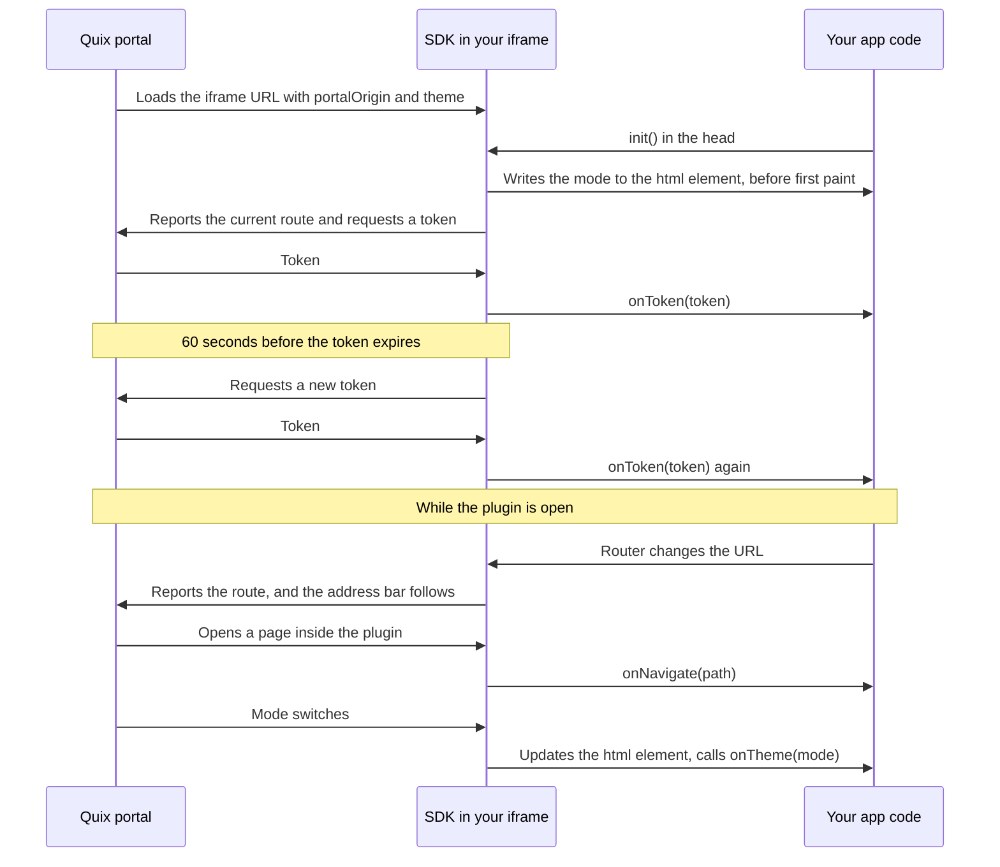

# Quix Plugin SDK

The **Quix Plugin SDK** is a small JavaScript library that connects a plugin's embedded UI to the Quix portal around it. Your plugin runs in an iframe on its own origin, so it can't read the user's session or see what the portal is doing. The SDK carries that information across the frame boundary, so your plugin can:

* **Act as the signed-in user.** The SDK delivers the user's auth token and requests a new one before each expires.
* **Have a real URL for every page.** When your plugin navigates, the portal's address bar follows, so refreshes, bookmarks and shared links open the same page inside your plugin.
* **Follow the portal's navigation.** When the portal opens a page inside your plugin, for example from a space's sidebar, your router changes page without reloading the iframe.
* **Match the portal's color mode.** Your page paints in light or dark from the first frame, and follows every switch.

This page describes SDK version **1.3.0**, for developers building the web UI of a plugin. To configure a deployment as a plugin, see [Configure a plugin](plugin.md#configure-a-plugin). For the security model and message protocol, see [How the Quix Plugin SDK works](plugin-sdk-internals.md).

## How it works

You load the SDK from the portal and call `QuixPlugin.init()` once. From then on, the SDK sits between your app code and the portal: it talks to the portal through `postMessage`, and talks to your code through callbacks and the URL.



Three things follow from this model:

* **The portal decides what to send based on the SDK version your page reports.** That's why you load the SDK from the portal rather than bundling a copy: the two stay in step.
* **The SDK reads the iframe URL once, in `init()`.** The portal puts its origin and color mode on the URL. Call `init()` in `<head>`, before your router rewrites the URL, or the SDK can't trust portal navigation and your page paints in the wrong mode first.
* **Your code reacts, it doesn't ask.** Callbacks run when something arrives, and run again on every change. There is nothing to poll.

## Quick start

Before you start, your plugin needs the embedded view turned on (see [Configure a plugin](plugin.md#configure-a-plugin)), and must route by path, answer every route with its entry page, and load assets from root-absolute URLs. [Navigation](#navigation) explains why.

Load the SDK and start it in the `<head>` of your entry page:

```html
<head>
  <meta charset="utf-8">
  <script src="https://<your-portal-domain>/static/sdk/quix-plugin.js"></script>
  <script>QuixPlugin.init();</script>
  <link rel="stylesheet" href="/css/app.css">
</head>
```

`<your-portal-domain>` is the host you open the Quix portal on, including your own host for a dedicated, self-hosted or custom-domain installation. The file is a plain script, not an ES module, and defines one global, `QuixPlugin`. If your plugin sends a `Content-Security-Policy`, add the portal's origin to `script-src`.

Keep the latest token, and wait for the first one before your first request:

```js
let authToken = null;

// Resolves on the first token. Every refresh updates authToken.
const tokenReady = new Promise((resolve) => {
  QuixPlugin.onToken((token) => {
    authToken = token;
    resolve();
  });
});

async function getJson(url) {
  await tokenReady;
  const response = await fetch(url, {
    headers: { Authorization: `Bearer ${authToken}` },
  });
  if (!response.ok) throw new Error(`Request failed: ${response.status}`);
  return response.json();
}
```

Hand portal navigation to your router, once, when your app starts:

```js
QuixPlugin.onNavigate((path) => router.navigate(path));
```

Style both modes against the attribute the SDK sets on `<html>`. Dark is the portal's default, so make it your CSS default too:

```css
:root { --bg: #14161c; --text: #e6e8ee; }
html[data-quix-theme='light'] { --bg: #ffffff; --text: #1b1d23; }
body { background: var(--bg); color: var(--text); }
```

Reporting your route to the portal needs no code: navigate with your router as usual.

!!! tip "Develop locally"

    Outside the portal no token arrives, so `tokenReady` never resolves, and the mode is `dark`. For local development, resolve `tokenReady` with a [personal access token](../access-security/personal-access-token.md) from local configuration when `window.parent === window`, and keep that token out of source control and production builds. To preview light mode, add `?theme=light` to your local URL.

## Authentication token

The token lets your plugin act as the signed-in portal user. Send it as a Bearer credential to Quix APIs, or to your own backend, which validates it. Requests made with it are authorized as that user. For the server side, see [How to handle the token in the backend](plugin.md#how-to-handle-the-token-in-the-backend).

Tokens are JWTs that expire. The SDK requests a new token 60 seconds before the current one expires and calls `onToken` with whatever the portal returns, which can be the same value when the portal hasn't renewed its own session yet. So treat `onToken` as "here is the current token", not "a token arrived": replace the stored value every time, and don't copy the first token into a long-lived API client. For the exact schedule, see [Token refresh schedule](plugin-sdk-internals.md#token-refresh-schedule).

Handle the token as the credential it is:

* **Keep it in memory.** Every page load gets a fresh token, so there's nothing to persist.
* **Keep it out of URLs.** The SDK reports your plugin's URL to the portal.
* **Validate it on your backend.** The SDK accepts a token from whichever page embeds your plugin, so your backend decides whether a token is genuine. See [Security model](plugin-sdk-internals.md#security-model).

Only the portal page that embeds your plugin answers the token request. If your plugin redirects the iframe to another origin, such as an external sign-in page or a different host name, that page gets no token. See [Stay on the embedded view origin](plugin.md#stay-on-the-embedded-view-origin).

## Navigation

The SDK keeps the portal's address bar and your plugin's route in step, in both directions. Each page inside your plugin then has a portal URL that people can bookmark, refresh and share, and the portal can open any page inside your plugin directly.

That only works if a page's URL is enough to load it, which puts four requirements on your app and its server:

* **Route by path, not by fragment.** Use `/alarms`, not `#/alarms`; most routers call this history mode. A hash-routed app works one way only: the portal mirrors its route, but the SDK accepts only paths that start with `/`, so navigation from the portal does nothing. The SDK logs `⚠ Hash routing detected` once when it sees one. Fragments on a path, such as `/runs#latest`, are fine.
* **Answer every route with your entry page.** A deep link to `/alarms` is a plain HTTP `GET` for `/alarms` on your server, before any JavaScript runs. Return `index.html` with status `200` for every route, and `404` for a missing asset file.
* **Load assets from root-absolute URLs.** On the page `/rigs/RIG-01`, a relative `css/app.css` resolves to `/rigs/css/app.css`. A catch-all route answers that with HTML, so the page renders unstyled or blank with no failed request in the network tab. Use `/css/app.css`. In Vite, leave `base` at `/`. In Angular, keep `<base href="/">`.
* **Serve from the root of your origin.** If your app lives under a prefix such as `/ui/`, the SDK reports `/ui/alarms`, the portal appends it to an embedded view URL that already ends in `/ui`, and the next load requests `/ui/ui/alarms`.

In nginx, for example, the catch-all route and the asset rule look like this:

```nginx
location / {
  try_files $uri /index.html;
}

# A missing asset returns 404, not index.html.
location ~* \.(?:css|js|map|json|ico|png|jpe?g|gif|svg|webp|woff2?|ttf)$ {
  try_files $uri =404;
}
```

### Plugin to portal

`init()` hooks `history.pushState`, `history.replaceState`, `popstate` and `hashchange`, so every route change your app makes is reported to the portal, whichever router you use. The portal appends the path to the plugin's portal URL without reloading anything. For example, an organization plugin at `/apps/<deployment-id>` that navigates to `/runs?status=failed` puts the portal at `/apps/<deployment-id>/runs?status=failed`.

The portal merges your query parameters into its own and never removes one. A parameter your plugin drops stays in the portal URL and comes back on the next load, so set an explicit empty or default value instead of removing it. For the parameters the portal adds to the iframe URL, see [What the portal adds to the URL](plugin.md#what-the-portal-adds-to-the-url).

### Portal to plugin

When the portal opens a different page inside the same plugin, it sends the path to your plugin instead of reloading the iframe, so your app keeps its state: open panels, scroll positions, unsaved input. The portal still reloads the iframe when it switches to a different plugin, when its own query parameters change, or when your plugin runs an SDK older than 1.2.1.

The path is relative to your plugin's root, starts with `/`, can include a `#fragment`, and never includes a query string. The SDK delivers it one of two ways:

* **With an `onNavigate` callback registered**, the SDK calls it and leaves `history` alone. Route with your router. Navigation your callback starts isn't echoed back to the portal.
* **With no callback**, the SDK calls `history.pushState()` and dispatches `popstate`, which most history-based routers pick up with no code. It also replays the path to the first `onNavigate` callback registered afterwards, so skip navigating to the page you're already on.

Register the callback once, at startup. Two frameworks have a catch:

| Router | Callback | Watch out for |
|---|---|---|
| Angular | `(path) => zone.run(() => router.navigateByUrl(path))` | The SDK starts before Angular, so callbacks can run outside the zone and the view doesn't update. Get `Router` and `NgZone` from `appRef.injector` after `bootstrapApplication()` resolves. |
| React Router | `(path) => router.navigate(path)` | Register at module level next to `createBrowserRouter()`, not in a component with `useNavigate()`. Every mount adds another callback, and `StrictMode` runs effects twice. |
| Vue Router | `(path) => router.push(path)` | Nothing special. |

Keep navigation inside your app. A plain `<a href>` link, `location.href`, `location.reload()`, a form post or a server redirect loads a new document: your app loses its state, the token handshake repeats, and the page can lose the portal's mode (see [Keep the mode after a full page load](#keep-the-mode-after-a-full-page-load)). Route same-origin link clicks through your router.

## Theme

The Quix portal has a light and a dark mode, and the SDK tells your plugin which one is showing, so a dark plugin doesn't sit inside a light portal. It sends only the mode, `light` or `dark`, never colors or design tokens: your plugin keeps full control of its palette.

The mode is the one the portal is actually showing. If a user's appearance setting follows the operating system, the portal resolves it first, and if the active space sets a mode, that mode is sent. The portal puts the mode on the iframe URL, so `init()` applies it before the first paint, and sends a message when it changes, without a reload.

By default, `init()` writes the mode to your `<html>` element, and rewrites it on every change:

* `data-quix-theme="light"` or `"dark"`, for your CSS selectors.
* An inline `color-scheme` style, so browser-drawn form controls and scrollbars match. Being inline, it overrides any `color-scheme` your stylesheet sets on `html`.

That means a plugin designed for light only shows a dark page background and dark form controls in the portal's default dark mode. Style both modes, or opt out.

`@media (prefers-color-scheme)` follows the operating system, not the portal, so a light portal on a dark operating system gives you a dark plugin. Use `html[data-quix-theme='light']` selectors instead. In Tailwind CSS v4, point the `dark` variant at the attribute:

```css
@custom-variant dark (&:where([data-quix-theme=dark], [data-quix-theme=dark] *));
```

If your app has its own theme system, such as a theme store or a component library's provider, turn off the SDK's writes and drive your system from `onTheme`:

```js
QuixPlugin
  .init({ applyTheme: false })
  .onTheme((theme) => {
    // Runs at once with the current mode, then on every change.
    document.documentElement.classList.toggle('dark', theme === 'dark');
  });
```

### Keep the mode after a full page load

The portal sends its mode again only to a page it loaded itself: the first load, `Reload app` in the [plugin toolbar](plugin.md#plugin-toolbar), a different plugin, or a portal navigation that reloads the iframe. A page your plugin loads on its own, through a plain link, `location.reload()`, a form post or a redirect, uses the `theme` parameter on its own URL, or `dark` when there is none, until the user switches mode again.

Navigate inside your app to avoid this. If you must load a new page, carry the mode on its URL:

```js
const url = new URL(window.location.href);
url.searchParams.set('theme', QuixPlugin.theme);
window.location.replace(url);
```

## API reference

The SDK defines one global object, `QuixPlugin`:

| Member | Since | Behavior |
|---|---|---|
| `init(options?)` | 1.0.0 | Starts the SDK. Until it runs, the SDK sends no messages, listens for none and doesn't touch `history`. Only the first call counts: later calls, and their options, are ignored. For the steps it runs, see [What init() does](plugin-sdk-internals.md#what-init-does). |
| `init({ applyTheme: false })` | 1.3.0 | Stops the SDK writing `data-quix-theme` and `color-scheme` to `<html>`. Only the value `false` turns it off. |
| `onToken(callback)` | 1.0.0 | `(token: string) => void`. Runs on the first token and after every refresh. If a token has already arrived, it also runs immediately with the latest one. |
| `onNavigate(callback)` | 1.2.1 | `(path: string) => void`. Runs when the portal opens a page inside your plugin. If a path arrived while no callback was registered, the first callback registered afterwards runs immediately with it. |
| `onTheme(callback)` | 1.3.0 | `(theme: QuixTheme) => void`, where the mode is `'light'` or `'dark'`. Runs immediately with the current mode, then on each change. Registered before `init()`, it first gets `dark`, then the URL's mode if that differs. |
| `theme` | 1.3.0 | Read-only. The current mode, never empty: `dark` before `init()` and when the URL has no mode. |
| `version` | 1.3.0 | The SDK version string, the same value the SDK reports to the portal. `undefined` on older SDKs, so to check for a feature, test for the method instead, for example `typeof QuixPlugin.onTheme === 'function'`. |

`init()`, `onToken()`, `onNavigate()` and `onTheme()` return `QuixPlugin`, so you can chain them, and you can register callbacks before or after `init()`. A callback that throws doesn't stop the others. Members that start with an underscore are internal.

!!! warning "Register callbacks once"

    The SDK has no way to remove a callback and doesn't check for duplicates: registering the same function twice runs it twice. Register callbacks when your app starts, not in code that runs every time a component mounts.

The SDK ships no type definitions. In TypeScript, add a global declaration file, such as `quix-plugin.d.ts`, with no `import` or `export` statements:

```ts
type QuixTheme = 'light' | 'dark';

interface QuixPluginSdk {
  readonly version: string;
  readonly theme: QuixTheme;
  init(options?: { applyTheme?: boolean }): QuixPluginSdk;
  onToken(callback: (token: string) => void): QuixPluginSdk;
  onNavigate(callback: (path: string) => void): QuixPluginSdk;
  onTheme(callback: (theme: QuixTheme) => void): QuixPluginSdk;
}

declare const QuixPlugin: QuixPluginSdk;
```

## Upgrade from an earlier SDK version

A plugin that loads `quix-plugin.js` from the portal already runs the version the portal serves, so there is no tag to change. If you bundled a copy, load it from the portal instead, as in [Quick start](#quick-start). These changes reach your plugin without any code change:

| Since | What changed | What to check |
|---|---|---|
| 1.1.0 | The SDK refreshes the token before it expires and calls `onToken` with each one. | Your callback replaces the stored token and is safe to run more than once. |
| 1.2.1 | Portal navigation inside your plugin no longer reloads the iframe. It goes to `onNavigate`, or to `pushState` plus `popstate`. | Portal navigation reaches your router, and `init()` runs before your router rewrites the URL. |
| 1.3.0 | The SDK writes `data-quix-theme` and an inline `color-scheme` to `<html>`, and the portal is dark by default. | A page with no background or text colors of its own now renders dark. Style both modes, or pass `init({ applyTheme: false })`. |

The console group header, for example `Quix Plugin SDK v1.3.0`, shows the version running. The file name doesn't change between versions, so an older version there means the browser cached the file: do a hard refresh. For every version and what the portal sends to it, see [Version history and compatibility](plugin-sdk-internals.md#version-history-and-compatibility).

## Troubleshooting

Start in the browser console. The SDK logs into a collapsed `Quix Plugin SDK` group with a blue `Quix` badge, and the portal logs with a `Quix Portal` badge.

| Symptom | Cause | Fix |
|---|---|---|
| Blank embedded view, or the browser says the site refused to connect | Your server sends `X-Frame-Options`, or a `frame-ancestors` policy that excludes the portal. Security middleware such as helmet, Flask-Talisman and Django's clickjacking middleware sets one by default. | Remove `X-Frame-Options`, and allow the portal's origin in `frame-ancestors`. |
| First API request fails with `401` and the header reads `Bearer null` | The request ran before the first token arrived. | Await the first token, as in [Quick start](#quick-start). |
| `onToken` never runs inside the portal, and the portal logs no `⟵ handshake` line | The page in the iframe is on a different origin from the embedded view URL, usually after a redirect. | Keep the plugin on its [embedded view origin](plugin.md#stay-on-the-embedded-view-origin). |
| A deep link shows `404` | Your server has no catch-all route. | Return `index.html` for every route. See [Navigation](#navigation). |
| A deep link renders blank or unstyled | Relative asset URLs resolve under the current route. | Use root-absolute asset URLs. |
| The portal URL gains a repeated segment, such as `/ui/ui/` | Your plugin is served under a path prefix. | Serve it from the root of its origin. |
| A portal sidebar entry for a page in your plugin does nothing, and the SDK logs `⊘ Ignored unsafe NAVIGATE path #/...` | Your app uses hash routing. | Switch your router to path routing. |
| The iframe reloads on portal navigation, and the portal logs `↻ reload — SDK ... lacks soft navigation` | The browser runs a cached SDK older than 1.2.1. | Do a hard refresh and check the version in the console group header. |
| Portal navigation and mode switches never arrive, and the SDK logs `No portalOrigin param` | `init()` ran after your app removed the query string from the first URL. | Call `init()` in `<head>`, before your router starts. |
| Angular logs `Navigation triggered outside Angular zone`, or the view doesn't update | SDK callbacks run outside Angular's zone. | Wrap the router call in `zone.run()`. See [Portal to plugin](#portal-to-plugin). |
| A query parameter your plugin removed comes back after a reload | The portal merges parameters and never removes one. | Set an empty or default value instead. |
| The plugin follows the operating system's mode, not the portal's | Your CSS uses `@media (prefers-color-scheme)`. | Use `html[data-quix-theme]` selectors. |
| The wrong mode flashes on load | `init()` runs after first paint, from a deferred bundle for example. | Call `init()` in a script in `<head>`. |
| The plugin turns dark after a link, reload or redirect | The portal doesn't resend its mode to a page your plugin loaded itself. | See [Keep the mode after a full page load](#keep-the-mode-after-a-full-page-load). |

## Migrate from a manual postMessage integration

Earlier plugin documentation showed a hand-rolled exchange of `REQUEST_AUTH_TOKEN` and `AUTH_TOKEN` messages. Those integrations typically stop working when the token expires, trust messages from any sender, and report no version, so the portal reloads the iframe on every portal navigation and never sends its mode. The portal side is the same for both, so moving to the SDK touches only your plugin:

```js
// Before: hand-rolled handshake
window.addEventListener('message', (event) => {
  if (event.data?.type === 'AUTH_TOKEN') {
    myApi.setAuthHeader(`Bearer ${event.data.token}`);
  }
});
window.parent.postMessage({ type: 'REQUEST_AUTH_TOKEN' }, '*');

// After: QuixPlugin.init() runs in <head>
QuixPlugin.onToken((token) => {
  myApi.setAuthHeader(`Bearer ${token}`);
});
```

Delete your `message` listener, the `REQUEST_AUTH_TOKEN` post, and any code that posts `NAVIGATE` to report routes, which would otherwise send each route twice. Then load the SDK as in [Quick start](#quick-start), and add `onNavigate` and theme styles. The portal's `⟵ handshake — SDK 1.3.0` console line confirms the switch. To keep your own integration instead, see [Requirements for a hand-rolled integration](plugin-sdk-internals.md#requirements-for-a-hand-rolled-integration).

## See also

* [Plugin system](plugin.md): configure a deployment as a plugin and choose where it appears in the portal.
* [How the Quix Plugin SDK works](plugin-sdk-internals.md): security model, message protocol and version history.
* [Embedded view URL](plugin.md#embedded-view-url): the URL your plugin loads from, and the parameters the portal adds to it.
* [Authentication and authorization](plugin.md#authentication-and-authorization): validate the token on your backend.
* [Portal API](../apis/portal-api/overview.md): the API your plugin can call with the token.
