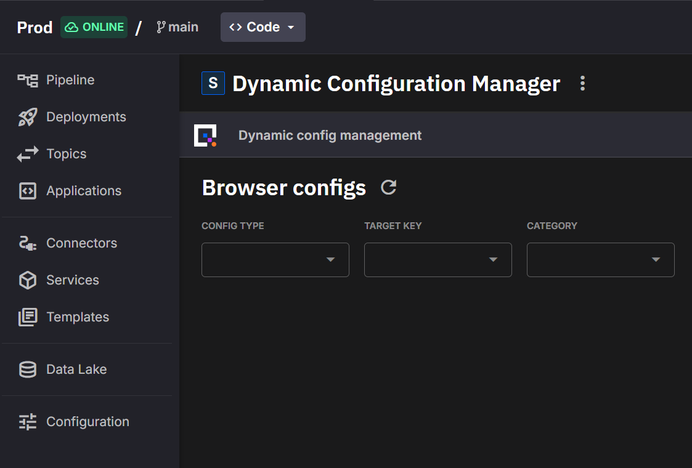
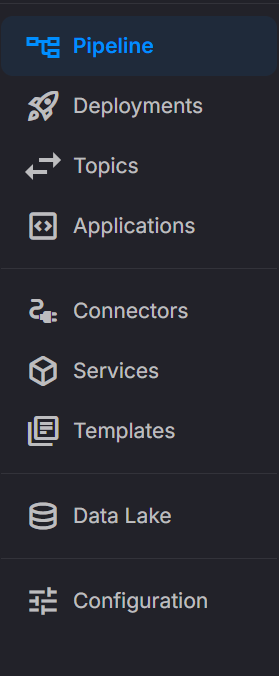

# Plugin system

A **plugin** is a deployment whose web UI opens inside the portal, the Quix Cloud web UI you sign in to. Use plugins to put tools such as configuration panels, dashboards, test managers or operations consoles next to the pipelines they belong to, so users don't have to switch to another site or sign in again.

The plugin system gives a deployment up to three ways to appear in the portal:

* An **embedded view**: the deployment's web UI, shown in an iframe inside the portal.
* An **environment plugin**: the plugin appears in the `Plugins` section of the sidebar of the environment it runs in. Only users working in that environment see it.
* An **organization plugin**: the plugin is available across the organization, so users can open it from outside its environment. The portal shows it as an app.

Organization admins use [spaces](../spaces/overview.md) to decide where organization plugins appear for each group of users. A **space** is an admin-curated view of the portal for a group of users that controls the sidebars and which apps are pinned to the header. Only users with access to a plugin see it. See [Organization plugins](#organization-plugins).

A plugin can also reuse Quix authentication. The portal hands your UI the signed-in user's token, and your backend can check that user's Quix permissions. See [Authentication and authorization](#authentication-and-authorization).

Any deployment can be a plugin. You configure it in the deployment dialog or in YAML. Managed services that Quix defines as plugins get an embedded view automatically, and you can override it. See [Configure a plugin](#configure-a-plugin).

<a id="what-it-does"></a>

## Where a plugin appears

### Embedded view

The embedded view shows the plugin's web UI inside the portal:

{width=80%}

Above the plugin, a title bar shows the deployment's icon and name. When you open the plugin inside its environment, and you can access the deployment's settings, the title bar also has an `Embedded view` / `Details view` toggle that switches to the deployment's details page and back. The Deployment details page has the same toggle when the embedded view is enabled. To hide the title bar so the plugin fills the whole panel, turn on `Hide deployment title bar` (`embeddedView.hideHeader`).

The embedded view opens at one of three portal URLs, depending on where you open it from:

| Portal URL | Layout | Opened from |
|---|---|---|
| `/pipeline/deployments/<deployment-id>/embedded?workspace=<environment-id>` | Inside the environment, with the environment sidebar | The environment sidebar, the pipeline view, the `Embedded view` toggle on Deployment details |
| `/apps/<deployment-id>` | Inside the portal, with the organization sidebar | While you're in a space: a header app, an organization sidebar entry, the command palette, or the space's landing page when the space also lists the plugin in its organization sidebar |
| `/plugins/details/<deployment-id>` | Full screen, with the top header and no sidebar | The command palette when you're not in a space, a space's landing page when the space doesn't list the plugin in its organization sidebar, and the page that existing [Operator-only users](#what-operator-only-users-see) land on |

Anything after the plugin's address in the portal URL is passed to the plugin as a path, so you can link straight to a page inside a plugin. For example, `/apps/<deployment-id>/alarms` opens the plugin's `/alarms` page. See [Embedded view URL](#embedded-view-url).

When the embedded view is enabled and set as the default view (`embeddedView.default: true`), the plugin opens there when users open the deployment from the pipeline, from the environment sidebar or, when they're not in a space, from the command palette. Otherwise these open the Deployment details page. The expand button in the pipeline's side panel always opens Deployment details.

<a id="environment-sidebar"></a>

### Environment plugins

When at least one deployment in an environment is an environment plugin (`environmentItem.show: true`), the environment sidebar gets a `Plugins` section below its built-in items:



Each item shows the plugin's icon and label, and its badge when the sidebar is expanded. When the sidebar is collapsed, hover over an icon to see the label. Items are sorted by `environmentItem.order`, lowest first. The list updates when deployments are created or deleted.

Clicking an item opens the plugin's embedded view if the embedded view is enabled and set as the default view. Otherwise it opens the Deployment details page.

Environment plugins are scoped to their environment. Users working in other environments don't see them. To make a plugin available outside its environment, make it an [organization plugin](#organization-plugins).

## Configure a plugin

You can configure a plugin in the deployment dialog or in the deployment's YAML. Both edit the same `plugin` settings. After you turn off part of a plugin in the dialog, check the result in the deployment's `Plugin` section. See [Check a deployment's plugin settings](#check-a-deployments-plugin-settings).

### Configure in the deployment dialog

Before you start, make sure the deployment serves a web UI over HTTP. For a deployment that isn't a managed service, the embedded view loads from the deployment's public URL, so the deployment also needs public access.

To configure a plugin in the deployment dialog:

1. Open the deployment dialog. To create a deployment, deploy an application. To change an existing deployment, select `Edit deployment` in its menu.

    If the deployment already has plugin settings, you can also click `Edit` in the `Plugin` section of its Deployment details page. This opens the dialog at the plugin settings.

2. For a deployment that isn't a managed service, on the `Basic` tab, open `Network settings` and turn on `Public access`. See [Deploy a public service](../deployments/deploy-public-page.md).
3. Select the `Advanced` tab. The `Plugin Settings` panel is expanded.
4. Turn on the parts of the plugin you need, and fill in their fields:

    * `Environment plugin` makes the deployment an environment plugin, with an item in this environment's sidebar.
    * `Organisation plugin` makes the deployment an organization plugin.
    * `Embedded View` turns on the embedded view.

5. Click `Deploy` for a new deployment. For an existing deployment, click `Save`, or `Redeploy` if it's running.

If you deploy from a code sample that includes plugin settings, the dialog is filled in with them.

Each dialog control writes one YAML setting:

| Dialog control | YAML setting | Notes |
|---|---|---|
| `Environment plugin` | `environmentItem.show` | Adds an item to this environment's sidebar only. |
| `Environment plugin` › `Label` | `environmentItem.label` | Up to 25 characters. |
| `Environment plugin` › `Badge` | `environmentItem.badge` | Up to 25 characters. |
| `Environment plugin` › `Order` | `environmentItem.order` | Lower numbers appear first. Minimum `0`, default `0`. |
| `Environment plugin` › icon picker | `environmentItem.icon` | Searchable list of Material icons, captioned `Icon shown in the sidebar`. |
| `Organisation plugin` | `organisationItem.show` | Makes the deployment available across the organization. |
| `Organisation plugin` › `Label` | `organisationItem.label` | Up to 25 characters. |
| `Organisation plugin` › `Badge` | `organisationItem.badge` | Up to 25 characters. |
| `Organisation plugin` › icon picker | `organisationItem.icon` | Captioned `Icon shown in the header`. |
| `Embedded View` | `embeddedView.enabled` | Turns on the embedded view. |
| `Embedded View` › `Hide deployment title bar` | `embeddedView.hideHeader` | Off by default. |
| `Embedded View` › `Use as default view` | `embeddedView.default` | On by default for a new deployment. |

The dialog has no order field for `Organisation plugin`. It keeps an existing `organisationItem.order`, and sets `0` when there isn't one. An organization plugin saved from the dialog therefore sorts before plugins with a higher `order`. To set `organisationItem.order`, use YAML. If your organization still has users with the deprecated Operator role, the plugin can also become the one they land on. See [Operator-only users (deprecated)](#what-operator-only-users-see).

<a id="yaml-configuration"></a>

### Configure in YAML

Add a `plugin` block to the deployment in `quix.yaml`:

```yaml
deployments:
  - name: Config Manager
    application: config-manager
    version: latest
    deploymentType: Service
    publicAccess:
      enabled: true                # Required for the embedded view of a non-managed deployment
      urlPrefix: config-manager
    plugin:
      embeddedView:
        enabled: true              # Show the deployment's web UI inside the portal
        hideHeader: false          # true hides the title bar above the plugin
        default: true              # Open the embedded view instead of Deployment details
      environmentItem:
        show: true                 # Make this an environment plugin
        label: "Configuration"
        icon: "tune"               # Google Material icon name
        order: 1                   # Lower values appear higher
        badge: "Alpha"
      organisationItem:
        show: true                 # Make this an organization plugin
        label: "Configuration"
        icon: "tune"
        order: 1                   # Sorts the command palette and space designer lists
        badge: "Alpha"
```

Every block is optional. Use only the ones you need. For the embedded view of a deployment that isn't a managed service, also set `publicAccess.enabled: true`.

`organisationItem` is spelled with an "s", like the `Organisation plugin` label. Quix skips unknown keys under `plugin` without an error, so if the plugin doesn't appear, check the spelling of the key.

!!! note "Renamed keys"

    `environmentItem` and `organisationItem` replace the old keys `sidebarItem` and `globalItem`. Quix Cloud still reads the old keys, and writes the new keys the next time it saves `quix.yaml`. If a deployment has both, the new key wins. Tools built on older Quix packages, including older versions of the Quix CLI, ignore the new keys and lose these settings, so update the Quix CLI before you use them.

!!! tip "Icons"

    Environment plugin and organization plugin icons use [Google Material Icons](https://fonts.google.com/icons){target=_blank}. Use the icon code, such as `tune`, `settings` or `play_arrow`. If you don't set an icon, the `extension` icon is used.

`plugin.embeddedView` configures the embedded view:

| Field | Type | Default | Description |
|---|---|---|---|
| `enabled` | boolean | `false` | Turns on the embedded view. |
| `hideHeader` | boolean | `false` | Hides the title bar above the plugin: the deployment's icon and name and the `Embedded view` / `Details view` toggle. The plugin then fills the whole panel. |
| `default` | boolean | `false` | Opens the embedded view instead of Deployment details. See [Embedded view](#embedded-view). |

`plugin.environmentItem` makes the deployment an environment plugin, with an item in the environment sidebar:

| Field | Type | Default | Description |
|---|---|---|---|
| `show` | boolean | `false` | Shows the item in the `Plugins` section of this environment's sidebar. |
| `label` | string | The deployment name | The item's text. |
| `icon` | string | `extension` | A Google Material icon code. |
| `order` | integer | None | Lower values appear higher. Set `order` on every environment plugin: items without one don't sort in a predictable place. |
| `badge` | string | None | Short text shown next to the label, such as `Alpha`, `Beta` or `New`. Shown only when the sidebar is expanded. |

`plugin.organisationItem` makes the deployment an organization plugin, available across the organization. For where each setting appears and what a space can change, see [How the organisationItem settings are used](#how-the-organisationitem-settings-are-used).

| Field | Type | Default | Description |
|---|---|---|---|
| `show` | boolean | `false` | `true` makes the deployment an organization plugin. |
| `label` | string | The deployment name | The app's name. |
| `icon` | string | `extension` | A Google Material icon code, such as `fact_check`. |
| `order` | integer | None | Sort position, lowest first. |
| `badge` | string | None | Short text shown next to the app's name, such as `Beta` or `Preview`. |

The deployment dialog limits labels and badges to 25 characters. Keep badges to a word or two: longer text is truncated in the sidebar and header, with the full text in a tooltip.

### Managed services

When you deploy a managed service that Quix defines as a plugin, and you don't set `plugin` yourself, Quix enables its embedded view and makes it the default view. Your own `plugin` settings replace these defaults. If you later remove your plugin settings, Quix restores the defaults instead of removing the embedded view.

### Check a deployment's plugin settings

The Deployment details page shows a `Plugin` section when any part of the plugin is turned on. It labels the two plugin types with their older names, `Sidebar item` and `Global item`. It lists:

* `Sidebar item`: the environment plugin's label, when the deployment is an environment plugin.
* `Global item`: the organization plugin's label, when the deployment is an organization plugin.
* `Embedded view`: `Disabled`, `Enabled`, or `Enabled` followed by `default view`, `header hidden` or both.

Click `Edit` in the section to change the settings in the deployment dialog.

<a id="what-are-global-plugins"></a>
<a id="when-to-use-global-plugins"></a>
<a id="global-plugins"></a>

## Organization plugins

An **organization plugin** is a deployment that users can reach from anywhere in the organization, not only from the environment it runs in. Use an organization plugin for a tool that serves users outside its project, such as a test manager, a monitoring dashboard or an operations console. Organization plugins were previously called global plugins.

In the portal, an organization plugin is shown as an **app**. The header, the organization sidebar and the command palette list it by its app name.

To make a deployment an organization plugin, do one of the following:

* In the deployment dialog, on the `Advanced` tab, turn on `Organisation plugin` in `Plugin Settings`.
* In YAML, set `plugin.organisationItem.show` to `true`.

Also turn on the embedded view and make it the default view (`embeddedView.enabled` and `embeddedView.default`), so the plugin opens as an app wherever users reach it. Without `default: true`, the command palette opens the deployment's details page instead when you're not in a space. In a space, the header, the organization sidebar and the command palette always open the plugin at `/apps/<deployment-id>`. If its embedded view is off, that page is empty.

!!! note "An organization plugin doesn't appear in the header by itself"

    Making a deployment an organization plugin makes it *available* across the organization. To put it in the header, an organization admin pins it in a space's `Header apps`. See [Pin header apps](../spaces/navigation.md#pin-header-apps).

<a id="where-global-plugins-appear"></a>

### Where organization plugins appear

Where users find an organization plugin depends on whether they're working in a space:

| Place | In a space | Without a space |
|---|---|---|
| Header app strip | Only the apps the space pins, in the order the space sets. | Empty. |
| Organization sidebar | Where the space adds the plugin as a plugin app. | Not listed. |
| Command palette (++cmd+k++ on macOS, ++ctrl+k++ on Windows and Linux) | Only the apps the space pins or adds to its organization sidebar. | Every organization plugin you have access to. |
| Landing page | Where the space uses the plugin as its landing page. | Not used. |

"Without a space" covers every organization that doesn't use spaces, users who don't belong to any space, and organization admins who switch to `Spaceless`.

The header app strip is part of the organization header. Inside a project, the header shows the project and environment instead, so pinned apps appear on organization-level pages such as `Home` and `Projects`.

In the command palette, organization plugins are listed under `Apps`. Each row shows the app's label, icon and badge, how many instances it has, and its project.

Whether an organization plugin opens inside the portal, with the organization sidebar, or full screen depends on where it's opened from. See the portal URL table under [Embedded view](#embedded-view).

### Instances

The portal groups organization plugins that share a project and a deployment name into one app. Each deployment in the group, typically one per environment, is an **instance** of the app. The command palette shows how many instances an app has. When an app has more than one instance, the header pin and the [plugin toolbar](#plugin-toolbar) let users switch between them.

<a id="how-the-globalitem-settings-are-used"></a>

### How the organisationItem settings are used

The `organisationItem` settings describe the plugin wherever it appears. A space controls *where* it appears.

| Setting | Effect |
|---|---|
| `show` | `true` makes the deployment an organization plugin. When it's `false` or missing, the deployment isn't an organization plugin: a space's header pin for it disappears, and an organization sidebar entry for it is shown disabled, with the tooltip `This app is not available right now`. |
| `label` | The app's name in the header, the command palette, the space designer and the plugin toolbar. If you don't set it, the deployment name is used. An organization admin can give a header pin a different label. An organization sidebar entry copies the name when the admin adds it. |
| `icon` | The app's icon in the same places as `label`. If you don't set it, the `extension` icon is used. An organization admin can choose a different icon for a pin or a sidebar entry. |
| `badge` | A short label shown next to the app's name in the header and the command palette, for example `Beta`. A space can't change it. |
| `order` | Sorts organization plugins in the command palette and in the space designer's app lists. Lower values come first, and plugins without `order` come last. It doesn't set the order of the header: each space sets its own. For existing Operator-only users, it also decides which plugin they land on. See [Operator-only users (deprecated)](#what-operator-only-users-see). |

### Permissions and access control

Access to organization plugins works like this:

* To see and open an organization plugin, a user needs `plugin:read` in the environment the plugin runs in. Plugin permissions apply per environment, not per deployment. A user doesn't need `workspace:read` in that environment.
* The Admin, Manager and Editor roles grant `plugin:*`, and the Viewer role grants `plugin:read`. The deprecated Operator role grants `plugin:*` and nothing else.
* To give someone access to the plugins in an environment, assign them a role that grants `plugin:read`. The narrowest choice is the Viewer role at the environment level. See [Permission levels](../roles.md#permission-levels). Don't assign the Operator role: it's deprecated. To show these users only the plugins, use a space. See [Replace the Operator role with a space](../spaces/replace-operator-role.md).

Spaces don't change any of this. A space that pins a plugin doesn't give anyone access to it. Users without access to a plugin don't see it in the header or the command palette. If a space lists it in the organization sidebar, they see that entry disabled.

For more information about roles and permissions, see [Roles and permissions](../roles.md).

<a id="what-operator-only-users-see"></a>

### Operator-only users (deprecated)

!!! warning "The Operator role is deprecated"

    Use spaces instead of the Operator role to give users a plugin-only view of Quix Cloud. Existing Operator assignments still work, but don't assign the role to new users. See [Replace the Operator role with a space](../spaces/replace-operator-role.md).

An Operator-only user has the Operator role and no Admin, Manager, Editor or Viewer role. If your organization still has Operator-only users, this is how the portal behaves for them. They can't open projects, environments or deployments, so for them the portal works as a launcher for organization plugins:

* When they open any other portal page, such as `Home` or a project, the portal opens their first organization plugin full screen instead. The first plugin is the one with the lowest `organisationItem.order`.
* If they have no organization plugins, they see `No global plugins available`, with a request to contact an organization administrator.
* The organization name in the header is disabled, with the tooltip `Your current permissions do not include Control Plane access`.
* Without a space, they switch between organization plugins with the command palette or `Search apps & pages` in the plugin toolbar. These open each plugin full screen at `/plugins/details/<deployment-id>`.
* In a space, header apps, organization sidebar apps and the command palette open plugins at `/apps/<deployment-id>`. The portal blocks that page for Operator-only users and sends them back to their first organization plugin, so these links don't take them to the plugin they chose.

To give these users a plugin-only view that works in a space, move them off the Operator role. [Replace the Operator role with a space](../spaces/replace-operator-role.md) has the full steps. In short:

1. Create a space that shows only the plugins. For example, pin the plugins to `Header apps` and set the main plugin as the `Landing page`.
2. Add the users' permission group to the space's `Membership`.
3. Change their role from Operator to Viewer, assigned at the level of the environment that runs the plugins.
4. Check the result with `Preview as member` on the spaces list.

A space controls what users see, not what they can access. Unlike Operator, the Viewer role also lets users read the environment's other resources, such as its pipelines, topics and deployments, through the APIs and the CLI, so assign it only to the environment that runs the plugins.

### Configuration example

To make a test manager available across the organization, use a configuration like this:

```yaml
deployments:
  - name: Test Manager
    application: TestManager
    version: latest
    deploymentType: Managed
    plugin:
      embeddedView:
        enabled: true
        default: true
      organisationItem:
        show: true
        label: "Test Manager"
        icon: "fact_check"
        order: 1
        badge: "Beta"
```

This configuration:

* Makes the deployment an organization plugin, so organization admins can pin it to the header of a space or add it to a space's organization sidebar.
* Enables the embedded view and makes it the default, so the plugin opens as an app.
* Names the app `Test Manager` and gives it the `fact_check` icon, unless a space overrides them.
* Sets `order` to `1`, so the app comes first in the command palette and the space designer's lists.
* Adds a `Beta` badge next to the app's name.

To show the app in the header, an organization admin pins it in a space.

## Plugin toolbar

Every embedded view has a floating button, the **plugin toolbar**, in its bottom-right corner. It gives users a way to reload or restart the plugin, and a way back to the rest of the portal. This matters most for plugins that hide the title bar or open full screen, where the toolbar is the only visible way out.

Hover over the button to see the app's label. Click it to open a menu with a search box, `What do you need?`, and these items:

* `View environment`: opens the pipeline of the environment the plugin runs in, shown as `<environment> · <branch>`.
* `Instance`: switches to another instance of the app. Shown only when the app has more than one instance.
* `Shortcuts`: round buttons for the most used actions.
* Two action sections, `This app` and `Portal`, described in the following table.

| Section | Action | What it does |
|---|---|---|
| `This app` | `Reload app` | Reloads the plugin in the iframe. |
| `This app` | `Open in new tab` | Opens the plugin's embedded view URL in a new browser tab, outside the portal. This is the plugin's root page, not the page you're on. |
| `This app` | `Copy app link` | Copies the portal URL of the page you're on, including the plugin's path. |
| `This app` | `View deployment` | Opens the Deployment details page. |
| `This app` | `Restart app instance` | Restarts the deployment. |
| `This app` | `Hide this button` | Hides the toolbar until you refresh the page. A message, `App button hidden until you refresh the page.`, offers `Undo`. |
| `Portal` | `Search apps & pages` | Opens the command palette. |
| `Portal` | `Ask Quix AI` | Opens the Quix AI panel. |
| `Portal` | `Exit to Home` | Returns to the organization home, or the space's landing page. |
| `Portal` | `Go to Projects` | Opens the projects list. |

Some actions depend on the plugin's state and your access:

* `Reload app` and `Open in new tab` appear only while the plugin is loaded. When it isn't running, the shortcuts offer `Restart app instance` and `View deployment` first.
* `View deployment` and `Restart app instance` need access to the deployment's settings.
* A space can hide `View environment`, `View deployment` and `Go to Projects` by hiding the pages they open.
* `Exit to Home` is hidden when the space doesn't show `Home`, has no landing page and has no organization sidebar entries.

The toolbar uses the plugin's `organisationItem` label and icon, falling back to the deployment name and the `extension` icon. It uses them even when you open the plugin from the environment sidebar.

Users can drag the button to another position. The browser remembers the position. The toolbar can still cover part of your plugin, so keep essential controls away from the bottom-right corner. An organization admin can turn the toolbar off for everyone in a space with the `Plugin toolbar` setting in the space's `Dev tools`. See [Hide the plugin toolbar](../spaces/create-space.md#hide-the-plugin-toolbar).

## Embedded view states

While the deployment isn't running, the embedded view shows the deployment's state instead of the plugin:

| Deployment state | What users see |
|---|---|
| Starting | `Starting embedded service`, with a progress spinner. |
| Deploying | `Deploying embedded service`, with a progress spinner. |
| Deployment failed | `Embedded service failed`. Users who can access the deployment's settings get a `Deployment details` button. |
| Runtime error | `Runtime error`. Users who can access the deployment's settings get a `Deployment details` button. |
| Stopped | `Embedded service is not running`, with a `Start` button. |

When it opens the plugin, the portal also sends a `GET` request to the embedded view URL. If your plugin answers `404 Not Found`, the portal shows `Embedded service not available` and a `Refresh` button instead of the iframe. Other errors don't block the iframe. To fix it, make sure your plugin's server answers requests for its root URL. See [Serve every path from your app](#serve-every-path-from-your-app).

## Embedded view URL

The embedded view loads from a URL that Quix derives for the deployment. You don't set it in YAML. The Portal API returns it as `plugin.embeddedViewUrl` when the embedded view is enabled.

The Portal API keeps the old names for the other plugin settings. Its JSON uses `plugin.sidebarItem` for `environmentItem` and `plugin.globalItem` for `organisationItem`. It lists environment plugins at `GET /workspaces/<environment-id>/plugins` and the organization plugins the signed-in user can access at `GET /plugins/global`.

| Deployment | Embedded view URL |
|---|---|
| Managed service | Quix sets it for you, from the deployment ID and the environment's public URL. |
| Any other deployment | The deployment's public URL. Enable public access (`publicAccess.enabled`), or the embedded view has no URL to load. |

Your plugin must also allow the portal to show it in an iframe. If your server sends an `X-Frame-Options` header, or a `Content-Security-Policy` `frame-ancestors` directive that doesn't include the portal's origin, the browser shows a blank iframe or reports that the site refused to connect. Security middleware often sets these headers by default.

### What the portal adds to the URL

The portal doesn't load the embedded view URL as it is. It builds the iframe address from:

1. **The plugin path.** Anything after the plugin's portal URL is appended to the URL's path, and a `#fragment` is kept. For example, the portal URL `/apps/<deployment-id>/alarms` loads `<embedded-view-url>/alarms`.
2. **The portal's query parameters.** Every query parameter on the portal URL is forwarded. In the environment, this includes `workspace=<environment-id>`. Query parameters that your plugin adds to its own URL through the SDK are merged into the portal URL, so they're forwarded again after a refresh. The portal never removes a parameter: one that your plugin drops from its URL stays in the portal URL and comes back to your plugin on the next load. Treat parameters as additive, or set an explicit empty or default value instead of removing one.
3. **Three parameters for the plugin.** The portal sets these last, so they override any parameter with the same name, and strips them from its own address bar:

    | Parameter | Value | Purpose |
    |---|---|---|
    | `isIframe` | `true` | Marks the page as loaded inside the portal. |
    | `portalOrigin` | The portal's origin, for example `https://<your-portal-domain>` | The only origin the Quix Plugin SDK accepts navigation and theme messages from. |
    | `theme` | `light` or `dark` | The portal's color mode when the iframe loads, so the plugin can paint in the right mode from the start. Later mode changes arrive as messages, without reloading the plugin. The portal doesn't resend the mode to a page that your plugin loads itself, such as after a plain link or a reload. |

For example, opening `/pipeline/deployments/<deployment-id>/embedded/runs/42?workspace=<environment-id>` in the portal loads this iframe address:

```text
<embedded-view-url>/runs/42?workspace=<environment-id>&isIframe=true&portalOrigin=https%3A%2F%2F<your-portal-domain>&theme=dark
```

The [Quix Plugin SDK](plugin-sdk.md) reads `portalOrigin` and `theme` for you. See [Theme](plugin-sdk.md#theme) and [Security model](plugin-sdk-internals.md#security-model).

### Serve every path from your app

A deep link or a browser refresh requests the plugin path from your server, such as `/runs/42`, so serve your plugin from the root of its origin and answer every route with your entry page and a `200` status. For path routing, catch-all route examples and asset URLs, see [Navigation](plugin-sdk.md#navigation).

### Stay on the embedded view origin

The portal exchanges messages only with the origin of the embedded view URL. If your plugin redirects the iframe to another origin, such as an external sign-in page, the portal ignores that page: it gets no token and its navigation isn't mirrored. Keep the pages that need the token on the embedded view origin.

<a id="quick-start"></a>
<a id="what-the-sdk-does"></a>
<a id="auth-handshake"></a>
<a id="url-synchronisation"></a>
<a id="api-reference"></a>
<a id="token-refresh-and-expiration"></a>
<a id="verifying-the-sdk-is-loaded"></a>
<a id="migrating-from-the-manual-postmessage-integration"></a>

## Quix Plugin SDK

To connect your plugin's UI to the portal, use the [Quix Plugin SDK](plugin-sdk.md), a small JavaScript library that the portal serves. It passes your UI the signed-in user's token and keeps it fresh, keeps the portal URL and your plugin's routes in step, and follows the portal's light or dark mode.

<a id="authentication-and-authorization-recommended"></a>

## Authentication and authorization

!!! note

    Authentication is **not required**. If your plugin doesn't need it, you can skip this section.
    Use it when you want your plugin to reuse Quix's sign-in and permissions, so it follows the same user and environment permissions as the rest of Quix Cloud.

When you use Quix authentication, users don't sign in to your plugin separately, and your plugin can check what each user is allowed to do in Quix.

Your plugin's UI can get the user's token in two ways:

=== "SDK token (recommended)"

    The [Quix Plugin SDK](plugin-sdk.md) asks the portal for the signed-in user's token, requests a new one before it expires, and passes each token to your `onToken` callback:

    ```html
    <script src="https://<your-portal-domain>/static/sdk/quix-plugin.js"></script>
    <script>
      let authToken = null;

      QuixPlugin
        .init()
        .onToken((token) => {
          // Runs with the first token and again after every refresh.
          authToken = token;
        });
    </script>
    ```

    Send the token as `Authorization: Bearer <token>` when you call Quix APIs, or send it to your own backend and validate it there. See [How to handle the token in the backend](#how-to-handle-the-token-in-the-backend).

    To wait for the first token before your first request, see [Quick start](plugin-sdk.md#quick-start). For token refresh, and what to do when no token arrives, see [Authentication token](plugin-sdk.md#authentication-token).

=== "Cookie"

    When a user is signed in, the portal also stores their access token in a cookie named `quix_access_token`. Some Portal API endpoints accept this cookie in place of an `Authorization` header, which is useful for files that the browser loads directly, such as images in an iframe.

    **Cookie details:**

    * **Name:** `quix_access_token`.
    * **Contents:** the user's Quix access token, a JWT.
    * **Scope:** the Quix domain that the portal runs under, and all its subdomains, which include the Portal API's host. If the portal's host isn't under that domain, the cookie is set for the portal's host only. The cookie is set with `SameSite=Lax`, and with `Secure` over HTTPS.

    **Endpoints that accept the cookie:**

    * Workspace file content, such as Markdown, images, CSS and PDF files.
    * Library template files.

    Other endpoints require an `Authorization` header.

    !!! warning "Any backend under the same domain receives the cookie"

        The browser sends the cookie to every host under the cookie's domain. If your deployment's public URL is under that domain, your plugin's backend receives the user's token with every request, and so does any other backend under that domain. Treat the cookie as a credential: don't log it, and validate the token on your server before you trust it.

    !!! warning "The cookie stays current only while the portal is open"

        The portal rewrites the cookie whenever it gets a new token for its own session. Nothing refreshes the cookie for your plugin, so once the token expires, requests that rely on it fail with authentication errors. Handle `401` responses, for example by asking the user to reload the portal page. If you need a token that stays valid without extra handling, use the SDK token.

    Even if you use the cookie, include the [Quix Plugin SDK](plugin-sdk.md) so that your plugin's routes and theme stay in step with the portal.

### How to handle the token in the backend

Validate the token on your backend for every request. Don't trust a token only because your UI received it: the SDK accepts a token from whichever page embeds your plugin. See [Security model](plugin-sdk-internals.md#security-model).

To validate and authorize requests against Quix, install the Quix Portal helper package, `quixportal`, from the public feed:

```bash
pip install -i https://pkgs.dev.azure.com/quix-analytics/53f7fe95-59fe-4307-b479-2473b96de6d1/_packaging/public/pypi/simple/ quixportal
```

Then, in your backend service, validate the token and enforce authorization for each request. For example:

```python
import os
from quixportal.auth import Auth

# Instantiate the authentication client. By default it reads
# the Portal API URL from the environment variable Quix__Portal__Api
auth = Auth()

# The token arrives in the request header
# Authorization: Bearer <token>
token = ...

# Example to obtain "Read" access to the "Workspace" resource
resource_type = "Workspace"
workspace_id = os.environ["Quix__Workspace__Id"]
permissions = "Read"

# Authorize the token bearer to access the resource
if auth.validate_permissions(
    token=token,
    resourceType=resource_type,
    resourceID=workspace_id,
    permissions=permissions,
):
    print("Bearer is authorized to access the resource")
else:
    print("Bearer is not authorized to access the resource")
```

Quix injects `Quix__Portal__Api` and `Quix__Workspace__Id` into your deployment as environment variables. See [Quix variables](../deployments/quix-variables.md).

## Checking permissions programmatically

Your backend can check a user's [permissions](../roles.md) with the Portal API.

### API endpoint

**Endpoint:** `GET /auth/permissions/query`

Send the user's token in the `Authorization: Bearer <token>` header.

| Parameter | Type | Description |
|-----------|------|-------------|
| `resourceType` | enum | The type of resource to check. See [Resource types](#resource-types). |
| `resourceId` | string | The ID of the specific resource. |
| `permission` | enum | The permission to check. See [Permission types](#permission-types). |

**Returns:** `true` if the user has the permission, `false` otherwise.

For example, to check whether the user can read an environment, where `<portal-api-url>` is the value of `Quix__Portal__Api`:

```bash
curl -H "Authorization: Bearer <token>" \
  "<portal-api-url>/auth/permissions/query?resourceType=Workspace&resourceId=<environment-id>&permission=Read"
```

### Resource types

| Resource type | Resource ID | Description |
|---------------|------------|-------------|
| `Organisation` | Organization ID | Organization-level settings |
| `Repository` | Repository ID | Git repository access |
| `Workspace` | Workspace ID | Environment access |
| `Topic` | Workspace ID | Topic management within an environment |
| `Deployment` | Workspace ID | Deployment access within an environment |
| `User` | User ID | User management |
| `Session` | Session ID | IDE session access |
| `Plugin` | Workspace ID | Plugin access within an environment |

### Permission types

| Permission | Description |
|------------|-------------|
| `Create` | Create new resources |
| `Read` | View resources |
| `Update` | Modify resources |
| `Delete` | Remove resources |
| `Write` | Write data (streaming operations only) |
| `All` | Every permission above |

## See also

* [Quix Plugin SDK](plugin-sdk.md): pass the token, navigation and theme between the portal and your plugin's UI.
* [How the Quix Plugin SDK works](plugin-sdk-internals.md): security model, message protocol and version history.
* [Roles and permissions](../roles.md): the roles that grant access to plugins.
* [Spaces](../spaces/overview.md): choose which organization plugins each group of users sees in the header and sidebar.
* [Personal access tokens](../access-security/personal-access-token.md): tokens for scripts and local development.
* [Portal API](../apis/portal-api/overview.md): the API your plugin can call with the token.
