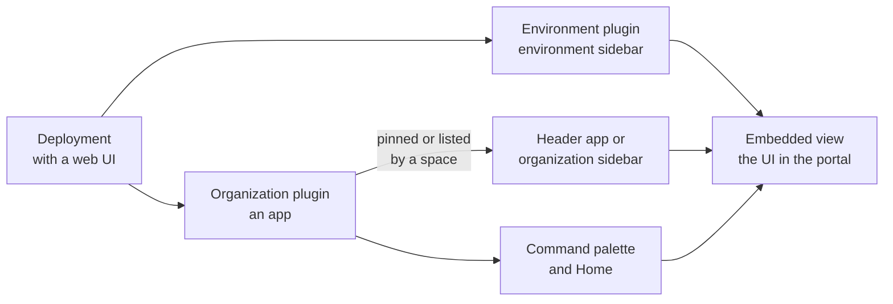
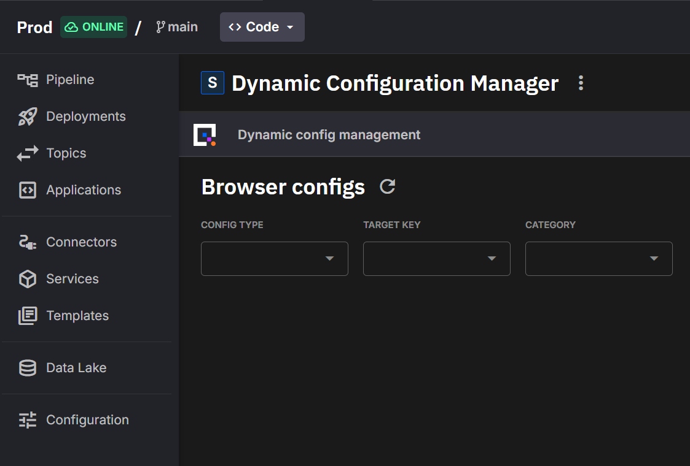
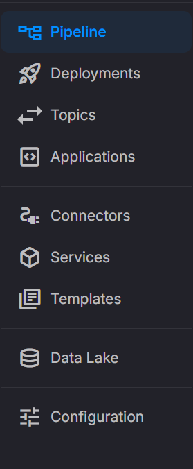
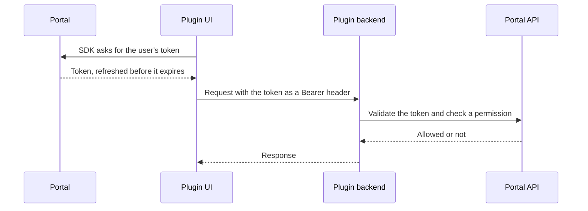

# Plugin system

A **plugin** is a deployment whose web UI opens inside the Quix Cloud portal. Plugins put tools such as configuration panels, dashboards, test managers and operations consoles next to the pipelines they belong to, so users don't switch to another site or sign in again.

Any deployment that serves a web UI over HTTP can be a plugin. Its plugin settings live on the deployment and decide where it appears in the portal. Quix sign-in and permissions come with it: the portal passes the signed-in user's token to your UI, and your backend can check what that user is allowed to do in Quix. See [Authentication and authorization](#authentication-and-authorization).

<a id="what-it-does"></a>

## Where a plugin appears

A plugin has three parts. You turn on only the ones you need:

* The **embedded view** is the deployment's web UI, shown in an iframe inside the portal. Wherever users open the plugin from, this is what they see.
* An **environment plugin** has an item in the sidebar of the environment it runs in. Only people working in that environment see it.
* An **organization plugin** is available across the organization, outside its own environment. The portal shows it as an **app**. Users can always find it by searching, and [spaces](../spaces/overview.md) decide whether it also appears in the header or the organization sidebar.


```mermaid
flowchart LR
    D["Deployment<br/>with a web UI"] --> E["Environment plugin<br/>environment sidebar"]
    D --> O["Organization plugin<br/>an app"]
    O -->|"pinned or listed<br/>by a space"| H["Header app or<br/>organization sidebar"]
    O --> C["Command palette<br/>and Home"]
    E --> V["Embedded view<br/>the UI in the portal"]
    H --> V
    C --> V
```

Every route leads to the embedded view, so almost every plugin turns it on. Without it, an environment plugin opens the deployment's details page, and an organization plugin opened from a space shows an empty page.

### Embedded view

{width=80%}

Above the plugin, a title bar shows the deployment's icon and name. Inside the environment, users who can access the deployment's settings also get an `Embedded view` / `Details view` toggle there, to switch between the plugin and the deployment's details page. Hiding the title bar (`hideHeader`) lets the plugin fill the whole panel.

Making the embedded view the default view (`default`) decides what opening the deployment does. When it's on, the pipeline, the environment sidebar and, outside a space, the command palette open the plugin. When it's off, they open Deployment details. The expand button in the pipeline's side panel always opens Deployment details.

The same embedded view opens at one of two portal addresses, depending on where it's opened from:

| Portal URL | Opened from | Layout |
|---|---|---|
| `/pipeline/deployments/<deployment-id>/embedded?workspace=<environment-id>` | The pipeline, the environment sidebar and Deployment details | Inside the environment, with the environment sidebar |
| `/apps/<deployment-id>` | Header apps, organization sidebar entries, the command palette, the `Apps` list on `Home`, and a space's landing page | In a space, beside the organization sidebar, unless the space hides it. Outside a space, full screen with the header and no sidebar. |

Anything after the plugin's address is passed to the plugin as a path, so `/apps/<deployment-id>/alarms` opens the plugin's `/alarms` page. See [Embedded view URL](#embedded-view-url). Older links in the form `/plugins/details/<deployment-id>` still work: the portal redirects them to `/apps/<deployment-id>`, keeping the path, query and fragment.

While the deployment isn't running, the embedded view shows the deployment's state in place of the plugin: starting, deploying, failed, or stopped with a `Start` button.

<a id="environment-sidebar"></a>

### Environment plugins



An environment plugin adds an item to a `Plugins` section of its environment's sidebar, below the built-in modules. Items are sorted by `environmentItem.order`, lowest first, and the list updates as deployments are created and deleted.

Environment plugins are scoped to their environment: someone working in another environment doesn't see them. To reach users outside the environment, also make the deployment an [organization plugin](#organization-plugins). One deployment can be both.

## Configure a plugin

Plugin settings belong to the deployment, under a `plugin` block with one optional sub-block per part. The deployment dialog and `quix.yaml` edit the same settings, so a change in one shows in the other.

```yaml
deployments:
  - name: Config Manager
    application: config-manager
    version: latest
    deploymentType: Service
    publicAccess:
      enabled: true                # Required for the embedded view of a non-managed deployment
      urlPrefix: config-manager
    plugin:
      embeddedView:
        enabled: true              # Show the web UI inside the portal
        hideHeader: false          # true hides the title bar above the plugin
        default: true              # Open the embedded view instead of Deployment details
      environmentItem:
        show: true                 # Make this an environment plugin
        label: "Configuration"
        icon: "tune"               # Google Material icon code
        order: 1                   # Lower values appear higher
        badge: "Alpha"
      organisationItem:
        show: true                 # Make this an organization plugin
        label: "Configuration"
        icon: "tune"
        badge: "Alpha"
```

<a id="yaml-configuration"></a>
<a id="configure-in-yaml"></a>

### Plugin keys

| Key | Default | What it does |
|---|---|---|
| `embeddedView.enabled` | `false` | Turns on the embedded view. |
| `embeddedView.hideHeader` | `false` | Hides the title bar above the plugin. |
| `embeddedView.default` | `false` | Opens the embedded view, not Deployment details, when users open the deployment. |
| `environmentItem.show` | `false` | Makes the deployment an environment plugin. |
| `environmentItem.order` | None | Position in the environment's `Plugins` section, lowest first. Set it on every environment plugin: items without one don't sort in a predictable place. |
| `organisationItem.show` | `false` | Makes the deployment an organization plugin. |
| `label` | The deployment name | Under either item: the name shown for the plugin. |
| `icon` | `extension` | Under either item: a [Google Material Icons](https://fonts.google.com/icons){target=_blank} code, such as `tune` or `fact_check`. |
| `badge` | None | Under either item: a short tag shown next to the name, such as `Beta`. |

`organisationItem` has no `order`, because each space sets the order of its own header apps and sidebar entries. The key is spelled with an "s". Quix skips unknown keys under `plugin` without an error, so a misspelled key makes the plugin silently not appear.

Keep labels and badges short. The deployment dialog limits them to 25 characters, and longer text is truncated in the sidebar and header.

!!! note "Renamed keys"

    `environmentItem` and `organisationItem` replace the old keys `sidebarItem` and `globalItem`. Quix Cloud still reads the old keys, and writes the new ones the next time it saves `quix.yaml`. If a deployment has both, the new key wins. Tools built on older Quix packages, including older versions of the Quix CLI, ignore the new keys and lose these settings, so update the Quix CLI first.

    The old names survive in two places. The Portal API's JSON still uses `plugin.sidebarItem` and `plugin.globalItem`, and the `Plugin` section of the Deployment details page labels the two items `Sidebar item` and `Global item`.

### Configure in the deployment dialog

The deployment dialog has a toggle for each part in `Plugin Settings` on its `Advanced` tab, with the same fields as the YAML. A few things it doesn't make obvious:

* **A deployment that isn't a managed service needs public access.** Its embedded view loads from its public URL, so without `Public access` in `Network settings` the embedded view has nothing to load. See [Deploy a public service](../deployments/deploy-public-page.md).
* **Turning a part off deletes its settings.** The dialog saves only the parts that are on. Once you save with a part off, its label, icon, badge and order are gone from the deployment, not just hidden.
* **The default view starts on.** For a new deployment, the dialog turns on `Use as default view` (`embeddedView.default`). In YAML it defaults to `false`.

If you deploy from a code sample that includes plugin settings, the dialog starts with them.

### Managed services

When you deploy a managed service that Quix defines as a plugin, and you don't set `plugin` yourself, Quix enables its embedded view and makes it the default view. Your own `plugin` settings replace these defaults. If you later remove your plugin settings, Quix restores the defaults rather than removing the embedded view.

<a id="what-are-global-plugins"></a>
<a id="when-to-use-global-plugins"></a>
<a id="global-plugins"></a>

## Organization plugins

An **organization plugin** is a deployment that users can reach from anywhere in the organization, not only from the environment it runs in. It suits a tool that serves people outside its project, such as a test manager, a monitoring dashboard or an operations console. Organization plugins were previously called global plugins.

The portal shows an organization plugin as an app. Turn on its embedded view and make it the default view as well, so it opens as an app wherever users reach it.

The portal groups organization plugins that share a project and a deployment name into one app. Each deployment in the group, typically one per environment, is an **instance** of the app. A header pin, sidebar entry or landing page opens the instance the space chose, and where an app has more than one instance, the [plugin toolbar](#plugin-toolbar) lets users switch between them.

### Available is not pinned

Making a deployment an organization plugin makes it *available* across the organization. It doesn't put the app anywhere on screen. Organization admins place it with [spaces](../spaces/overview.md): a space can pin it to the header, list it in the organization sidebar, or use it as the landing page. See [Pin header apps](../spaces/navigation.md#pin-header-apps).

<a id="where-global-plugins-appear"></a>

### Where organization plugins appear

| Place | In a space | Without a space |
|---|---|---|
| Header app strip | Only the apps the space pins, in the order the space sets. | Empty, except for [Operator-only users](#operator-only-users-deprecated). |
| Organization sidebar | Where the space lists the app. | Not listed. |
| Landing page | When the space uses the app as its landing page. | Not used. |
| Command palette, and the `Apps` list on `Home` | Every organization plugin the user has access to. | Every organization plugin the user has access to. |

"Without a space" covers organizations that don't use spaces, users who belong to no space, and organization admins who switch to Spaceless. A space curates the header and the organization sidebar, but search always finds every app a user can open. The `Apps` list on `Home` is shown to users who aren't organization admins.

The header app strip appears only on organization-level pages, such as `Home` and `Projects`. Inside a project, the header shows the project and environment instead.

<a id="how-the-globalitem-settings-are-used"></a>
<a id="how-the-organisationitem-settings-are-used"></a>

The `organisationItem` settings describe the app wherever it appears, and a space decides where that is. An organization admin can give a header pin or sidebar entry its own label and icon, but the badge always comes from the deployment. If a deployment stops being an organization plugin, its header pins disappear and its sidebar entries show as disabled, with the tooltip `This app is not available right now`.

### Permissions and access control

Access to an organization plugin comes from roles, never from spaces:

* To see and open an organization plugin, a user needs `plugin:read` in the environment the plugin runs in. Plugin permissions apply per environment, not per deployment, and the user doesn't need `workspace:read` there.
* The Admin, Manager and Editor roles grant `plugin:*`, and the Viewer role grants `plugin:read`. The narrowest choice is the Viewer role assigned at the environment level. See [Permission levels](../roles.md#permission-levels).
* A space that pins an app doesn't give anyone access to it. Users without access don't see the app in the header or the command palette, and see a sidebar entry for it as disabled.

<a id="what-operator-only-users-see"></a>
<a id="operator-only-users-deprecated"></a>

!!! warning "The Operator role is deprecated"

    The Operator role grants `plugin:*` and nothing else. Existing assignments still work. An Operator-only user, with no Admin, Manager, Editor or Viewer role, can open any app at `/apps/<deployment-id>`, including a space's header apps. Any other page sends them to their first organization plugin, and they always see plugins full screen, never beside the organization sidebar. Without a space, their header lists every app they can access. The portal checks the role once per session, so a role change applies after the user reloads the portal.

    Don't assign the role to new users. To give users a plugin-only view, use a space and the Viewer role instead. See [Replace the Operator role with a space](../spaces/replace-operator-role.md).

## Plugin toolbar

Every embedded view has a floating button in its bottom-right corner, the **plugin toolbar**. It's the way back to the rest of the portal from a plugin that hides its title bar or opens full screen. Its menu also acts on the plugin itself: reload it, open it in a new tab, copy a link to the current page, switch instance, open or restart the deployment, and search the portal. Actions on the deployment need access to its settings, and pages a space hides drop out of the menu.

The toolbar shows the plugin's `organisationItem` label and icon, even when the plugin is opened from the environment sidebar, and falls back to the deployment name and the `extension` icon.

Users can drag the button, and the browser remembers where. It can still cover part of your plugin, so keep essential controls away from the bottom-right corner. A user can hide it until the page reloads, and an organization admin can turn it off for everyone in a space.

## Embedded view URL

The embedded view loads from a URL that Quix derives for the deployment. You don't set it in YAML.

| Deployment | Embedded view URL |
|---|---|
| Managed service | Set by Quix, from the deployment ID and the environment's public URL. |
| Any other deployment | The deployment's public URL. Without public access (`publicAccess.enabled`), there's no URL to load. |

The Portal API returns it as `plugin.embeddedViewUrl` when the embedded view is enabled. It lists environment plugins at `GET /workspaces/<environment-id>/plugins`, and the organization plugins the signed-in user can access at `GET /plugins/global`.

Two server-side problems stop the plugin from loading:

* **Frame headers.** If your server sends `X-Frame-Options`, or a `Content-Security-Policy` `frame-ancestors` directive that doesn't include the portal's origin, the browser shows a blank iframe or reports that the site refused to connect. Security middleware often sets these headers by default.
* **A `404` at the root.** When it opens the plugin, the portal sends a `GET` request to the embedded view URL. If your server answers `404 Not Found`, the portal shows `Embedded service not available` in place of the iframe. Other errors don't block it.

### What the portal adds to the URL

The portal doesn't load the embedded view URL as it is. It builds the iframe address from:

1. **The plugin path.** Anything after the plugin's portal URL is appended to the URL's path, and a `#fragment` is kept. For example, the portal URL `/apps/<deployment-id>/alarms` loads `<embedded-view-url>/alarms`.
2. **The portal's query parameters.** Every query parameter on the portal URL is forwarded. In the environment, this includes `workspace=<environment-id>`. Query parameters that your plugin adds to its own URL through the SDK are merged into the portal URL, so they're forwarded again after a refresh. The portal never removes a parameter: one that your plugin drops from its URL stays in the portal URL and comes back on the next load. Treat parameters as additive, or set an explicit empty or default value instead of removing one.
3. **Three parameters for the plugin.** The portal sets these last, so they override any parameter with the same name, and strips them from its own address bar:

    | Parameter | Value | Purpose |
    |---|---|---|
    | `isIframe` | `true` | Marks the page as loaded inside the portal. |
    | `portalOrigin` | The portal's origin, for example `https://<your-portal-domain>` | The only origin the Quix Plugin SDK accepts navigation and theme messages from. |
    | `theme` | `light` or `dark` | The portal's color mode when the iframe loads, so the plugin can paint in the right mode from the start. Later changes arrive as messages, without a reload. The portal doesn't resend the mode to a page that your plugin loads itself, such as after a plain link or a reload. |

For example, opening `/pipeline/deployments/<deployment-id>/embedded/runs/42?workspace=<environment-id>` in the portal loads this iframe address:

```text
<embedded-view-url>/runs/42?workspace=<environment-id>&isIframe=true&portalOrigin=https%3A%2F%2F<your-portal-domain>&theme=dark
```

The [Quix Plugin SDK](plugin-sdk.md) reads `portalOrigin` and `theme` for you. See [Theme](plugin-sdk.md#theme) and [Security model](plugin-sdk-internals.md#security-model).

### Serve every path from your app

A deep link or a browser refresh requests the plugin path from your server, such as `/runs/42`. Serve your plugin from the root of its origin, and answer every route with your entry page and a `200` status. For path routing, catch-all routes and asset URLs, see [Navigation](plugin-sdk.md#navigation).

### Stay on the embedded view origin

The portal exchanges messages only with the origin of the embedded view URL. If your plugin redirects the iframe to another origin, such as an external sign-in page, the portal ignores that page: it gets no token and its navigation isn't mirrored. Keep the pages that need the token on the embedded view origin.

<a id="quick-start"></a>
<a id="what-the-sdk-does"></a>
<a id="auth-handshake"></a>
<a id="url-synchronisation"></a>
<a id="api-reference"></a>
<a id="token-refresh-and-expiration"></a>
<a id="verifying-the-sdk-is-loaded"></a>
<a id="migrating-from-the-manual-postmessage-integration"></a>

## Quix Plugin SDK

To connect your plugin's UI to the portal, use the [Quix Plugin SDK](plugin-sdk.md), a small JavaScript library that the portal serves. It passes your UI the signed-in user's token and keeps it fresh, keeps the portal URL and your plugin's routes in step, and follows the portal's light or dark mode.

<a id="authentication-and-authorization-recommended"></a>

## Authentication and authorization

Authentication is optional. Use it when you want your plugin to reuse Quix sign-in and permissions: users don't sign in to your plugin separately, and your plugin enforces the same user and environment permissions as the rest of Quix Cloud.

Your UI receives the user's token from the portal, but only your backend can trust it. The backend validates every request against the Portal API:


```mermaid
sequenceDiagram
    participant P as Portal
    participant U as Plugin UI
    participant B as Plugin backend
    participant A as Portal API
    U->>P: SDK asks for the user's token
    P-->>U: Token, refreshed before it expires
    U->>B: Request with the token as a Bearer header
    B->>A: Validate the token and check a permission
    A-->>B: Allowed or not
    B-->>U: Response
```

Your plugin's UI can get the token in two ways:

=== "SDK token (recommended)"

    The [Quix Plugin SDK](plugin-sdk.md) asks the portal for the signed-in user's token, requests a new one before it expires, and passes each token to your `onToken` callback:

    ```html
    <script src="https://<your-portal-domain>/static/sdk/quix-plugin.js"></script>
    <script>
      let authToken = null;

      QuixPlugin
        .init()
        .onToken((token) => {
          // Runs with the first token and again after every refresh.
          authToken = token;
        });
    </script>
    ```

    Send the token as `Authorization: Bearer <token>` when you call Quix APIs, or to your own backend to validate there. To wait for the first token before your first request, see [Quick start](plugin-sdk.md#quick-start). For refresh, and what to do when no token arrives, see [Authentication token](plugin-sdk.md#authentication-token).

=== "Cookie"

    When a user is signed in, the portal also stores their access token, a JWT, in a cookie named `quix_access_token`. It's scoped to the Quix domain that the portal runs under and all its subdomains, which include the Portal API's host. If the portal's host isn't under that domain, the cookie is set for the portal's host only. It's set with `SameSite=Lax`, and with `Secure` over HTTPS.

    A few Portal API endpoints accept the cookie in place of an `Authorization` header: workspace file content, such as Markdown, images, CSS and PDF files, and library template files. This is useful for files the browser loads directly. Every other endpoint requires the header.

    !!! warning "Any backend under the same domain receives the cookie"

        The browser sends the cookie to every host under its domain. If your deployment's public URL is under that domain, your backend receives the user's token with every request, and so does any other backend there. Treat the cookie as a credential: don't log it, and validate the token on your server before you trust it.

    !!! warning "The cookie stays current only while the portal is open"

        The portal rewrites the cookie whenever it gets a new token for its own session. Nothing refreshes it for your plugin, so once the token expires, requests that rely on it fail with authentication errors. Handle `401` responses, for example by asking the user to reload the portal page, or use the SDK token instead.

    Even if you use the cookie, include the [Quix Plugin SDK](plugin-sdk.md) so that your plugin's routes and theme stay in step with the portal.

### How to handle the token in the backend

Validate the token on your backend for every request. Don't trust a token only because your UI received it: the SDK accepts a token from whichever page embeds your plugin. See [Security model](plugin-sdk-internals.md#security-model).

To validate and authorize requests against Quix, install the Quix Portal helper package, `quixportal`, from the public feed:

```bash
pip install -i https://pkgs.dev.azure.com/quix-analytics/53f7fe95-59fe-4307-b479-2473b96de6d1/_packaging/public/pypi/simple/ quixportal
```

Then, in your backend service, validate the token and enforce authorization for each request. For example:

```python
import os
from quixportal.auth import Auth

# Instantiate the authentication client. By default it reads
# the Portal API URL from the environment variable Quix__Portal__Api
auth = Auth()

# The token arrives in the request header
# Authorization: Bearer <token>
token = ...

# Example to obtain "Read" access to the "Workspace" resource
resource_type = "Workspace"
workspace_id = os.environ["Quix__Workspace__Id"]
permissions = "Read"

# Authorize the token bearer to access the resource
if auth.validate_permissions(
    token=token,
    resourceType=resource_type,
    resourceID=workspace_id,
    permissions=permissions,
):
    print("Bearer is authorized to access the resource")
else:
    print("Bearer is not authorized to access the resource")
```

Quix injects `Quix__Portal__Api` and `Quix__Workspace__Id` into your deployment as environment variables. See [Quix variables](../deployments/quix-variables.md).

## Checking permissions programmatically

Your backend can also check a user's [permissions](../roles.md) directly with the Portal API.

### API endpoint

**Endpoint:** `GET /auth/permissions/query`

Send the user's token in the `Authorization: Bearer <token>` header.

| Parameter | Type | Description |
|-----------|------|-------------|
| `resourceType` | enum | The type of resource to check. See [Resource types](#resource-types). |
| `resourceId` | string | The ID of the specific resource. |
| `permission` | enum | The permission to check. See [Permission types](#permission-types). |

**Returns:** `true` if the user has the permission, `false` otherwise.

For example, to check whether the user can read an environment, where `<portal-api-url>` is the value of `Quix__Portal__Api`:

```bash
curl -H "Authorization: Bearer <token>" \
  "<portal-api-url>/auth/permissions/query?resourceType=Workspace&resourceId=<environment-id>&permission=Read"
```

### Resource types

| Resource type | Resource ID | Description |
|---------------|------------|-------------|
| `Organisation` | Organization ID | Organization-level settings |
| `Repository` | Repository ID | Git repository access |
| `Workspace` | Workspace ID | Environment access |
| `Topic` | Workspace ID | Topic management within an environment |
| `Deployment` | Workspace ID | Deployment access within an environment |
| `User` | User ID | User management |
| `Session` | Session ID | IDE session access |
| `Plugin` | Workspace ID | Plugin access within an environment |

### Permission types

| Permission | Description |
|------------|-------------|
| `Create` | Create new resources |
| `Read` | View resources |
| `Update` | Modify resources |
| `Delete` | Remove resources |
| `Write` | Write data (streaming operations only) |
| `All` | Every permission above |

## See also

* [Quix Plugin SDK](plugin-sdk.md): pass the token, navigation and theme between the portal and your plugin's UI.
* [How the Quix Plugin SDK works](plugin-sdk-internals.md): security model, message protocol and version history.
* [Roles and permissions](../roles.md): the roles that grant access to plugins.
* [Spaces](../spaces/overview.md): choose which organization plugins each group of users sees in the header and sidebar.
* [Personal access tokens](../access-security/personal-access-token.md): tokens for scripts and local development.
* [Portal API](../apis/portal-api/overview.md): the API your plugin can call with the token.
