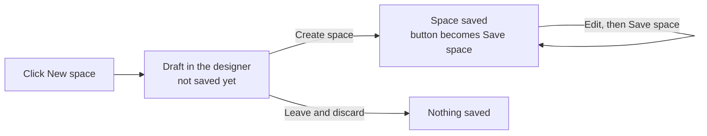

# Create and manage spaces

**The Spaces page** is where organization admins create, design and organize every space in the organization. You build each space in the **space designer**, which shows a live preview of what members see. Nothing reaches members until you save.

For the sidebars, header apps and landing page, see [Design navigation](navigation.md). For assigning people, see [Assign members](membership.md).

## Before you start

You need the `Admin` role at organization level to manage spaces. Other users never see the `Spaces` item. If they open the page's address directly, the portal redirects them.

Admins are members too, so your active space can hide `Spaces` from you. If that happens, switch to Spaceless from the space chip in the header. See [Switch to Spaceless](use-spaces.md#switch-to-spaceless).

## Open the Spaces page

*(Organization admins — `Spaces` in the organization sidebar.)*

In the organization sidebar, select `Spaces`. In the standard sidebar, it's under the `Users` heading.

The Spaces page opens with one card for each space, in the organization's order. If there are no spaces yet, the page shows `No spaces yet` and a `New space` button.

You can also get to your spaces from two other places:

* On the organization `Home` page, the `Spaces` panel has a `Design →` link to the Spaces page, and a row for each space that opens its designer.
* In the space chip menu in the header, the pencil button next to each space opens that space's designer without switching you into it. Its tooltip is `Edit {space name}`.

## Create a space

*(Organization admins — Spaces page.)*

A new space starts as a **draft** that exists only in your browser. It isn't saved until you click `Create space`, so if you leave without creating it, no empty space is left behind. Create the space first, then design its navigation and assign members: `Preview` works only on a saved space.

1. On the Spaces page, click `New space`.

    The space designer opens on the `Identity` section, with a draft called `New space`.

2. In `Name`, enter a name that tells members which view they're in, for example `Line operations`. `Create space` stays disabled while `Name` is blank.
3. Optionally, set the rest of the identity. See [Set the identity](#set-the-identity).
4. Click `Create space`.

The space is saved and appears on the Spaces page. You stay in the designer, and the button changes to `Save space` for any further changes. If the create fails, the portal shows an error and keeps your draft so you can try again.

Nobody works in the space until you assign members. See [Assign members](membership.md).

### What a new space starts with

A new space curates nothing. Its members see the same portal as Spaceless: the standard sidebars and no header apps.

| Setting | Starting value |
|---|---|
| Name | `New space` |
| Description | Empty |
| Icon | `layers` |
| Accent | Blue |
| Theme | `Members choose their theme` on |
| Header apps | `None`: no apps pinned |
| Organization sidebar | `Stock` |
| Environment | `Stock` |
| Landing page | `Home` |
| Membership | No groups and no direct members |
| Plugin toolbar | Shown |

### Next steps

1. [Design navigation](navigation.md): choose the header apps, sidebars and landing page.
2. [Assign members](membership.md): bind permission groups and add users.
3. [Preview the space as a member](#preview-a-space-as-a-member) to check what members see.

## Find your way around the designer

The designer has three panes, from left to right:

1. **Section list.** The seven sections of a space. Each shows a one-line summary of its current setting. Click a section to open it.
2. **Live preview.** A miniature of the portal as a member of this space sees it, updated as you edit. When you choose a landing page other than `Home`, the preview's caption ends with it, for example `lands on Projects`. You can edit sidebar rows and header apps directly in the preview. See [Edit in the live preview](navigation.md#edit-in-the-live-preview).
3. **Inspector.** The settings for the selected section.

Above the panes, the page header shows the space's icon, name and description, and three buttons:

* `Preview` opens the saved space as a member sees it. See [Preview a space as a member](#preview-a-space-as-a-member).
* `Cancel` returns to the Spaces page.
* `Create space` for a new space, or `Save space` for an existing one, saves your changes.

The sections appear in this order:

| Section | What it controls | Where it's documented |
|---|---|---|
| `Identity` | Name, description, accent color, icon and theme. | [Set the identity](#set-the-identity) |
| `Header apps` | The plugin apps pinned to the header, in order. | [Pin header apps](navigation.md#pin-header-apps) |
| `Organization sidebar` | The modules, plugin apps, environment links and headings in the organization sidebar. | [Design the organization sidebar](navigation.md#design-the-organization-sidebar) |
| `Environment` | The modules inside every environment, including the YAML sync button and the `Settings` row. | [Choose the environment modules](navigation.md#choose-the-environment-modules) |
| `Landing page` | Where members arrive after they sign in. | [Choose a landing page](navigation.md#choose-a-landing-page) |
| `Membership` | Which permission groups and users belong to the space. | [Assign members](membership.md) |
| `Dev tools` | Whether the floating plugin toolbar appears over embedded apps. | [Hide the plugin toolbar](#hide-the-plugin-toolbar) |

## Set the identity

*(Organization admins — space designer, `Identity` section.)*

A space's identity tells members which view they're in. The accent color draws a thin line across the top of the header and tints the selected item in the sidebars, the space chip and the space's card. It doesn't change the portal's own colors or anyone's theme.

1. In the section list, select `Identity`.
2. In `Name`, enter the space's name. Members see it in the space chip in the header.
3. In `Description`, optionally describe the space. Members see it in the space chip's tooltip. If you leave it empty, the designer header shows `No description yet — add one in Identity.`
4. Under `Accent`, click the color swatch and choose a color. See [Choose an accent color](#choose-an-accent-color).
5. Under `Icon`, click the icon and choose one. You can browse by category or type in `Search icons...`.
6. Optionally, set one theme for every member. See [Set the theme](#set-the-theme).
7. Click `Save space`, or `Create space` for a new space.

The designer header, the section list and the live preview update as you type. Members see the new identity once you save.

### Choose an accent color

The accent picker offers seven preset colors: Blue, Purple, Green, Amber, Orange, Pink and Aqua. Blue is the default. Hover over a preset to see its name. [Accent colors](reference.md#accent-colors) lists their hex values.

To use a custom color, do one of these in the picker:

* Drag in the saturation and brightness field, and along the hue slider.
* Type a value in the `Hex` field, for example `#1a7f5a`.
* Click the eyedropper button, whose tooltip is `Pick from screen`, to sample a color from anywhere on screen. This button appears only in browsers that support it.

In the light theme, the portal uses a darker shade of the accent for text and icons, so the accent stays readable. Choose a color that is distinct from your other spaces, so members can tell spaces apart at a glance.

### Set the theme

By default, members choose their own light or dark theme. You can set one theme for everyone in the space instead, for example a dark theme for a control-room screen.

1. In the `Identity` section, turn off `Members choose their theme`.

    A switch with three options appears: `Auto`, `Light` and `Dark`. `Dark` is selected by default.

2. Select the theme members get:

    * `Auto` follows each member's device setting. Members can't override it with the portal's theme switch.
    * `Light` always uses the light theme.
    * `Dark` always uses the dark theme.

3. Click `Save space`.

Members of the space get the theme you chose, and their theme switch is disabled. Their own theme choice isn't overwritten: they get it back when they leave the space or when you turn `Members choose their theme` back on. See [Theme set by your space](use-spaces.md#theme-set-by-your-space) for what members see.

The designer remembers your choice of `Auto`, `Light` or `Dark` if you turn the toggle on and off again.

## Hide the plugin toolbar

*(Organization admins — space designer, `Dev tools` section.)*

The **plugin toolbar** is the floating button that appears over an embedded plugin app. It opens the portal menu and gives members a way back out of the app. It's shown by default. Hide it when members work in one app and the button gets in the way.

!!! warning "Leave members a way out"

    Without the toolbar, members leave an embedded app only with the command palette (++cmd+k++ on macOS, ++ctrl+k++ on Windows and Linux) or from a header app. If the space has no header apps, keep the toolbar.

1. In the section list, select `Dev tools`.
2. Turn off `Plugin toolbar`.

    A note appears in the inspector to remind you how members leave an embedded app without the toolbar.

3. Click `Save space`.

Members of the space no longer see the plugin toolbar. Where the toolbar is shown, each member can drag it to a new position, or hide it until they refresh the page.

## Save your changes

*(Organization admins — space designer.)*

Click `Save space`. The space is saved and you stay in the designer. Members who are signed in get the change without reloading the page.

`Save space` is disabled when:

* You haven't changed anything since the last save.
* `Name` is blank.
* Another space change is still being saved.

If a save fails, the portal shows an error and keeps your edits, so you can try again.

### Leave with unsaved changes

If you leave the designer with unsaved changes, for example by clicking `Cancel` or the `Spaces` breadcrumb, the designer asks what to do:

| Situation | Dialog title | Buttons |
|---|---|---|
| Existing space with unsaved changes | `Unsaved changes` | `Keep editing` stays in the designer. `Discard changes` leaves without saving. |
| New space that hasn't been created | `Space not created` | `Keep editing` stays in the designer. `Discard space` leaves, and the draft is lost. |

A new draft you haven't changed closes without a prompt.

## Preview a space as a member

*(Organization admins — Spaces page, or the space designer.)*

Preview shows you the real portal as a member of a space sees it, including its sidebars, landing page and theme, without adding yourself to the space. Use it to check a space before you assign people, or after you change it.

To start a preview, do one of the following:

* On the space's card on the Spaces page, click the eye button (tooltip `Preview as member`), or open the card's **⋮** menu and select `Preview as member`.
* In the space designer, click `Preview` at the top of the page.

The portal opens on the space's landing page, as it is for members. A banner shows the space's icon and name, with the text `Previewing as member — this is what members of this space see` and an `Exit preview` button.

Preview always shows the **saved** space. In the designer, `Preview` is disabled in these cases, and its tooltip explains why:

| Tooltip | Why |
|---|---|
| `Create the space before previewing it` | The space isn't created yet. |
| `Save to preview` | You have unsaved changes. |
| `You’re in this space — the shell around you is already the live view` | The space is your active space, so the portal around the designer already shows it. |

While you preview:

* The admin-only `Spaces`, `Settings` and `Audit` items are hidden, as they are for members.
* Visiting a page the space doesn't include redirects you to its landing page, as it does for members.
* The space's theme and plugin toolbar settings apply.
* You keep your own role. Preview shows what the space presents, not what a particular member's role allows, so a page a member can't open may still open for you.

To end the preview, click `Exit preview`. The portal returns you to the Spaces page. Choosing a space or `Spaceless` from the space chip also ends the preview.

## Manage your spaces

*(Organization admins — Spaces page.)*

### What each card shows

Each card on the Spaces page summarizes one space, so you can compare spaces at a glance. Click a card to open the space in the designer.

| Part of the card | What it tells you |
|---|---|
| Icon, name and description | The space's identity. The icon tile uses the space's accent color. |
| `Audience` | Who is in the space: the first bound permission group, the number of other groups, and the number of direct members. Hover to see every group with its number of users. `No audience yet — bind a group or add users` means nobody works in the space yet. |
| `Shell` | The shape of the portal members get. `Platform default` means nothing is curated. `Portal mode — header apps only` means the space hides every built-in module in both the organization sidebar and the environment. `Custom` lists what is curated, such as `org 5/9 · env 14/14 · 3 pinned`. Hover for a line per section. |
| `Landing` | Where members arrive. `Product home` means the landing page is `Home`, the default. A page or app name means you chose a landing page. `unavailable` in red means the landing app no longer exists, so members fall back to the home page. |
| Footer | The member count, or `No audience`, and the date the space was last updated. |
| Eye button | Starts a preview of the space as a member. Its tooltip is `Preview as member`. |
| Menu button | Opens the card menu: `Open designer`, `Duplicate space`, `Move up`, `Move down`, `Preview as member` and `Delete`. |

The member count adds the number of users in each bound group to the direct members. A user who is in a bound group and is also a direct member is counted twice.

### Find a space

Type in the `Search spaces by name or description...` box. The grid shows only the spaces whose name or description contains your search text. The search ignores case. If nothing matches, the page shows `No spaces match your search.`

### Reorder spaces

The order of the cards is the organization's space order. It's shared by every admin and every member: each member's space chip menu lists their spaces in this order. Put the spaces people use most at the top.

To move a space:

1. Clear the search box, if it has text in it. While a search is active, the page shows `Reordering off while searching`, and the move controls are unavailable.
2. Drag the card to its new position.

    Or, to use the keyboard, open the card's menu and select `Move up` or `Move down`.

The new order is saved immediately. There is no separate save step. If the save fails, the cards return to their previous order and the portal shows an error.

### Duplicate a space

Duplicating is the quickest way to build a variation of an existing space, for example a second line operations space for another site.

The copy has the same description, icon, accent, theme, sidebars, header apps, custom sidebar entries, landing page and plugin toolbar setting as the original. Membership is copied only if you ask for it.

1. On the space's card, open the menu and select `Duplicate space`.

    The `Duplicate space` dialog opens. The `Name` field is filled in with the space's name followed by `(copy)`.

2. In `Name`, enter a name for the new space. It's required and can be up to 100 characters. Names don't have to be unique, so choose a name members can tell apart.
3. Leave `Copy membership` cleared if the copy is for a different audience. If you select it, every member of the original immediately sees the new space in their space chip menu.
4. Click `Duplicate`.

The new space appears at the end of the list, and a message confirms `{new name} created from {source name}`. Click `Open` in that message to open the new space in the designer. If the duplicate fails, the dialog stays open and shows the error.

### Delete a space

!!! warning "Deleting a space is permanent"

    You can't undo a delete. Members who are working in the space move to their next space, or to the standard portal if they have none. Permissions don't change.

1. On the space's card, open the menu and select `Delete`.

    The `Delete space?` dialog opens.

2. In the dialog's text box, type the space's name exactly as shown.
3. Click `Delete space`.

The space is removed from the Spaces page. If the delete fails, the dialog stays open and the portal shows an error.

## See also

* [Spaces overview](overview.md)
* [Design navigation](navigation.md)
* [Assign members](membership.md)
* [Work in a space](use-spaces.md)
* [Spaces reference](reference.md)
