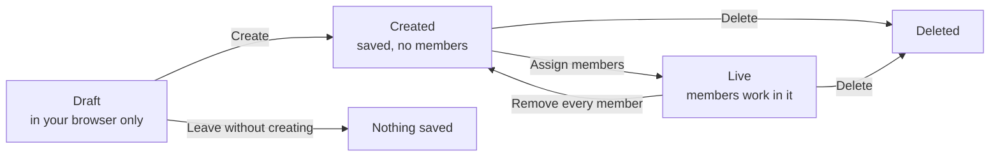

# Create and manage spaces

Organization admins build every space on the **Spaces page**, in the **space designer**. The designer pairs each setting with a live preview of the portal as members of the space will see it. This page covers how a space comes into being, its identity and theme, the plugin toolbar, previewing, and how to manage spaces once you have several.

Only users with the `Admin` role at organization level can manage spaces. Your active space shapes your own portal too, so it can hide `Spaces` from you. See [Admins are members too](overview.md#what-a-space-doesnt-control).

For sidebars, header apps and the landing page, see [Design navigation](navigation.md). For assigning people, see [Assign members](membership.md).

## How a space comes into being

A new space starts as a **draft** that exists only in your browser. You can shape all of it in the designer, from identity to navigation to membership, but nothing reaches the server until you create the space. If you leave without creating it, no empty space is left behind.

Creating the space saves the whole draft at once. From then on it's a real space, but it does nothing until it has members: a space with no audience appears in nobody's space chip menu, including yours. Once members are assigned, it's live.

```mermaid
flowchart LR
    A["Draft<br/>in your browser only"] -->|"Create"| B["Created<br/>saved, no members"]
    A -->|"Leave without creating"| X["Nothing saved"]
    B -->|"Assign members"| C["Live<br/>members work in it"]
    C -->|"Remove every member"| B
    B -->|"Delete"| D["Deleted"]
    C -->|"Delete"| D
```

Two consequences are worth planning around:

* **Members in a draft get the space the moment you create it.** If you bind user groups while the space is still a draft, those people see it as soon as it's created, before you've had a chance to preview it. To check a space first, create it without members, [preview it](#preview-a-space-as-a-member), then [assign members](membership.md).
* **Every save on a live space is live.** There is no separate publish step. Members who are signed in get the change without reloading the page. To rework a space that people depend on, [duplicate it](#duplicate-a-space) without its membership, make and preview your changes on the copy, then move people across.

A new space curates nothing. Until you change its navigation, its members see the same portal as Spaceless: the standard sidebars, no header apps and `Home` as the landing page.

<!-- The portal's designer help links still target these anchors on this page. The content lives in navigation.md. -->

## How the designer is organized

The designer has three panes:

* **Section list.** The space's settings, grouped into sections, each with a one-line summary of its current value. It works as a checklist of what the space changes.
* **Live preview.** A miniature of the portal as a member of this space sees it, updated as you edit. It's also an editor: you can rearrange and edit sidebar rows and header apps directly in it. See [Edit in the live preview](navigation.md#edit-in-the-live-preview).
* **Inspector.** The settings for the selected section.

The sections cover four areas:

| Area | Sections | Documented in |
|---|---|---|
| Identity | `Identity` | [Identity and theme](#set-the-identity) |
| Navigation | `Header apps`, `Organization sidebar`, `Environment`, `Landing page` | [Design navigation](navigation.md) |
| Audience | `Membership` | [Assign members](membership.md) |
| Embedded apps | `Dev tools` | [Plugin toolbar](#hide-the-plugin-toolbar) |

If you leave the designer with unsaved changes, it asks whether to keep editing or discard them. For a draft, discarding throws the whole space away.

## Identity and theme

A space's identity tells members which view of the portal they're in. It doesn't change what they can reach.

* **Name.** Members see it in the space chip in the header. Names don't have to be unique, so choose one that members can tell apart from their other spaces, such as `Line operations` rather than `Operators`.
* **Description.** Optional. Members see it in the space chip's tooltip.
* **Icon.** Appears beside the name in the space chip, in its menu and on the space's card.
* **Accent.** The space's identity color, described in [Key concepts](overview.md#key-concepts). You can pick a preset or any custom color. In the light theme, the portal automatically uses a darker shade of the accent for text and icons so that it stays readable.

For members who belong to several spaces, the accent and icon are the quickest way to tell spaces apart. Give each space a distinct accent.

### Theme

By default, each member chooses their own light or dark theme, and the space doesn't interfere. You can instead set one theme for everyone in the space, for example a dark theme for a control-room screen:

* `Light` or `Dark` applies that theme to every member, whatever their own setting.
* `Auto` follows each member's device setting.

When a space sets the theme, members' theme switch is disabled and tells them the space has set it. Their own choice isn't overwritten. They get it back when they switch to a space that doesn't set the theme, or when you hand the choice back to members. See [Theme set by your space](use-spaces.md#theme-set-by-your-space).

## Plugin toolbar

The **plugin toolbar** is the floating button that appears over an embedded plugin app. It opens a menu of portal shortcuts and gives members a way back out of the app. It's shown by default, and the `Plugin toolbar` setting in `Dev tools` turns it off for everyone in the space.

Hide it when members spend their time in one app and the button gets in the way, for example on a kiosk or a wall display. Where it's shown, each member can still move it or dismiss it until they refresh the page.

!!! warning "Leave members a way out"

    Without the toolbar, members leave an embedded app only with the command palette (++cmd+k++ on macOS, ++ctrl+k++ on Windows and Linux) or from an app pinned in the header. If the space has no header apps, keep the toolbar.

For plugin developers, see [Plugin toolbar](../services/plugin.md#plugin-toolbar).

## Preview a space as a member

The live preview in the designer is a miniature. **Preview** shows you the real portal as a member of the space sees it, without adding yourself to the space. Use it to check a space before you assign people, and after any change that affects them.

You can start a preview from the space's card on the Spaces page or from the designer. The portal opens on the space's landing page, with a banner that names the space and an `Exit preview` button. Exiting returns you to the Spaces page.

While you preview, the portal behaves as it does for members:

* The admin-only `Users`, `Spaces`, `Settings` and `Audit` items are hidden.
* Pages the space doesn't include send you to the space's landing page.
* The space's theme and plugin toolbar setting apply.

Two limits matter:

* **Preview shows the saved space.** It isn't available for a draft, or while the designer has unsaved changes. It also isn't available for your own active space, because the portal around the designer already shows that space.
* **Preview keeps your role.** It shows what the space presents, not what a particular member's role allows. A page that a member can't open may still open for you. Permissions come from [roles](../roles.md), not from the space.

## Manage spaces

The Spaces page shows one card for each space in the organization, in the organization's space order. You can also open any space's designer from the `Spaces` panel on `Home`, or from the edit button next to each space in the space chip menu, without switching into it.

### What each card shows

Each card summarizes a space so you can compare spaces at a glance:

* **`Audience`** is who is in the space: the bound user groups and the number of direct members. `No audience yet` means nobody works in the space.
* **`Shell`** is the shape of the portal members get. `Platform default` means nothing is curated. `Custom` summarizes what is, such as how many organization and environment modules are shown and how many apps are pinned. `Portal mode — header apps only` means the space hides every built-in module, so members work from header apps alone.
* **`Landing`** is where members arrive. It shows `unavailable` when the landing app no longer exists. Members then fall back to `Home`, or to the first sidebar entry if the space hides `Home`, with no other warning, so treat it as something to fix.

The member count on a card adds up the users in each bound group and the direct members. A user who is both in a bound group and a direct member is counted twice, so the count can be higher than the number of distinct people.

### Reorder spaces

The order of the cards is the organization's space order, shared by every admin and every member. Each member's space chip menu lists their spaces in this order, so put the spaces people switch to most often at the top.

You can reorder by dragging cards or from each card's menu. A new order is saved immediately and applies to everyone. Reordering is unavailable while a search filter is active on the Spaces page.

### Duplicate a space

Duplicating is the quickest way to build a variation of a space, for example the same line operations view for a second site, or a safe copy to rework before you move people across.

The copy has everything that shapes the portal: description, icon, accent, theme, sidebars, header apps, custom sidebar entries, landing page and plugin toolbar setting. You give it a new name, and it's added at the end of the space order.

Membership is copied only if you ask for it. If you copy it, every member of the original sees the new space in their space chip menu immediately. Leave it out when the copy is for a different audience, or when you want to preview it first.

### Delete a space

!!! warning "Deleting a space is permanent"

    You can't undo a delete. To confirm, you type the space's name.

When you delete a space, its members who were working in it move to another space they belong to, or to Spaceless if they have none. The space's group bindings and direct memberships go with it, but the user groups and users themselves are unchanged, and nobody's permissions change. If the space was the only way some people reached a header app, they lose that shortcut.

## See also

* [Spaces overview](overview.md)
* [Design navigation](navigation.md)
* [Assign members](membership.md)
* [Work in a space](use-spaces.md)
