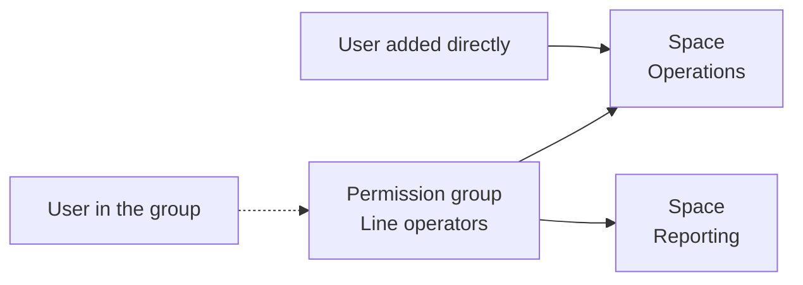

# Assign members

**Space membership** decides who works in a space. You bind permission groups to a space, and add individual users where a whole group is too broad. Everyone you assign sees the portal the way the space presents it, and nobody gains or loses access to anything.

## How membership works

A **permission group** is a named group of users that shares the same permissions. The portal lists groups on the `User Groups` tab of `Users`. A user belongs to a space in one of two ways:

* **Through a permission group.** When you bind a group to a space, every user in that group is a member. Users who join the group later become members too.
* **Directly.** You add a named user to the space. Use this for exceptions, such as one person from another team who needs the same view.

!!! warning "Spaces aren't a security boundary"

    A space changes what people see in the portal, not what they can access. Only the portal's navigation is curated: when a space hides a page, the portal steers people away from it, but anyone whose role allows the page can still reach its data and actions through the Quix APIs and CLI. If spaces fail to load, no space is applied and nothing is blocked. To restrict access, assign [roles](../roles.md). See [What a space doesn't control](overview.md#what-a-space-doesnt-control).

Each user belongs to one permission group. A user's spaces are therefore the spaces bound to their group, plus any spaces you added them to directly:

A few rules follow from this:

* **A user can belong to several spaces.** Only one space is active at a time, and the user switches between them from the space chip in the header. The chip's menu lists spaces in the order of the cards on the Spaces page. See [Reorder spaces](create-space.md#reorder-spaces) and [Which space you start in](use-spaces.md#which-space-you-start-in).
* **A user who belongs to no space sees the standard portal.** The portal shows every module their role allows, as it does in an organization with no spaces.

You can manage membership from the space, or from the user or group:

| Where | What you can do | When changes apply |
|---|---|---|
| The `Membership` section of the space designer | Bind groups and add users to one space | When you click `Save space` |
| The `Spaces` field on a user's page, and the `Edit details` dialog | Add a user to spaces, or remove them | Immediately |
| The `Spaces` field on a group's page, and the `Edit group` dialog | Bind a group to spaces, or unbind it | Immediately |
| The `Spaces` column in the `Users` and `User Groups` tables | See each user's or group's spaces | Read only |

!!! warning "Changes on the Users pages apply immediately"

    On a user's or group's page, and in the `Edit details` and `Edit group` dialogs, space changes apply as soon as you save the `Manage spaces` dialog or click **×** on a chip. You aren't asked to confirm. Cancelling `Edit details` or `Edit group` afterwards doesn't undo them.

## Assign members in the designer

*(Organization admins — space designer, `Membership` section.)*

Use the designer when you're setting up a space and want to choose its whole audience in one place.

1. In the organization sidebar, select `Spaces`.
2. Click the card of the space you want to change. The space designer opens.
3. In the section list on the left, select `Membership`.
4. Under `Permission groups`, select each group whose users should work in this space. Each row shows how many users the group has. When your organization has more than eight groups, type in the `Find a group...` box to filter the list.
5. Under `Direct members`, select each user you want to add individually. Each row shows the user's name and email address.
6. Click `Save space`. For a new space, click `Create space` instead.

The space now has an audience. Members who are signed in see the change without reloading the page.

A summary line below the two lists confirms who lands in the space. It names the first group you bound, as in "**Line operators** lands in this space". If you only added users directly, the line uses the generic word `member`: "**member** lands in this space". The `Membership` entry in the section list also shows a count, such as `2 groups · 1 direct`.

!!! warning "A space with no audience is invisible"

    You can save a space without binding any group or adding any user, but nobody works in it, and it appears in nobody's space chip menu, including yours. The designer shows `No audience — bind a group or add users.` in red, and the space's card on the Spaces page shows `No audience yet — bind a group or add users`. To see the space as a member would, [preview it](create-space.md#preview-a-space-as-a-member).

If a user you added directly is later deleted from the organization, they stay listed at the end of `Direct members`, so you can clear them.

## Manage a user's spaces

*(Organization admins — `Users` in the organization sidebar.)*

Use this when you're working with one person, for example when someone changes role and needs a different view of the portal.

On a user's page, the `Spaces` field shows a chip for each space the user belongs to. A chip marked `via group` means the user belongs through their permission group.

1. In the organization sidebar, select `Users`.
2. On the `Users` tab, click the user's row. The user's page opens.
3. In the details panel, next to `Spaces`, click **+**. The `Manage spaces` dialog opens.
4. Select each space you want to add the user to, and clear each space you want to remove them from.
5. Click `Save`.

The dialog closes when the changes are applied, and the `Spaces` field updates.

You can make the same changes from the `Edit details` dialog. On the `Users` tab, open the user's row menu (**⋮**) and select `Edit details`, then click `Manage spaces` in the `Spaces` section. The `Spaces` section appears only for existing users, not when you invite someone.

You can't change your own space membership from the Users pages. On your own user page and in your own `Edit details` dialog, the controls stay visible but are disabled, with the tooltip `You can't change your own space membership. Ask another organisation admin to do it.`

### The Manage spaces dialog

The `Manage spaces` dialog lists every space in the organization in three bands, each sorted alphabetically: spaces the user or group was added to directly, then spaces a user belongs to through their group, then every other space.

| Element | What it means |
|---|---|
| `Search spaces...` | Filters the list by space name and description. If nothing matches, the dialog shows `No spaces matching your search.` |
| A selected, locked row marked `Via {group}` | The user belongs to this space through their permission group. You can't remove it here. To remove it, unbind the group from the space. This removes the space for everyone in the group. |
| `Will be removed` | You cleared a space the user or group belongs to directly. Clicking `Save` removes it. |
| The count in the footer | Summarizes your pending changes, for example `2 to add · 1 to remove`, or `No changes`. |
| `Save` | Applies the changes. It's disabled until you change something. |

If a change fails, the dialog stays open and shows the error.

!!! warning "Don't change groups just to change spaces"

    A user's permission group also sets their permissions. Moving someone to another group changes what they can do, not just which spaces they see. To give one person a different set of spaces, add or remove them directly instead.

## Manage a group's spaces

*(Organization admins — `Users` in the organization sidebar, `User Groups` tab.)*

Bind a group when a whole team needs the space. Everyone in the group becomes a member, including people who join the group later, and people who leave the group lose the space.

1. In the organization sidebar, select `Users`, then select the `User Groups` tab.
2. Click the group's row. The group's page opens.
3. In the details panel, next to `Spaces`, click **+**. The `Manage spaces` dialog opens.
4. Select each space the group should be bound to, and clear each space it should leave.
5. Click `Save`.

The group's users gain or lose the spaces immediately. You can make the same change from the `Edit group` dialog, in its `Spaces` section.

!!! note "Add spaces after you create a group"

    The `New group` dialog on the `User Groups` tab has a `Spaces` section, but spaces you choose there aren't saved. Create the group first, then add its spaces from the group's page, as described above, or bind the group in the space designer's `Membership` section.

## Remove someone from a space

*(Organization admins — `Users` in the organization sidebar, or the space designer.)*

Removing someone from the Users pages applies immediately, without asking you to confirm. To undo it, add the user or group back.

To remove a user or a group from a space, do one of the following:

* Click the **×** on the space's chip in the `Spaces` field of a user's page or a group's page, or in the `Edit details` or `Edit group` dialog.
* Clear the space in the `Manage spaces` dialog, and click `Save`.
* Clear the group or user in the space designer's `Membership` section, and click `Save space`.

A chip marked `via group` has no **×**, because the membership belongs to the group. To remove it, unbind the group from the space.

Members who are signed in see the change without reloading, with the message `Your spaces have changed — the sidebar and header were updated.` If you remove a user from the space they're working in, their active space changes to their next space, or to the standard portal if they have no spaces left.

## See who belongs where

*(Organization admins — `Users` in the organization sidebar.)*

The `Users` and `User Groups` tables each have a `Spaces` column. It shows the first space as a chip, and `+N` when there are more. Hover over `+N` to see the rest. Other users can't see space membership on the Users pages.

On the Spaces page, each card's `Audience` line summarizes who is in the space. See [What each card shows](create-space.md#what-each-card-shows).

To check what members of a space see, [preview the space](create-space.md#preview-a-space-as-a-member).

## See also

* [Spaces overview](overview.md)
* [Create and manage spaces](create-space.md)
* [Work in a space](use-spaces.md)
* [Spaces reference](reference.md)
* [Roles and permissions](../roles.md)
