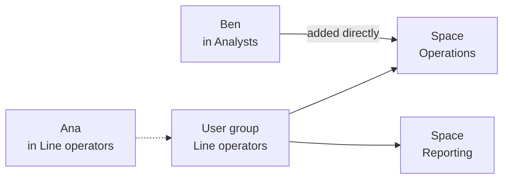

# Assign members

**Space membership** decides who works in a space. You bind user groups to a space for whole teams, and add individual users directly for the exceptions. Everyone you assign sees the portal the way the space presents it. Nobody gains or loses access to anything, because a space only shapes what people see. See [What a space doesn't control](overview.md#what-a-space-doesnt-control).

## How membership works

A user belongs to a space in one of two ways:

* **Through a user group.** When you bind a [user group](../access-security/user-groups.md) to a space, every user in the group is a member. The binding is to the group, not to the people in it at that moment, so it stays current on its own: users who join the group later become members, and users who leave it lose the space.
* **Directly.** You add a named user to the space. Use this for exceptions, such as one person from another team who needs the same view.

Each user belongs to one user group, so a user's spaces are the spaces bound to their group plus any spaces they were added to directly. That can be several spaces at once:

```mermaid
flowchart LR
    G["User group<br/>Line operators"] --> S1["Space<br/>Operations"]
    G --> S2["Space<br/>Reporting"]
    U1["Ana<br/>in Line operators"] -.-> G
    U2["Ben<br/>in Analysts"] -->|"added directly"| S1
```

Here Ana belongs to both spaces through her group, and Ben belongs to Operations on his own, whatever his group is bound to.

A few consequences follow:

* **Only one space is active at a time.** A user in several spaces switches between them from the space chip in the header. See [Which space you start in](use-spaces.md#which-space-you-start-in).
* **A user in no space sees the standard portal**, with every module their role allows.
* **A space with no members is invisible.** You can save a space with no groups and no users, but it appears in nobody's space chip menu, including yours. The designer and the space's card on the `Spaces` page flag it. To see a space as a member would before you assign anyone, [preview it](create-space.md#preview-a-space-as-a-member).
* **Removing someone from their active space moves them on.** Their portal switches to their next space, or to the standard portal if they have no spaces left.

!!! note "Members with the Operator role"

    The Operator role is deprecated and doesn't work well inside a space. Users whose only role is Operator can open plugin apps, including the space's header apps, but every other page sends them to their first organization plugin, and plugin apps open full screen, so the space's sidebar and its other pages don't reach them. To give them the view the space defines, replace their Operator role with a role such as `Viewer`. Assigning them to the space first is safe. See [Replace the Operator role with a space](replace-operator-role.md).

## Where you manage membership

Membership is one relationship between spaces, user groups and users, and organization admins can edit it from either side. Pick the side that matches the job:

| From | Use it to | Changes take effect |
|---|---|---|
| The space designer's `Membership` section | Choose a space's whole audience in one place, typically while you set the space up | When the space is saved |
| A user's page in `Users` | Change one person's spaces, for example when they move to a different job | Immediately |
| A group's page in `Users` | Change which spaces a whole team works in | Immediately |

The two sides behave differently. The designer collects your membership changes with the rest of the space and applies them together when you save. On a user's or group's page, each change applies as soon as you make it, without a confirmation, and cancelling the surrounding edit dialog afterwards doesn't undo it. Either way, members who are signed in see the result without reloading.

On a user's page, spaces that come from the user's group are marked `via group` and can't be removed there, because the membership belongs to the group. To remove one, unbind the group from the space, which removes it for everyone in the group, or reconsider whether the person belongs in that group.

The `Users` and `User Groups` tables show each user's and group's spaces in a `Spaces` column, and each card on the `Spaces` page summarizes its audience. See [What each card shows](create-space.md#what-each-card-shows). Only organization admins see space membership on the Users pages, and you can't change your own membership there. Ask another organization admin to do it.

!!! warning "Spaces chosen when you create a group aren't saved"

    The `New group` dialog on the Users page has a `Spaces` section, but the spaces you pick there are discarded when the group is created. Create the group first, then add its spaces from the group's page or bind it in the space designer.

## Don't change groups just to change spaces

A user group carries permissions as well as space bindings. Moving someone to another group to give them a different set of spaces also changes what they can do in the platform. To give one person a different view, add them to or remove them from spaces directly, and leave their group alone.

## See also

* [Spaces overview](overview.md)
* [Create and manage spaces](create-space.md)
* [Work in a space](use-spaces.md)
* [User groups](../access-security/user-groups.md)
* [Roles and permissions](../roles.md)
