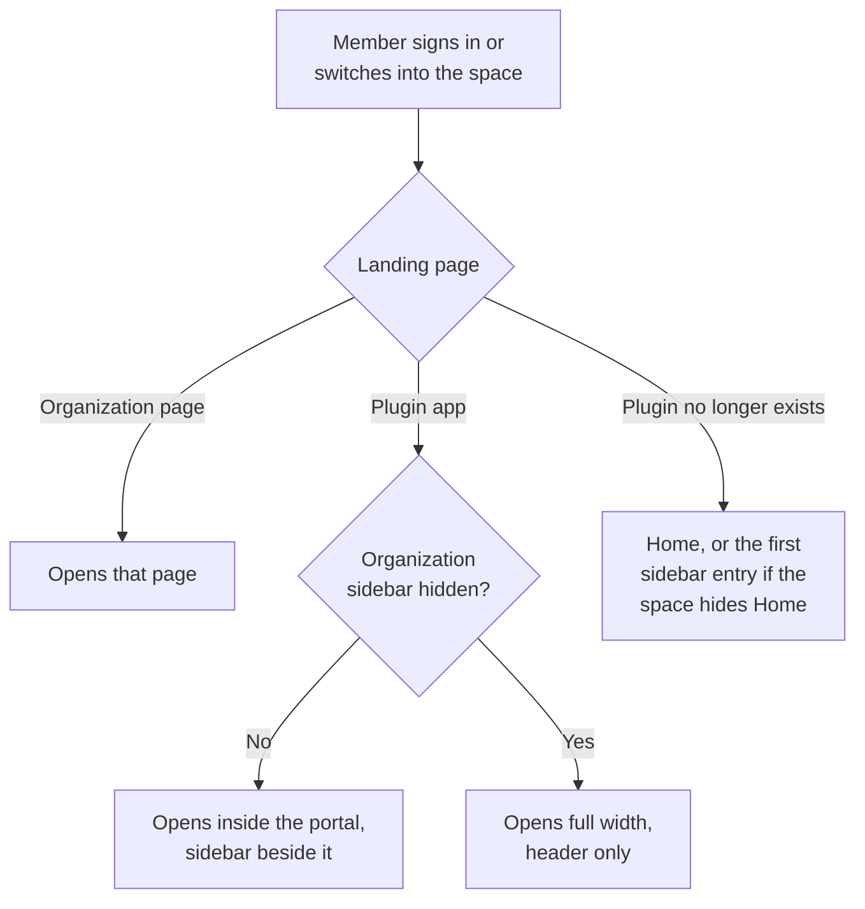

# Design navigation

A space's navigation decides what its members can reach and where they start. It has four parts: the apps pinned to the header, the organization sidebar, the modules inside every environment, and the landing page. Together they cover everything from a lightly trimmed platform for developers to a single app with no sidebar at all for line operators.

Navigation is presentation only. Hiding a page removes it from members' sidebars, command palette and links, and sends direct visits to the landing page, but it doesn't remove access. Showing a page doesn't grant it either. See [What a space doesn't control](overview.md#what-a-space-doesnt-control).

Everything you change in the space designer is a draft. Members see nothing until the space is saved.

## Header apps

The header app strip is the row of plugin apps in the portal's top bar. For an audience that works in one or two apps, it is the main way around the portal. A pinned app opens inside the portal, with the organization sidebar still visible if the space shows one.

Inside a space, the strip shows only the apps the space pins, so a space that pins nothing shows none. Outside a space the strip is empty, except for users with only the deprecated [Operator role](replace-operator-role.md), so a space is the only way to choose which plugin apps appear in the header. Pinning doesn't affect search: the command palette offers every app the member can open, whatever the space pins.

Only [organization plugins](../services/plugin.md#organization-plugins) can be pinned. These are deployments with the `Organisation plugin` setting turned on, which sets `plugin.organisationItem.show: true` in YAML. If no deployment in the organization is an organization plugin, there is nothing to pin.

Each app can be pinned once, up to 20 pins per space. A pin can override the app's label and icon, and the order you set is the order members see. If a pinned plugin is later removed, members stop seeing the pin, and the designer keeps it so the pin returns if the app does.

When a plugin is deployed in more than one environment, a pin points at one of those deployments, chosen in its `Environment` field. Members open that deployment, not whichever one happens to be the plugin's default. The same applies to plugin apps in the organization sidebar and to a plugin landing page.

## Organization sidebar

The organization sidebar is the sidebar on organization-level pages such as `Home` and `Projects`. A space can keep the platform's standard sidebar (`Stock`), curate its own list (`Custom`) or remove it (`Hidden`).

`Stock` follows the platform: when Quix adds a module, `Stock` sidebars show it automatically. A `Custom` list changes only when an admin edits it, so new modules don't appear in it until someone adds them. Choose `Stock` for any audience that should always get the full, current platform.

`Users`, `Spaces`, `Settings` and `Audit` are admin-only. Non-admin members never see them, whatever the space says, but a space can hide them from admins. That includes you, if you belong to the space, so keep a way back. See [What a space doesn't control](overview.md#what-a-space-doesnt-control) and [Switch to Spaceless](use-spaces.md#switch-to-spaceless).

### What a custom sidebar can hold

A `Custom` sidebar starts as the stock sidebar: nine modules under the headings `Core`, `Quix Lake`, `Users` and `Governance`. You curate it by clearing modules and adding your own entries. A cleared module keeps its place in the list, so selecting it again puts it back where it was.

| Entry | What it gives members |
|---|---|
| **Module** | A built-in organization page, such as `Projects` or `File Explorer`. |
| **Plugin app** | An organization plugin that opens inside the portal with the sidebar visible, in the environment you choose when the plugin is deployed in more than one. It can open at a path inside the app, for example `/dashboard`, and can carry **pages**: extra links under the app to specific paths, such as `/test-runs`. A path must start with `/` and can't contain `..`. |
| **Environment link** | A shortcut straight into one environment of a project, opening on the page you choose (`Pipeline` by default). Useful for the production pipeline a line operator watches. |
| **Heading** | A caption, up to 16 characters, that groups the entries below it down to the next heading. Removing a heading leaves its entries in place. |

Entries outlive the things they point to. If a plugin app is removed or an environment is deleted, its entry stays in the sidebar but renders disabled for members, and the designer flags it so you can remove it or keep it for when the target returns. An entry with no app or environment chosen yet also renders disabled.

An environment link that opens on `Topics`, `Connectors`, `Templates` or `Data Lake` depends on the environment having a Kafka broker. In an environment without one, members don't see that page. See [Kafka-dependent modules](#kafka-dependent-modules).

The designer caps how many entries and headings a sidebar can have.

### Hidden sidebar

A `Hidden` sidebar suits audiences who live in header apps and a landing page. With no sidebar, those are the only ways around the portal, so pin at least one [header app](#header-apps) and set a [landing page](#landing-page) first. Without them, members can reach only `Home` and the command palette.

Saving with `Hidden` deletes the sidebar's custom entries. If you belong to the space, hiding the sidebar also hides `Users`, `Spaces`, `Settings` and `Audit` from you.

## Environment modules

The `Environment` section controls what members see inside every environment of every project: the environment sidebar, the YAML sync button in the environment header, and the `Settings` row at the foot of the sidebar. A `Custom` list groups the modules under `Core`, `Library`, `Quix Lake` and `Environment`, where the `Environment` group holds `YAML` and `Settings`. Modules reorder only within their own group.

An environment can't be set to `Hidden`, but clearing every module has the same effect. Members then get no environment sidebar at all, including its `Plugins` section, and no YAML sync button or `Settings` row.

When a space hides an environment module:

* It disappears from the sidebar and the command palette, and links to it elsewhere in the portal no longer open. Panels that open inside another page, such as the project variables panel, stay available.
* If it's `Pipeline`, members who open an environment start on the first module the space shows.
* If it's `Deployments`, the `View in environment` action on header apps and the `View deployment` action on the plugin toolbar disappear too.

### Kafka-dependent modules

`Topics`, `Connectors`, `Templates` and `Data Lake` need a Kafka broker. A space can hide them, but it can't show them in an environment that has no broker.

!!! note "Environment plugins aren't curated"

    [Environment plugins](../services/plugin.md#environment-plugins), the plugin apps a deployment adds to the `Plugins` section of the environment sidebar, appear whatever the space says, as long as the environment sidebar is shown. The `Environment` section controls only the built-in modules.

## Landing page

The landing page is where members arrive when they sign in and when they switch into the space. It can be an organization page or an organization plugin. The default is `Home`.

The landing applies at two moments:

* **After sign-in**, once per session, and only when the member opens the portal's home page. A bookmark or a link to a specific page still opens that page.
* **On switching into the space.** See [Work in a space](use-spaces.md).

Where members end up depends on what the landing is and what the space shows:

A plugin landing opens in the same place as any plugin app in the space. The space's organization sidebar shows beside it, whether or not the app itself is in the sidebar or pinned in the header. In a space with a `Hidden` sidebar, the app fills the page under the header, which is what makes a single-app space feel like a dedicated tool.

A space that hides `Home` but leaves the landing as `Home` sends members to the first entry in its sidebar instead.

A landing page doesn't have to appear anywhere else in the space. Members still land on it, but if it isn't in the sidebar or pinned in the header, they can't find their way back to it later. The designer flags this case.

## Copy a section from another space

`Header apps`, `Organization sidebar` and `Environment` can each be copied from another space. Copying replaces the whole section in your draft: copying from a space whose sidebar is `Stock` makes yours `Stock` too. Copying the organization sidebar brings its modules, plugin apps, environment links, headings and order together.

Before you commit, the designer compares your section with the other space's and shows what would be added, removed and kept. A space whose section already matches yours can't be chosen, and the option is unavailable when there are no other spaces. As with any draft change, nothing reaches members until the space is saved.

A copy replaces what you had. After copying, switching the organization sidebar back to `Custom` no longer restores the entries you had before the copy.

## Live preview

The live preview in the middle of the designer shows the organization sidebar, or the environment sidebar while the `Environment` section is selected, and doubles as an editor. You can open an entry's settings beside it, drag entries to reorder a `Custom` section, and use an entry's context menu for the actions it supports. Editing a `Stock` sidebar here switches it to `Custom`.

## See also

* [Work in a space](use-spaces.md)
* [Plugins](../services/plugin.md)
