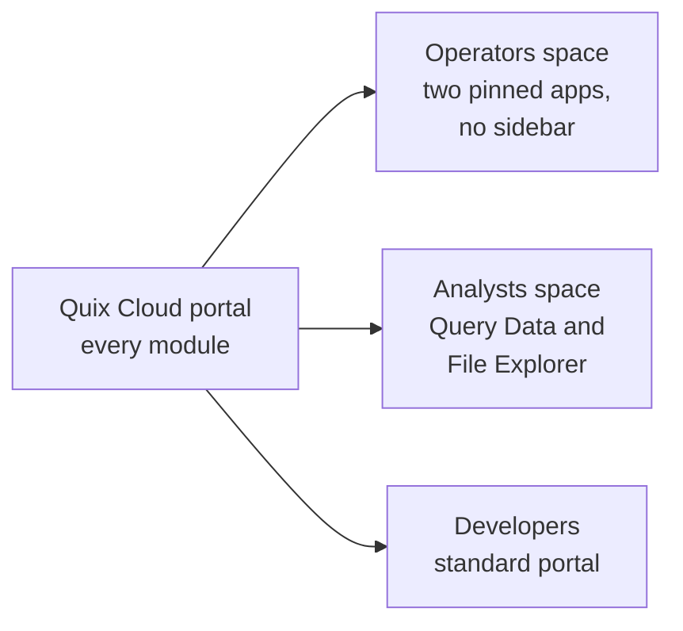
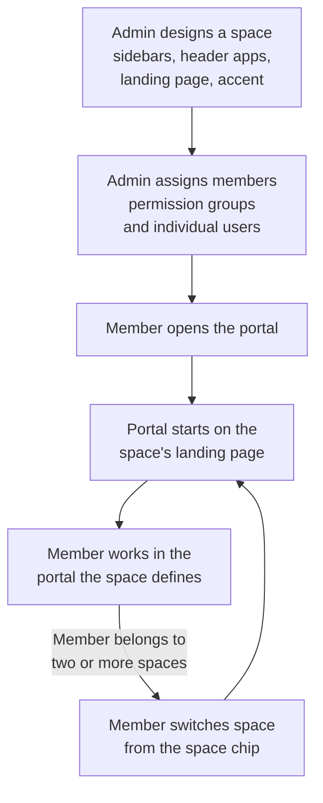

# Spaces overview

**Spaces** let organization admins shape the Quix Cloud portal around each audience. An admin decides which sidebar items, header apps and landing page a group of people sees. Each team gets a portal built for the work it does, not a copy of everything the platform offers.

An admin designs each space in the space designer and assigns permission groups or individual users to it. When those members open the portal, it starts on the space's landing page, with the space's sidebars and header apps. A space changes only what people see. Permissions still come from [roles](../roles.md).

## The problem spaces solve

Without spaces, everyone in an organization sees the same portal. Every sidebar item, every module inside an environment, and every route through the platform is on screen for every user, whether they need it or not.

Different people use Quix Cloud for very different jobs:

* **Operators** run a production line or a test rig. They need one or two plugin apps, and they don't need projects, topics or YAML.
* **Analysts** query and explore data. They need Query Data and File Explorer, and sometimes a reporting app.
* **Developers** build and run pipelines. They need the full platform.

A space gives each of these audiences its own view of the portal. Operators can open straight into their app with no sidebar at all, analysts see only the data tools, and developers keep the standard portal. Each space has its own name, icon and accent color, so people can always tell which view they're in.

### Do you need a space?

Use a space when a group of people needs a narrower or different portal from the rest of the organization, or when you want plugin apps in the header. If everyone uses the full platform, you don't need one.

Creating a space is safe. It changes nothing for anyone until you assign members to it, and users who belong to no space keep the standard portal.

## What a space controls

A space controls presentation. It decides:

* Which items appear in the organization sidebar, including custom entries such as plugin apps, pages inside those apps, shortcuts into a project environment, and headings. The space can also hide the organization sidebar completely.
* Which modules appear inside every environment, including the YAML sync button in the environment header and the `Settings` row at the foot of the environment sidebar.
* Which [global plugins](../services/plugin.md#global-plugins) are pinned to the header as apps, and in what order. Outside a space, the header app strip is empty, so a space is the only way to put plugin apps in the header.
* Which page members land on after they sign in or switch into the space.
* The accent color and icon that identify the space.
* Whether members can choose their own light or dark theme, or the space sets it for them.
* Whether the floating plugin toolbar appears over embedded apps.

When a space hides a module, the module disappears from the sidebar and the command palette, and links to it elsewhere in the portal no longer open. If someone opens its address directly, the portal takes them to the space's landing page instead. [Work in a space](use-spaces.md) describes what members see.

## What a space doesn't control

A space never grants or denies access to anything. Permissions still come from [roles](../roles.md).

A space curates only the portal's navigation: its sidebars, header, command palette and links. It isn't a security boundary:

* **Hiding a page doesn't secure it.** The data and actions behind a hidden page stay reachable through the Quix APIs and the Quix CLI for anyone whose role allows them.
* **Showing a page doesn't grant access to it.** If a space shows a page that a member's role doesn't allow, the page's own permission check still applies.
* **If spaces fail to load, no space is applied.** The portal shows the standard portal and blocks nothing, rather than stopping people from working.

To control what people can do, assign roles.

A space also leaves these parts of the portal alone:

* Plugin apps listed in the `Plugins` section of the environment sidebar. The one exception is a space that hides every environment module, which removes the environment sidebar and its `Plugins` section.
* Panels that open from inside another page, such as the project variables panel.
* Pages inside a visible module. They follow their parent module.

`Spaces`, `Settings` and `Audit` in the organization sidebar appear only for organization admins, whatever a space says. A space can still hide them from admins. See [Who can do what](#who-can-do-what).

## Key concepts

| Term | What it is |
|---|---|
| **Space** | A named, organization-wide view of the portal, designed by an admin for an audience. It has a name, an optional description, an icon and an accent color. It changes what people see, never what they can do. |
| **Permission group** | A named group of users that shares the same permissions. The portal lists groups on the `User Groups` tab of `Users`. Each user belongs to one group. |
| **Member** | A user who belongs to a space, through a permission group bound to the space or because an admin added them directly. A user can belong to several spaces. |
| **Active space** | The one space that currently shapes a user's portal. The portal saves it to the user's account. |
| **Space chip** | The control in the header that shows your active space. If you belong to more than one space, click it to switch. |
| **Spaceless** | No space applied: the standard portal, with every module the user's role allows and no header apps. It is what everyone sees in an organization with no spaces, and what a user who belongs to no space sees. Only organization admins can choose Spaceless while they belong to a space. |
| **Space designer** | The page where an admin creates and edits a space. It has a section list, a live preview and an inspector with the settings for the selected section. |
| **Source** | The setting at the top of the designer's `Header apps`, `Organization sidebar` and `Environment` sections that decides where that part of the portal comes from. See [How section sources work](navigation.md#how-section-sources-work). |
| **Landing page** | Where members arrive when they sign in, and when they switch into the space. It can be an organization page or a plugin app. The default is `Home`. |
| **Accent** | The space's identity color. It draws a thin line across the top of the header, and tints the space chip and the selected item in the sidebars. It doesn't change the portal's own colors or the user's theme. |

The [glossary](reference.md#glossary) lists every term the Spaces pages use.

## How it works end to end

An admin designs a space and assigns people to it. From then on, those people work in a portal shaped by the space.

1. An organization admin creates a space and designs it in the space designer. See [Create and manage spaces](create-space.md) and [Design navigation](navigation.md).
2. The admin binds permission groups to the space, or adds individual users. See [Assign members](membership.md).
3. A member opens the portal. It starts in their active space and takes them to the space's landing page. Links and bookmarks still open the page they point to, if the space includes it.
4. The member sees the space's sidebars, header apps and accent. The space chip in the header shows which space they're in.
5. A member who belongs to more than one space switches between them from the space chip. See [Work in a space](use-spaces.md).

When an admin saves a change, members who are signed in see it without reloading the page.

## Who can do what

Organization admins are users with the `Admin` role at organization level. Admins manage spaces, and they also belong to spaces like everyone else.

| Task | Organization admins | Other users |
|---|---|---|
| Create, edit, reorder, duplicate and delete spaces | Yes | No |
| Assign groups and users to spaces | Yes | No |
| Preview a space as a member | Yes | No |
| Have their own portal shaped by their active space | Yes | Yes |
| Switch between their spaces | Yes. With one space, they switch between it and Spaceless. | Yes, with two or more spaces |
| Choose Spaceless | Yes | No |

!!! warning "Admins are members too"

    A space shapes an admin's portal exactly as it shapes a member's. If your active space hides `Spaces`, `Settings` or `Audit`, you lose those items too, and opening their address sends you to the space's landing page. To get them back, switch to Spaceless, or to another of your spaces that shows them. See [Switch to Spaceless](use-spaces.md#switch-to-spaceless).

## Where to go next

- __Work in a space__

    ---

    Find your current space, switch spaces, and understand what changes in the portal.

    [Work in a space :octicons-arrow-right-24:](use-spaces.md)

- __Create and manage spaces__

    ---

    Create a space, set its name, icon, accent and theme, preview it, and duplicate, reorder or delete spaces.

    [Create and manage spaces :octicons-arrow-right-24:](create-space.md)

- __Design navigation__

    ---

    Choose the header apps, organization sidebar, environment modules and landing page.

    [Design navigation :octicons-arrow-right-24:](navigation.md)

- __Assign members__

    ---

    Bind permission groups and add users to a space, from the designer or the Users pages.

    [Assign members :octicons-arrow-right-24:](membership.md)

- __Reference__

    ---

    Module catalogs, accent colors, limits, troubleshooting and a glossary.

    [Spaces reference :octicons-arrow-right-24:](reference.md)

## See also

* [Roles and permissions](../roles.md)
* [Global plugins](../services/plugin.md#global-plugins)
