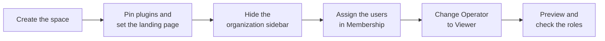

# Replace the Operator role with a space

The **Operator role** gave users a plugin-only view of Quix Cloud: they saw global plugins and nothing else. The role is deprecated. A space gives the same audience a plugin-only view that you design, and a standard role such as `Viewer` gives them access to the plugins.

This page explains why to move users off the Operator role, what changes for them, and how to rebuild their view as a space.

!!! warning "The Operator role is deprecated"

    Use spaces instead of the Operator role to give users a plugin-only view of Quix Cloud. Existing Operator assignments still work, but don't assign the role to new users. See [Move users from Operator to a space](#move-users-from-operator-to-a-space).

## Why replace the Operator role

The Operator role combines two things: a permission, full access to plugins (`plugin:*`), and a fixed view of the portal. An **Operator-only user**, someone whose every role assignment is `Operator`, can't open any page except global plugins. The portal opens their first global plugin, and sends them back to it from any other page.

Spaces separate the view from the permission. With a space, you decide:

* Which plugin apps appear in the header, in what order and with what labels.
* Which page or app members land on when they sign in.
* Whether members get a sidebar at all, and what it contains.
* The space's name, icon and accent color, so members know which view they're in.

Spaces and the Operator role don't combine well. Inside a space, header apps, plugin apps in the organization sidebar, and apps in the command palette open inside the portal, at an address that Operator-only users can't open. When an Operator-only user selects one, the portal sends them back to their first global plugin instead. To give these users a working space, give them a standard role as well.

## What changes for your users

After you follow the steps on this page, the users have a role such as `Viewer` instead of `Operator`, and they work in a space that shows only their plugins.

| | With the Operator role | With Viewer and a space |
|---|---|---|
| What they see | Global plugins only. Every other page sends them back to their first global plugin. | Only what the space shows: its header apps, landing page and, if you keep one, its sidebar. |
| Where they start | Their first global plugin. | The space's landing page, which you choose. |
| Plugin access | Every plugin permission (`plugin:*`), wherever the role applies. | `plugin:read` in the environment where you assign `Viewer`. |
| Access to other resources | None. | Read access to the environment's other resources, such as its deployments. |

### A space isn't a permission

A space changes what people see in the portal, never what they can access. Hiding a page doesn't stop someone whose role allows it from reaching its data through the Quix APIs and CLI. See [What a space doesn't control](overview.md#what-a-space-doesnt-control).

Unlike Operator, `Viewer` can read the environment's other resources through the APIs and CLI. If that matters, assign `Viewer` only at the environment that runs the plugins, not at project or organization level.

Operator also allowed users to create, update and delete plugin resources, while `Viewer` allows only `plugin:read`. If a plugin checks for `Create`, `Update` or `Delete` on the `Plugin` resource before users can act in it, test the plugin with the new role. See [Checking permissions programmatically](../services/plugin.md#checking-permissions-programmatically).

## Before you start

* You need the `Admin` role at organization level. Only organization admins can manage spaces and edit other users' roles.
* The plugins must be [global plugins](../services/plugin.md#global-plugins): deployments with the `Organisation plugin` setting turned on. Only global plugins can be pinned to the header or used as a landing page.
* Note which environment runs each plugin. You assign `Viewer` in those environments.
* Note who has the `Operator` role. On a user's page, the `Project permissions` tab shows their role at each level. On a group's page, the `Project permissions` tab shows the roles the group grants.

## Move users from Operator to a space

*(Organization admins — `Spaces` and `Users` in the organization sidebar.)*

Create and design the space first, assign the users to it, and only then change their role. In this order, the users move straight from their Operator view to the space, without seeing the standard portal in between.

### Create the space

1. In the organization sidebar, select `Spaces`.
2. Click `New space`.

    The space designer opens on the `Identity` section.

3. In `Name`, enter a name that tells members which view they're in, for example `Line operations`.
4. Optionally, set a description, icon and accent. See [Set the identity](create-space.md#set-the-identity).
5. Click `Create space`.

You stay in the designer, and the button changes to `Save space`.

### Design the plugin-only view

Pin the plugins and choose the landing page before you hide the sidebar. Without them, members can reach only `Home` and the command palette.

1. In the section list, select `Header apps`, and select the `Custom` tile.
2. Click `+ Plugin app`, and in `App`, choose a plugin. Repeat for each plugin the users work with.

    Put the pins in order: drag a row by its handle, or use the `Move up` and `Move down` arrows. See [Pin header apps](navigation.md#pin-header-apps).

3. In the section list, select `Landing page`. Under `Plugins`, select the plugin the users work in most.
4. In the section list, select `Organization sidebar`, and select the `Hidden` tile.

    The caption reads `Members get the header and content only`. To keep a sidebar with only the plugin apps instead, select the `Custom` tile, clear every module, and add each plugin with `+ Plugin app`. See [Customize the organization sidebar](navigation.md#customize-the-organization-sidebar).

5. Optionally, in the section list, select `Environment`, select the `Custom` tile, and clear the modules the users don't need. If you clear `Deployments`, the `View in environment` action on header apps disappears too. See [Choose the environment modules](navigation.md#choose-the-environment-modules).
6. Optionally, in the section list, select `Dev tools`, and turn off `Plugin toolbar`. Members can still move between plugins from the header apps.
7. Click `Save space`.

With a `Hidden` sidebar, the landing plugin opens full screen. Members move to their other plugins from the header apps.

### Assign the users

1. In the section list, select `Membership`.
2. Under `Permission groups`, select the group whose users had the Operator role. Or, under `Direct members`, select each user.

    Binding a group puts every user in the group in the space, including people who join the group later. If the group includes people who don't need this view, add the users directly instead.

3. Click `Save space`.

The summary line below the lists names who lands in the space. See [Assign members](membership.md).

### Change the users' role

Each user's roles come either from their permission group or from their own assignments. Change them where they're set.

To change the roles of a group:

1. In the organization sidebar, select `Users`, then select the `User Groups` tab.
2. Click the group's row, and select the `Project permissions` tab.
3. Find the environment that runs the plugins. To see a project's environments, click the arrow next to the project.
4. On that environment's row, in the `Role` column, select `Viewer`.
5. On every other row set to `Operator`, select `None`, or the role the group needs at that level.
6. Click `Save changes`.

Everyone in the group gets the new roles.

To change the roles of one user:

1. In the organization sidebar, select `Users`. On the `Users` tab, click the user's row.

    The user's page opens on the `Project permissions` tab.

2. If `Inherit from group` is on, the user's roles come from their group, and you can't edit them here. Change the group's roles instead, as described above.
3. On the row of the environment that runs the plugins, in the `Role` column, select `Viewer`.
4. On every other row set to `Operator`, select `None`, or the role the user needs at that level.
5. Click `Save changes`.

The portal checks for the Operator role once per session. Ask users who are signed in to reload the page, so that the space's header apps open inside the portal.

## Check the result

*(Organization admins — Spaces page, or the space designer.)*

To check what the users see, preview the space:

1. On the space's card on the Spaces page, click the eye button, whose tooltip is `Preview as member`. Or, in the space designer, click `Preview`.
2. Check that the portal opens on the landing plugin, the header shows the pinned plugins in your order, and there's no organization sidebar.
3. Click `Exit preview`.

On the Spaces page, the space's card also summarizes the result. `Landing` names the landing plugin, and `Audience` names the bound group or counts the direct members. See [What each card shows](create-space.md#what-each-card-shows).

Preview keeps your own role, so it shows what the space presents, not what the users' new role allows. To check the roles, open each user's page. The `Project permissions` tab should show `Viewer` on the environment that runs the plugins, and no `Operator` rows.

If a user still gets sent back to their first global plugin when they select a header app, they still have only the `Operator` role, or they haven't reloaded the page since you changed it.

## See also

* [Roles and permissions](../roles.md)
* [Create and manage spaces](create-space.md)
* [Design navigation](navigation.md)
* [Assign members](membership.md)
* [Global plugins](../services/plugin.md#global-plugins)
