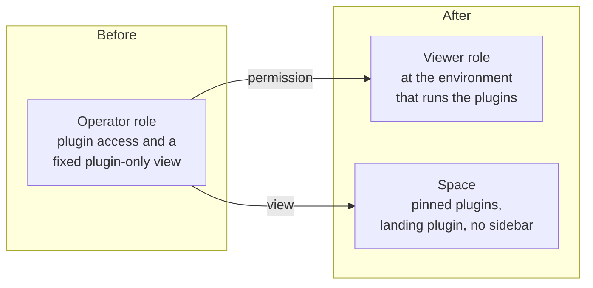
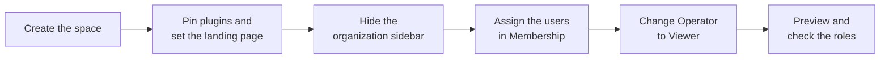

# Replace the Operator role with a space

The **Operator role** gave users a plugin-only view of Quix Cloud: they saw organization plugins and nothing else. The role is deprecated. Its replacement splits the job in two: a [space](overview.md) designs the plugin-only view, and a standard role such as `Viewer` grants access to the plugins.

!!! warning "The Operator role is deprecated"

    Existing Operator assignments still work, but don't assign the role to new users. Move the users who have it to a space and a standard role, as this page describes. See [Move users from Operator to a space](#move-users-from-operator-to-a-space).

## Why replace the Operator role

The Operator role bundles a permission, full access to plugins (`plugin:*`), with a view of the portal that nobody can change. An **Operator-only user**, someone whose every role assignment is `Operator`, can open organization plugins and nothing else. The portal opens their first organization plugin, and any other page sends them back to it.

That fixed view is the problem. You can't choose which plugins come first, where users land, or what they're called, and you can't tell one audience's view from another's.

A space gives you those choices: which plugins are pinned to the header and in what order, which plugin members land on, whether they get a sidebar, and the name, icon and accent that tell them which view they're in.

The two don't mix. The Operator rule still applies inside a space, so an Operator-only user who is a member of a space can open its plugins but none of its other pages. Plugins open full screen, without the space's sidebar, and every other page, including a landing page that isn't a plugin, sends them back to their first organization plugin, which isn't necessarily the space's landing plugin or its first header app. To give these users the view the space defines, replace their Operator role.

## What changes for your users

The permission and the view become two separate settings that you control independently.

```mermaid
flowchart LR
    subgraph Before
        O["Operator role<br/>plugin access and a<br/>fixed plugin-only view"]
    end
    subgraph After
        V["Viewer role<br/>at the environment<br/>that runs the plugins"]
        S["Space<br/>pinned plugins,<br/>landing plugin, no sidebar"]
    end
    O -->|"permission"| V
    O -->|"view"| S
```

| | Operator role | Viewer and a space |
|---|---|---|
| **What they see** | Organization plugins only, opened full screen. Every other page sends them back to their first organization plugin. | What the space shows: its header apps, its landing page and, if you keep one, its sidebar. |
| **Where they start** | Their first organization plugin. | The space's landing page, which you choose. |
| **Plugin access** | Every plugin permission (`plugin:*`), wherever the role is assigned. | `plugin:read`, in the environment where you assign `Viewer`. |
| **Other access** | No access to projects, environments or deployments. | Read access to the environment's other resources, such as its pipelines, topics and deployments. |

### A space isn't a permission

The table hides a trade-off. Operator restricted what users could do. A space only restricts what they see, so the role carries the whole access decision. See [What a space doesn't control](overview.md#what-a-space-doesnt-control).

Two consequences follow:

* **Viewer reads more than Operator did.** Through the Quix APIs and the Quix CLI, a Viewer can read the environment's pipelines, topics and deployments, which the space hides in the portal. Keep the scope narrow: assign `Viewer` at the environment that runs the plugins, not at project or organization level. See [Permission levels](../roles.md#permission-levels).
* **Viewer writes less than Operator did.** Operator granted every plugin action, and `Viewer` grants only `plugin:read`. If a plugin checks for `Create`, `Update` or `Delete` on the `Plugin` resource before it lets users act, test it with the new role. See [Checking permissions programmatically](../services/plugin.md#checking-permissions-programmatically).

## Move users from Operator to a space

The migration needs the `Admin` role at organization level, because it touches both spaces and other users' roles. The plugins must be [organization plugins](../services/plugin.md#organization-plugins), since only organization plugins can be pinned to the header or used as a landing page.

Order matters. Build the space and assign the users before you change their role. Assigning them early is safe: while they're still Operator-only, they can reach only plugins, whatever the space contains. When their role changes, they move straight from the Operator view into the space. Change the role first and they land in the standard portal, with every module their new role allows, until you assign them to the space.

```mermaid
flowchart LR
    A["Create the space"] --> B["Pin plugins and<br/>set the landing page"]
    B --> C["Hide the<br/>organization sidebar"]
    C --> D["Assign the users<br/>in Membership"]
    D --> E["Change Operator<br/>to Viewer"]
    E --> F["Preview and<br/>check the roles"]
```

1. **A space shows only the plugins.** The plugins the users work with are [pinned as header apps](navigation.md#pin-header-apps), in the order they use them, and the main one is the [landing page](navigation.md#choose-a-landing-page). The organization sidebar is hidden, so the landing plugin fills the screen and members move between plugins from the header. Pin the apps and set the landing page before you hide the sidebar: a hidden sidebar with nothing pinned leaves members with only `Home` and the command palette. If members need a sidebar, [customize it](navigation.md#customize-the-organization-sidebar) to hold only the plugin apps.
2. **The users are members of the space.** Bind the user group whose users had the Operator role, or add the users directly. A bound group also brings in everyone who joins it later, so if the group mixes audiences, add the users directly instead.
3. **The users hold `Viewer`, not `Operator`.** Each user has `Viewer` at the environment that runs the plugins, and no `Operator` assignment anywhere. Wherever else the role was assigned, replace it with `None` or with the role the user needs there. Change roles where they're set: a user whose roles are inherited from their user group gets them from the group, so change the group's roles, and everyone in the group moves together.
4. **Signed-in users reload the portal.** The portal checks for the Operator role once per session, so users who were signed in during the change keep the Operator view until they reload the page.

## Check the result

Two checks cover the two halves of the migration.

**The view.** Preview the space as a member from the `Spaces` page. The portal should open on the landing plugin, with the pinned plugins in the header in your order and no organization sidebar. On the Spaces page, the space's card also summarizes the result: `Landing` names the landing plugin and `Audience` names who is in the space.

**The access.** Preview keeps your own role, so it can't show what a user's new role allows. Check the roles on each user's or group's `Project permissions` tab instead: `Viewer` on the environment that runs the plugins, and no `Operator` rows.

If a user still lands back on their first organization plugin when they open a page in the space, they're still Operator-only, or they haven't reloaded the portal since their role changed.

## See also

* [Roles and permissions](../roles.md)
* [Design navigation](navigation.md)
* [Organization plugins](../services/plugin.md#organization-plugins)
