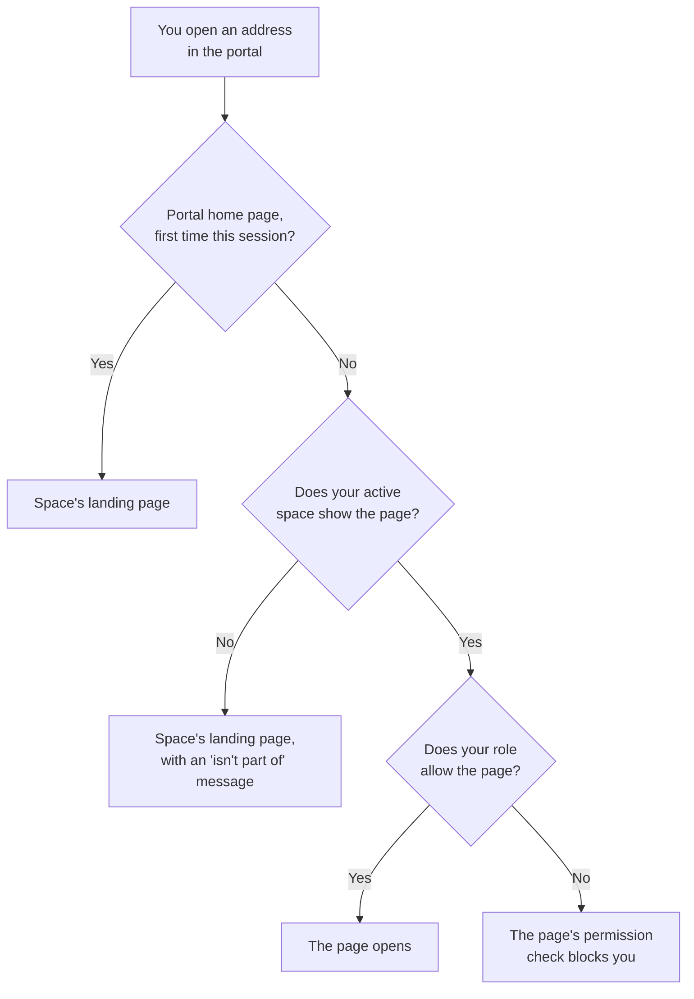

# Work in a space

A **space** is a view of the Quix Cloud portal that an organization admin designs for your team. While a space is active, it decides which sidebar items, header apps and landing page you see. It never changes what your role lets you do. See [Spaces overview](overview.md) for the concept.

This page describes the portal from a member's side: how you know which space you're in, how the active space is chosen, what it changes, and why a page sometimes sends you to your space's landing page instead of opening.

## Your active space

Only one space shapes your portal at a time: your **active space**. The **space chip** in the header shows its icon and name. On organization pages it sits after the organization name; inside a project environment it sits at the far left. The chip's tooltip says whether you're in the space through your user group or because an admin added you directly.

The space's accent color is the second cue. It draws a thin line across the top of the header and tints the chip and the selected sidebar item. The accent marks the space; it doesn't recolor the rest of the portal.

!!! note "No space chip"

    No chip means no space is applied, and you see the standard portal with every module your role allows. Usually you simply don't belong to a space. If the portal can't load your spaces, it also falls back to the standard portal rather than blocking you, so reload the page if you expected a space.

## Switch spaces

The chip becomes a switcher only when you have a choice to make:

| You are | You belong to | The space chip |
|---|---|---|
| Any user | No spaces | Doesn't appear |
| Not an admin | One space | Shows the space, nothing to switch to |
| Not an admin | Two or more spaces | Opens the `Switch space` menu |
| Organization admin | One or more spaces | Opens the `Switch space` menu, which also offers [Spaceless](#spaceless) |

The menu lists your spaces in the order your admins set. Switching is a full change of context: the portal applies the new space's sidebars, header apps and accent, and takes you to its landing page. If you switch from inside an environment, you leave the environment.

Where you land depends on how the new space is set up:

* An **organization page**, such as `Projects` or `Query Data`, opens that page.
* A **plugin app** opens inside the portal, beside the space's organization sidebar, or filling the page under the header if the space hides the sidebar.
* **`Home`**, the default, opens `Home`. If the space hides `Home`, you land on the first item in the space's sidebar.

## Which space you start in

Your active space is saved to your user account, not to your browser, so the portal opens in the same space on any browser or device.

* If you belong to one space and you aren't an admin, you always work in it.
* If you belong to several, Quix Cloud picks your starting space the first time. After that, the portal opens in the last space you chose.
* The landing page applies once per session, when you open the portal's home page. A bookmark or a link to a specific page opens that page instead, as long as your space shows it.

If a switch can't be saved, the portal returns you to your previous space and shows an error.

## What changes in the portal

The active space shapes navigation across the portal. Your permissions stay the same.

| Part of the portal | In a space |
|---|---|
| Organization sidebar | Only the items the space includes, which can be custom entries such as plugin apps and shortcuts into an environment. Some spaces hide the sidebar completely, and you work from the header and the page itself. |
| Environment sidebar | Only the modules the space includes. Opening an environment starts you on the first module the space shows, which isn't always `Pipeline`. |
| Header apps | The plugin apps the space pins, in its order. Each opens inside the portal, in the environment the space chose for it. A space that pins none shows none. |
| Command palette | Only pages from modules the space includes. Apps aren't curated: the palette lists every organization plugin you can access, whatever the space pins. |
| `Home` | Sections and shortcuts for hidden modules don't appear. The organization name and the Quix logo take you to the landing page instead if the space hides `Home`. |
| Links elsewhere in the portal | Links to hidden pages, on deployment cards or in tables for example, stay readable as text but don't open. Their tooltip names the space. |

A custom sidebar entry whose app or page no longer exists stays in place but is disabled, so you can tell something is missing rather than wondering where it went.

### Theme set by your space

A space can fix the theme for its members, light, dark, or following your operating system, instead of letting each person choose. While it does, your theme switch stays visible but is locked, and its tooltip names the space that set it.

Your own choice isn't lost. As soon as you're in a space that doesn't set the theme, or the admin stops setting it, the portal goes back to your preference. On first load you may see your own theme for a moment before the space's theme applies.

### Plugin toolbar

The plugin toolbar is the floating button over an embedded plugin app. It gives you portal shortcuts and a way out of the app, and your space decides whether it appears. Where it does, you can drag it out of the way or hide it until you next refresh the page. Where the space turns it off, you leave an embedded app through the command palette, the sidebar or a header app.

## Why a page sends you to your space's landing page

A space can hide a page that your role allows. The page's address still exists, so a shared link, an old bookmark or a typed URL can still point at it. When you open it, the portal takes you to your space's landing page and tells you why:

> **Deployments** isn't part of **Line operations** — you're back at **Line monitor**.

This isn't an error and it isn't about permissions. The page exists and your role may allow it, but your active space doesn't show it. To reach it, switch to a space that includes it, or ask an organization admin to add it to yours.

Following a link to a hidden page from elsewhere in the portal shows the same message.

The portal checks your space before your role whenever you arrive at an address:

When no space is active, the space check is skipped and only your role applies.

**Tell a space redirect from a permission block by the message.** A space redirect always says the page "isn't part of" your space. If you're turned away without that message, or you see an access error, your role doesn't allow the page, and switching spaces won't help. Ask an organization admin about your role. See [Roles and permissions](../roles.md).

## When an admin changes your space

Admins can edit a space, or your membership, while you're signed in. Your sidebar and header update without a reload, and a message tells you what changed. The portal doesn't move you off the page you're on, even if the space no longer includes it; the message offers a way to the landing page instead.

If you're removed from your active space, your active space becomes your next space, or the standard portal if you have none left. The change takes effect when you next navigate.

## Spaceless

**Spaceless** means no space is applied: the standard portal, with every module your role allows. Members who belong to no space are always in it. Organization admins are the only users who can choose it while they belong to a space, from the bottom of the `Switch space` menu or from `Go spaceless` on the redirect message.

Admins need it because a space shapes an admin's portal exactly as it shapes a member's. If your active space hides `Users`, `Spaces`, `Settings` or `Audit`, you lose those items, and opening their address sends you to the landing page. Switching to Spaceless is how you get them back. See [Admins are members too](overview.md#what-a-space-doesnt-control).

Spaceless is saved like any other choice, so you stay Spaceless until you pick a space. While you're Spaceless the header app strip is empty; plugin apps are still available from the command palette and open full screen.

Two other admin controls show up in the space experience:

* Each space in the `Switch space` menu has an edit button that opens it in the space designer without switching into it. The designer is part of the `Spaces` module, so if your active space hides `Spaces`, switch to Spaceless first. See [Create and manage spaces](create-space.md).
* A `Previewing as member` banner means you're previewing a space rather than working in it. See [Preview a space as a member](create-space.md#preview-a-space-as-a-member).

## See also

* [Spaces overview](overview.md)
* [Assign members](membership.md)
* [Roles and permissions](../roles.md)
