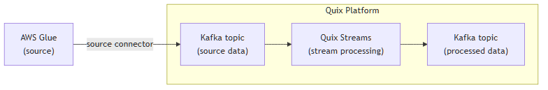

<!--- BEGIN MARKDOWN --->
# Integrate AWS Glue with Kafka using the source AWS Glue Kafka connector

Quix enables you to publish data from an AWS Glue job to Apache Kafka and then process it. All of this in real time, using pure Python, and at any scale. 

[Book a demo](https://share.hsforms.com/1iW0TmZzKQMChk0lxd_tGiw4yjw2)

## Move AWS Glue data to Kafka and process it in two simple steps

1. ### Ingest data from AWS Glue into Kafka

Use the Quix-made AWS Glue Kafka source connector to consume data from AWS Glue into Quix-managed Apache Kafka topics. The connector enables you to stream data in a scalable, fault-tolerant manner, with consistently low latencies. 

2. ### Process and transform data with Python

After data is ingested from AWS Glue, process and transform it on the fly with Quix Streams, an open-source, Kafka-based Python library. Quix Streams offers an intuitive Streaming DataFrame API (similar to pandas DataFrame) for real-time data processing. It supports aggregations, windowing, filtering, group-by operations, branching, merging, serialization, and more, allowing you to shape your data to fit your needs. 

## Quix Kafka connectors — a simpler, better alternative to Kafka Connect

Quix offers a Python-native, developer-friendly approach to data integration that eliminates the complexity associated with Kafka Connect deployment, configuration, and management. 

With Quix Kafka connectors, there's no need to wrestle with complex connector configurations, worker scaling, or infrastructure management that typically come with Kafka Connect.

Quix fully manages the entire Kafka connectors lifecycle, from deployment to monitoring. This means faster development, easier debugging, and lower operational overhead compared to traditional Kafka Connect implementations.

## Quix, your solution to simplify real-time data integration

As a Kafka-based platform, Quix streamlines real-time data integration across your entire tech stack, empowering you to effortlessly collect data from disparate sources into Kafka, transform and process it with Python, and send it to your chosen destination(s).

By using Quix as your central data hub, you can:

* Accelerate time to insights from your data to drive informed business decisions  
* Ensure data accuracy, quality, and consistency across your organization  
* Automate data integration pipelines and eliminate manual tasks  
* Manage and protect sensitive data with robust security measures  
* Handle large datasets in a scalable, fault-tolerant way, with sub-second latencies, and exactly-once processing guarantees  
* Reduce your data integration TCO to a fraction of the typical cost  
* Benefit from managed data integration infrastructure, thus reducing complexity and operational burden  
* Use a flexible, comprehensive toolkit to build data integration pipelines, including CI/CD and IaC support, environment management features, observability and monitoring capabilities, an online code editor, Python code templates, a CLI tool, and 130+ Kafka source and sink connectors

[Explore the Quix platform](https://portal.demo.quix.io/pipeline?workspace=demo-gametelemetrytemplate-prod)  |  [Book a demo](https://share.hsforms.com/1iW0TmZzKQMChk0lxd_tGiw4yjw2)

## FAQs

### What is AWS Glue?

AWS Glue is a fully managed ETL (Extract, Transform, Load) service that automates the process of preparing data for analytics. It orchestrates ETL jobs using Apache Spark and provides a centralized metadata repository, known as the Schema registry, to store connection properties, job properties, and data catalogs. AWS Glue is ideal for building data lakes, unifying disparate data sources, and creating data pipelines.

### What is Apache Kafka?

Apache Kafka is a scalable, reliable, and fault-tolerant event streaming platform that enables real-time integration and data exchange between different systems. Kafka’s publish-subscribe model ensures that any source system can write data to a central pipeline, while destination systems can read that data instantly as it arrives. In essence, Kafka acts as a central nervous system for data. It helps organizations unify their data architecture and provide a continuous, real-time flow of information across disparate components.

### What are Kafka connectors?

Kafka connectors are pre-built components that help integrate Apache Kafka with external systems. They allow you to reliably move data in and out of a Kafka cluster without writing custom integration code. There are two main types of Kafka connectors:

* Source connectors. These are used to pull data from source systems into Kafka topics.

* Sink connectors. These are used to push data from Kafka topics to destination systems.

### What is real-time data, and why is it important?

Real-time data is information that’s made available for use as soon as it's generated. It’s passed from source to destination systems with minimal latency, enabling rapid decision-making, immediate insights, and instant actions. Real-time data is crucial for industries like finance, logistics, manufacturing, healthcare, game development, information technology, and e-commerce. It empowers businesses to improve operational efficiency, increase revenue, enhance customer satisfaction, quickly respond to changing conditions, and gain a competitive advantage.

### What data can you publish from AWS Glue to Kafka in real time?

* Tables with connection properties, e.g., new table creations, updates, and deletions with metadata  
* Job metrics, including runtime statistics, resources used, and job properties adjustments  
* Data transformations results like JSON format serialization and schema conversion outcomes  
* Catalog data including table name, column structure, and schema evolution details  
* Security log data containing access changes, SSL connection initiations, and user audits  
* Glue scripts output, showing results of specific ETL jobs and script execution statuses  
* Stream classified data revealing inferred classifications, data types, and sensitivity levels

### What are key factors to consider when publishing AWS Glue data to Kafka in real time?

* AWS Glue requires configuring ETL jobs accurately to handle real-time data ingestion appropriately, demanding a good understanding of data sources and connection type.   
* Handling large datasets within AWS Glue's environment requires efficient resource management and partitioning strategies to optimize performance and maintain scalability.  
* Configuring SSL connection for secure data transmission between AWS Glue and Kafka demands thorough security practices to prevent data breaches.  
* Monitoring the performance of AWS Glue data streams when integrated with Kafka for performance tuning and resource optimization involves comprehensive analysis of job execution metrics.  
* Properly managing connection properties for seamless integration with various AWS Glue tables can be tricky, especially when aligning with external Kafka quotas and limits.  
* Schema evolution in AWS Glue when data schemas undergo frequent changes adds complexity to maintaining backward compatibility with downstream systems and Kafka consumers.  
* Aligning Glue's ETL jobs timing with Kafka's event-driven architecture can be challenging, particularly when orchestrating batch and stream processing in parallel.

### How does the AWS Glue Kafka source connector offered by Quix work?

The source AWS Glue Kafka connector provided by Quix is fully managed and written in Python. 

The connector continuously retrieves data from AWS Glue and publishes it to designated Quix-managed Kafka topics.  

The connector provides strong data delivery guarantees (ordering and exactly-once semantics) to ensure data is reliably ingested into Kafka. You can customize its write performance and choose between several serialization formats (such as JSON, Avro, and Protobuf).  

To find out more about the source AWS Glue Kafka connector offered by Quix, [book a demo](https://share.hsforms.com/1iW0TmZzKQMChk0lxd_tGiw4yjw2).

### Does Quix offer a sink AWS Glue Kafka connector too?

Yes, Quix also provides a sink AWS Glue Kafka connector.

Learn more about it.

In fact, Quix offers 130+ Kafka sink and source connectors, enabling you to move data from a variety of sources into Kafka, process it, and then send it to your desired destination(s). All in real time.

[Explore the library of Quix Kafka connectors](https://quix.io/connectors)
<!--- END MARKDOWN --->