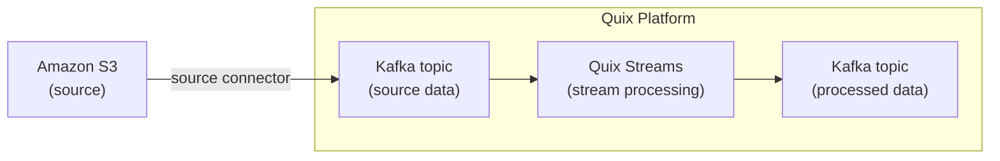

<!--- BEGIN MARKDOWN --->
# Integrate Amazon S3 with Kafka using the source Amazon S3 Kafka connector

Quix enables you to publish data from Amazon S3 to Apache Kafka and then process it. All of this in real time, using pure Python, and at any scale. 

[Book a demo](https://share.hsforms.com/1iW0TmZzKQMChk0lxd_tGiw4yjw2)

## Move Amazon S3 data to Kafka and process it in two simple steps

1. ### Ingest data from Amazon S3 into Kafka

Use the Quix-made Amazon S3 Kafka source connector to publish messages from Amazon S3 into Quix-managed Apache Kafka topics. The S3 connector enables you to stream data in a scalable, fault-tolerant manner, with consistently low latencies. 

2. ### Process and transform data with Python

After data is ingested from Amazon S3, process and transform it on the fly with Quix Streams, an open-source, Kafka-based Python library. Quix Streams offers an intuitive Streaming DataFrame API (similar to pandas DataFrame) for real-time data processing. It supports aggregations, windowing, filtering, group-by operations, branching, merging, serialization, value processing, timestamp management, and more, allowing you to shape your data to fit your needs.

## Quix Kafka connectors — a simpler, better alternative to Kafka Connect

Quix offers a Python-native, developer-friendly approach to data integration that eliminates the complexity associated with Kafka Connect deployment, configuration, and management. 

With Quix Kafka connectors, there's no need to wrestle with complex connector configurations, worker scaling, or infrastructure management that typically come with Kafka Connect.

Quix fully manages the entire Kafka connectors lifecycle, from deployment to monitoring. This means faster development, easier debugging, and lower operational overhead compared to traditional Kafka Connect implementations.

## Quix, your solution to simplify real-time data integration

As a Kafka-based platform, Quix streamlines real-time data integration across your entire tech stack, empowering you to effortlessly collect data from disparate sources into Kafka, transform and process it with Python, and send it to your chosen destination(s).

By using Quix as your central data hub, you can:

* Accelerate time to insights from your data to drive informed business decisions  
* Ensure data accuracy, quality, and consistency across your organization  
* Automate data integration pipelines and eliminate manual tasks  
* Manage and protect sensitive data with robust security measures  
* Handle data in a scalable, fault-tolerant way, with sub-second latencies, and exactly-once processing guarantees  
* Reduce your data integration TCO to a fraction of the typical cost  
* Benefit from managed data integration infrastructure, thus reducing complexity and operational burden  
* Use a flexible, comprehensive toolkit to build data integration pipelines, including CI/CD and IaC support, environment management features, observability and monitoring capabilities, an online code editor, Python code templates, a CLI tool, and 130+ Kafka source and sink connectors

[Explore the Quix platform](https://portal.demo.quix.io/pipeline?workspace=demo-gametelemetrytemplate-prod)                     [Book a demo](https://share.hsforms.com/1iW0TmZzKQMChk0lxd_tGiw4yjw2)

## FAQs

### What is Amazon S3?

Amazon S3 is an object-based storage service offered by AWS that helps you store data reliably and securely, providing easy scalability and high performance. It's suitable for a range of use cases including data archiving, big data analytics, backup and restore, and cloud-native application storage. S3 enables straightforward integration with other AWS services via the AWS console and supports a variety of data formats.

### What is Apache Kafka?

Apache Kafka is a scalable, reliable, and fault-tolerant event streaming platform that enables real-time integration and data exchange between different systems. Kafka’s publish-subscribe model ensures that any source system can write data to a central pipeline, while destination systems can read that data instantly as it arrives. In essence, Kafka acts as a central nervous system for data. It helps organizations unify their data architecture and provide a continuous, real-time flow of information across disparate components.

### What are Kafka connectors?

Kafka connectors are pre-built components that help integrate Apache Kafka with external systems. They allow you to reliably move data in and out of a Kafka cluster without writing custom integration code. There are two main types of Kafka connectors:

* Source connectors. These are used to pull data from source systems into Kafka topics.

* Sink connectors. These are used to push data from Kafka topics to destination systems.

### What is real-time data, and why is it important?

Real-time data is information that’s made available for use as soon as it's generated. It’s passed from source to destination systems with minimal latency, enabling rapid decision-making, immediate insights, and instant actions. Real-time data is crucial for industries like finance, logistics, manufacturing, healthcare, game development, information technology, and e-commerce. It empowers businesses to improve operational efficiency, increase revenue, enhance customer satisfaction, quickly respond to changing conditions, and gain a competitive advantage.

### What data can you publish from Amazon S3 to Kafka in real time?

* Object metadata, e.g., keys, timestamps, storage class  
* Log files generated by various AWS services, including access logs, error logs   
* Data backup and archival including database snapshots, config files  
* Analytics data such as transaction records, user behavior logs  
* Media files like images, videos, and recordings  
* Compliance and audit records showing various system operations and user actions  
* Container images and code deployments for application rollouts and updates  

### What are key factors to consider when publishing Amazon S3 data to Kafka in real time?

* Understanding and setting up the connectors' configuration is key to ensuring compatibility with both Amazon S3 and Kafka ecosystem.  
* Efficient handling of large file sizes is crucial as it affects both S3 storage costs and Kafka consumer throughput, particularly in cases where data is processed in bulk.  
* Ensuring AWS credentials, such as those used by the AWS CLI, are securely managed is essential for protecting access to S3, your AWS account, and the Quix platform.  
* Dealing with variable latencies between S3 data writes and Kafka topic publishing requires careful monitoring and tuning to avoid disruption.  
* AWS region selection can impact data transfer speed and costs, especially when streaming data across different geographical locations.  
* Managing and transforming the schema of data to match Kafka message formats is critical for maintaining data integrity during real-time ETL.  
* Frequent polling of Amazon S3 buckets might introduce overhead costs, necessitating fine-tuned cost management strategies.

### How does the Amazon S3 Kafka source connector offered by Quix work?

The Amazon S3 connector for Kafka provided by Quix is fully managed and written in Python. 

The connector continuously retrieves data from Amazon S3 and publishes messages to designated Quix-managed Kafka topics. 

The S3 connector provides strong data delivery guarantees (ordering and exactly-once semantics) to ensure data is reliably ingested into Kafka. You can customize its write performance, handle AWS credentials securely, and choose between several serialization formats (such as JSON, Avro, and Protobuf).  

To find out more about the source Amazon S3 Kafka connector offered by Quix, [book a demo](https://share.hsforms.com/1iW0TmZzKQMChk0lxd_tGiw4yjw2).

### Does Quix offer a sink Amazon S3 Kafka connector too?

Yes, Quix also provides an Amazon S3 sink connector for Kafka.

Learn more about it.

In fact, Quix offers 130+ Kafka sink and source connectors, enabling you to move data from a variety of sources into Kafka, process it, and then send it to your desired destination(s). All in real time.

[Explore the library of Quix Kafka connectors](https://quix.io/connectors)
<!--- END MARKDOWN --->