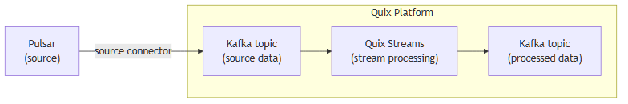

<!--- BEGIN MARKDOWN --->
# Integrate Pulsar with Kafka using the source Pulsar Kafka connector

Quix enables you to publish data from Apache Pulsar to Apache Kafka and then process it. All of this in real time, using pure Python, and at any scale.

[Book a demo](https://share.hsforms.com/1iW0TmZzKQMChk0lxd_tGiw4yjw2)

## Move Pulsar data to Kafka and process it in two simple steps

1. ### Ingest data from Pulsar into Kafka

Use the Quix-made Pulsar Kafka source connector to publish data from Pulsar into Quix-managed Apache Kafka topics. The connector enables you to stream data in a scalable, fault-tolerant manner, with consistently low latencies and strong ordering guarantees.

2. ### Process and transform data with Python

After data is ingested from Pulsar, process and transform it on the fly with Quix Streams, an open-source, Kafka-based Python library. Quix Streams offers an intuitive Streaming DataFrame API (similar to pandas DataFrame) for real-time data processing and message transformation. It supports aggregations, windowing, filtering, group-by operations, branching, merging, serialization, and more, allowing you to shape your data to fit your needs.

## Quix Kafka connectors — a simpler, better alternative to Kafka Connect

Quix offers a Python-native, developer-friendly approach to data integration that eliminates the complexity associated with Kafka Connect deployment, configuration, and management.

With Quix Kafka connectors, there's no need to wrestle with complex connector configurations, worker scaling, or infrastructure management that typically come with traditional messaging systems like Kafka Connect.

Quix fully manages the entire Kafka connectors lifecycle, from deployment to monitoring. This means faster development, easier debugging, and lower operational overhead compared to traditional Kafka Connect implementations.

## Quix, your solution to simplify real-time data integration

As a Kafka-based platform, Quix streamlines real-time data integration across your entire tech stack, empowering you to effortlessly collect data from disparate sources into Kafka, transform and process it with Python, and send it to your chosen destination(s).

By using Quix as your central data hub, you can:

* Accelerate time to insights from your data to drive informed business decisions  
* Ensure data accuracy, quality, and consistency across your organization  
* Automate data integration pipelines and eliminate manual tasks  
* Ensure guaranteed message delivery and manage and protect sensitive data with robust security measures  
* Handle data with scalability, fault tolerance, sub-second latencies, and exactly-once processing guarantees  
* Reduce your data integration TCO to a fraction of the typical cost  
* Benefit from managed data integration infrastructure, thus reducing complexity and operational burden  
* Use a flexible, comprehensive toolkit to build data integration pipelines, including CI/CD and IaC support, environment management features, observability and monitoring capabilities, an online code editor, Python code templates, a CLI tool, and 130+ Kafka source and sink connectors

[Explore the Quix platform](https://portal.demo.quix.io/?workspace=demo-iotphonedemo-prod)  |  [Book a demo](https://share.hsforms.com/1iW0TmZzKQMChk0lxd_tGiw4yjw2)

## FAQs

### What is Pulsar?

Apache Pulsar is a distributed messaging and streaming data platform that offers multi-tenancy, high throughput, low latency, and global data replication. It is designed for handling high throughput workloads and provides features like multiple consumers in a single subscription, message durability, and advanced processing capabilities. Pulsar is suitable for stream processing, pub-sub messaging, and real-time analytics.

### What is Apache Kafka?

Apache Kafka is a scalable, reliable, and fault-tolerant event streaming platform that enables global data replication, real-time integration, and data exchange between different systems. Kafka and Pulsar both utilize a publish-subscribe model that ensures any source system can write data to a central pipeline, while destination systems can read that streaming data instantly as it arrives. In essence, Kafka acts as a central nervous system for data. It helps organizations unify their data architecture and provide a continuous, real-time flow of information across disparate components.

### What are Kafka connectors?

Kafka connectors are pre-built components that help integrate Apache Kafka with external systems. They allow you to reliably transfer data in and out of a Kafka cluster without writing custom integration code. There are two main types of Kafka connectors:

* **Source connectors**: These are used to pull data from source systems into Kafka topics.

* **Sink connectors**: These are used to push data from Kafka topics to destination systems.

### What is real-time data, and why is it important?

Real-time data is information that’s made available for use as soon as it's generated. It’s passed from source to destination systems with minimal latency, enabling rapid decision-making, immediate insights, and instant actions. Real-time data is crucial for industries like finance, logistics, manufacturing, healthcare, game development, information technology, and e-commerce. It empowers businesses to improve operational efficiency, increase revenue, enhance customer satisfaction, quickly respond to changing conditions, and gain a competitive advantage.

### What data can you publish from Pulsar to Kafka in real time?

* Event logs, e.g., application logs, audit logs, and user activity logs with timestamps and metadata  
* Metrics and performance data, including CPU usage, memory usage, and request latency  
* Sensor and IoT data like temperature, humidity, and pressure readings  
* Financial transactions showing real-time updates and approvals with associated timestamps  
* User interaction events such as button clicks, form submissions, and page views  
* Streaming media data including video playback progress, resolution changes, and buffer status  
* System notifications, such as alerts, warnings, and status changes  

### What are key factors to consider when publishing Pulsar data to Kafka in real time?

* Multi-cloud deployments may affect global data replication and require careful configuration for robust geo-replication capabilities.  
* Message ordering and deduplication can be challenging to maintain during schema evolution, particularly with large messages and complex retention policies.  
* Defining optimal Pulsar topic partitioning strategies is crucial to avoid uneven data distribution and scaling issues.  
* Careful management of producer and consumer configurations is essential to handle high throughput workloads without impacting performance or causing resource contention.  
* Implementing security features such as encryption, authentication, and authorization is vital to protecting data streams when transferring between Pulsar and Kafka environments.  
* Network reliability is essential to ensure guaranteed message delivery and avoid data loss during transmission.  
* Aligning data schemas between Pulsar and Kafka can be complex, requiring synchronization tools and processes to ensure consistency and integrity of streaming data.

### How does the Pulsar Kafka source connector offered by Quix work?

The source Pulsar Kafka connector provided by Quix is fully managed and written in Python.

The connector continuously retrieves data from Pulsar and publishes it to designated Quix-managed Kafka topics.

The connector provides strong data delivery guarantees (ordering and exactly-once semantics) to ensure data is reliably ingested into Kafka. You can customize its write performance and choose between several serialization formats (such as JSON, Avro, and Protobuf).

To find out more about the source Pulsar Kafka connector offered by Quix, [book a demo](https://share.hsforms.com/1iW0TmZzKQMChk0lxd_tGiw4yjw2).

### Does Quix offer a sink Pulsar Kafka connector too?

Yes, Quix also provides a sink Pulsar connector for Kafka.

[Learn more about it](../../../quix-streams/sinks/coming-soon/ApachePulsar-sink.md).

In fact, Quix offers 130+ Kafka sink and source connectors, enabling you to move data from a variety of sources into Kafka, process it, and then send messages to your desired destination(s). All in real time.

[Explore the library of Quix Kafka connectors](https://quix.io/connectors)
<!--- END MARKDOWN --->