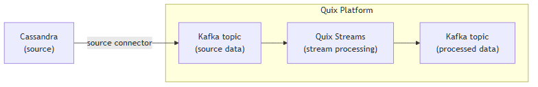

<!--- BEGIN MARKDOWN --->
# Integrate Cassandra with Kafka using the source Cassandra Kafka connector

Quix enables you to publish data from Cassandra to Apache Kafka and then process it. All of this in real time, using pure Python, and at any scale. 

[Book a demo](https://share.hsforms.com/1iW0TmZzKQMChk0lxd_tGiw4yjw2)

## Move Cassandra data to Kafka and process it in two simple steps

1. ### Ingest data from Cassandra into Kafka

Use the Quix-made Cassandra Kafka source connector to publish data from Apache Cassandra into Quix-managed Apache Kafka topics. The connector enables you to stream data in a scalable, fault-tolerant manner, with consistently low latencies. 

2. ### Process and transform data with Python

After data is ingested from Cassandra, process and transform it on the fly with Quix Streams, an open-source, Kafka-based Python library that performs computations. Quix Streams offers an intuitive Streaming DataFrame API (similar to pandas DataFrame) for real-time data processing. It supports aggregations, windowing, filtering, group-by operations, branching, merging, serialization, and more, allowing you to shape your data to fit your needs.

## Quix Kafka connectors — a simpler, better alternative to Kafka Connect

Quix offers a Python-native, developer-friendly approach to data integration that eliminates the complexity associated with the Kafka Connect framework deployment, configuration, and management.

With Quix Kafka connectors, there's no need to wrestle with complex connector configurations, worker scaling, or infrastructure management that typically come with Kafka Connect.

Quix fully manages the entire Kafka connectors lifecycle, from deployment to monitoring. This means faster development, easier debugging, and lower operational overhead compared to traditional Kafka Connect implementations.

## Quix, your solution to simplify real-time data integration

As a Kafka-based platform, Quix streamlines real-time data integration across your entire tech stack, empowering you to effortlessly collect data from disparate sources into Kafka, transform and process it with Python, and send it to your chosen destination(s).

By using Quix as your central data hub, you can:

* Accelerate time to insights from your data to drive informed business decisions  
* Ensure data accuracy, quality, and consistency across your organization  
* Automate data integration pipelines and eliminate manual tasks  
* Manage and protect sensitive data with robust security measures  
* Handle data in a scalable, fault-tolerant way, with sub-second latencies, and exactly-once processing guarantees  
* Reduce your data integration TCO to a fraction of the typical cost  
* Benefit from managed data integration infrastructure, thus reducing complexity and operational burden  
* Use a flexible, comprehensive toolkit to build data integration pipelines, including CI/CD and IaC support, environment management features, observability and monitoring capabilities, an online code editor, Python code templates, a CLI tool, and 130+ Kafka source and sink connectors

[Explore the Quix platform](https://portal.demo.quix.io/?workspace=demo-iotphonedemo-prod)  |  [Book a demo](https://share.hsforms.com/1iW0TmZzKQMChk0lxd_tGiw4yjw2)

## FAQs

### What is Cassandra?

Apache Cassandra is a distributed NoSQL database known for its high availability and scalability capabilities. It’s designed to handle large volumes of data stored across multiple nodes with no single point of failure. Its powerful query language, CQL, allows you to perform complex queries on Cassandra tables. Cassandra is ideal for applications that require fast responses, high write and read speeds, and robust fault tolerance.

### What is Apache Kafka?

Apache Kafka is a scalable, reliable, and fault-tolerant event streaming platform that enables real-time integration and data exchange between different systems. Kafka’s publish-subscribe model ensures that any source system can write data to a central pipeline, while destination systems can read that data instantly as it arrives. In essence, Kafka acts as a central nervous system for data. It helps organizations unify their data architecture, providing a continuous, real-time flow of information across disparate components.

### What are Kafka connectors?

Kafka connectors are pre-built components that help integrate Apache Kafka with external systems. They allow you to reliably move data in and out of a Kafka cluster without writing custom integration code. There are two main types of Kafka connectors:

* **Source connectors**: These are used to pull data from source systems into Kafka topics.

* **Sink connectors**: These are used to push data from Kafka topics to destination systems.

### What is real-time data, and why is it important?

Real-time data is information that’s made available for use as soon as it's generated. It’s passed from source to destination systems with minimal latency, enabling rapid decision-making, immediate insights, and instant actions. Real-time data is crucial for industries like finance, logistics, manufacturing, healthcare, game development, information technology, and e-commerce. It empowers businesses to improve operational efficiency, increase revenue, enhance customer satisfaction, quickly respond to changing conditions, and gain a competitive advantage.

### What data can you publish from Apache Cassandra to Kafka in real time?

* Table updates, e.g., new row insertions, updates, and deletions with associated timestamps and user metadata  
* Performance metrics, such as read/write latency, error rates, and operation counters  
* Keyspace changes, including schema alterations, index modifications, and new column families  
* Time-series data containing periodic measurements, sensor readings, and statistical summaries  
* JSON format payloads for event-driven applications and microservices architectures  
* Geospatial data for location-based services, travel, and logistics applications  
* User activity logs including login attempts, transaction completions, and content interactions

### What are key factors to consider when publishing Cassandra data to Kafka in real time?

* Internode communication latency in a Cassandra cluster can affect synchronization speed and data consistency across nodes.  
* High-volume streaming from Cassandra tables may lead to contention issues, requiring careful load distribution and write performance tuning.  
* Performing batch writes during peak load can significantly impact the streaming data performance both on Cassandra and Kafka ends, necessitating efficient task scheduling.  
* The JSON format output of streaming data needs efficient extraction and parsing mechanisms to ensure processing efficiency and data integrity.  
* Implementing comprehensive fault tolerance and recovery mechanisms in both Cassandra and Kafka is essential to maintain high availability during failures.  
* The distributed mode of both technologies requires robust coordination and monitoring systems to manage data flow and observability efficiently.  
* Ensuring data protection and security requires consistent application of access controls and encryption across both systems to safeguard sensitive information.

### How does the Cassandra Kafka source connector offered by Quix work?

The Cassandra source connector for Kafka provided by Quix is fully managed and written in Python.

The connector continuously retrieves data from Cassandra and publishes it to designated Quix-managed Kafka topics.

The connector provides strong data delivery guarantees (ordering and exactly-once semantics) to ensure data is reliably ingested into Kafka. You can customize its write performance and choose between several serialization formats (such as JSON format, Avro, and Protobuf).

To find out more about the Cassandra Kafka source connector offered by Quix, [book a demo](https://share.hsforms.com/1iW0TmZzKQMChk0lxd_tGiw4yjw2).

### Does Quix offer a sink Cassandra Kafka connector too?

Yes, Quix also provides a Cassandra sink connector for Kafka.

[Learn more about it](../../../quix-streams/sinks/coming-soon/Cassandra-sink.md).

In fact, Quix offers 130+ Kafka sink and source connectors, enabling you to move data from a variety of sources into Kafka, performs computations, and then send it to your desired destination(s). All in real time.

[Explore the library of Quix Kafka connectors](https://quix.io/connectors)
<!--- END MARKDOWN --->