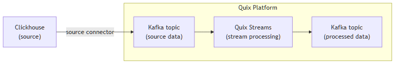

<!--- BEGIN MARKDOWN --->
"
# Integrate Clickhouse with Kafka using the source Clickhouse Kafka connector

Quix enables you to publish data from Clickhouse to Apache Kafka and then process it. All of this in real time, using pure Python, and at any scale.

[Book a demo](https://share.hsforms.com/1iW0TmZzKQMChk0lxd_tGiw4yjw2)

## Move Clickhouse data to Kafka and process it in two simple steps

1. ### Ingest data from Clickhouse into Kafka

Use the Quix-made Clickhouse Kafka source connector to publish data from Clickhouse into Quix-managed Apache Kafka topics. The connector enables you to stream data in a scalable, fault-tolerant manner, with consistently low latencies.

2. ### Process and transform data with Python

After data is ingested from Clickhouse, process and transform it on the fly with Quix Streams, an open-source, Kafka-based Python library. Quix Streams offers an intuitive Streaming DataFrame API (similar to pandas DataFrame) for real-time data processing. It supports aggregations, windowing, filtering, group-by operations, branching, merging, serialization, and more, allowing you to shape your data to fit your needs.

## Quix Kafka connectors — a simpler, better alternative to Kafka Connect

Quix offers a Python-native, developer-friendly approach to data integration that eliminates the complexity associated with Kafka Connect deployment, configuration, and management.

With Quix Kafka connectors, there's no need to wrestle with complex connector configurations, worker scaling, or infrastructure management that typically come with Kafka Connect.

Quix fully manages the entire Kafka connectors lifecycle, from deployment to monitoring. This means faster development, easier debugging, and lower operational overhead compared to traditional Kafka Connect implementations.

## Quix, your solution to simplify real-time data integration

As a Kafka-based platform, Quix streamlines real-time data integration across your entire tech stack, empowering you to effortlessly collect data from disparate sources into Kafka, transform and process it with Python, and send it to your chosen destination(s).

By using Quix as your central data hub, you can:

* Accelerate time to insights from your data to drive informed business decisions  
* Ensure data accuracy, quality, and consistency across your organization  
* Automate data integration pipelines and eliminate manual tasks  
* Manage and protect sensitive data with robust security measures  
* Handle data in a scalable, fault-tolerant way, with sub-second latencies, and exactly once guarantees  
* Reduce your data integration TCO to a fraction of the typical cost  
* Benefit from managed data integration infrastructure, thus reducing complexity and operational burden  
* Use a flexible, comprehensive toolkit to build data integration pipelines, including CI/CD and IaC support, environment management features, observability and monitoring capabilities, an online code editor, Python code templates, a CLI tool, and 130+ Kafka source and sink connectors

[Explore the Quix platform](https://portal.demo.quix.io/?workspace=demo-dataintegrationdemo-prod)  |  [Book a demo](https://share.hsforms.com/1iW0TmZzKQMChk0lxd_tGiw4yjw2)

## FAQs

### What is Clickhouse?

Clickhouse is a columnar database management system designed for online analytical processing (OLAP). It is known for its high performance in querying large volumes of data using highly efficient table engine storage mechanisms. Common use cases include real-time reporting, analytics, and complex queries across distributed systems with Clickhouse's cluster coordination system.

### What is Apache Kafka?

Apache Kafka is a scalable, reliable, and fault-tolerant event streaming platform that enables real-time integration and data exchange between different systems. Kafka’s publish-subscribe model ensures that any source system can write data to a central pipeline, while destination systems can read that data instantly as it arrives. In essence, Kafka acts as a central nervous system for data. It helps organizations unify their data architecture and provide a continuous, real-time flow of information across disparate components.

### What are Kafka connectors?

Kafka connectors are pre-built components that help integrate Apache Kafka with external systems. They allow you to reliably move data in and out of a Kafka cluster without writing custom integration code. There are two main types of Kafka connectors:

* **Source connectors**: These are used to pull data from source systems into Kafka topics.

* **Sink connectors**: These are used to push data from Kafka topics to destination systems.

### What is real-time data, and why is it important?

Real-time data is information that’s made available for use as soon as it's generated. It’s passed from source to destination systems with minimal latency, enabling rapid decision-making, immediate insights, and instant actions. Real-time data is crucial for industries like finance, logistics, manufacturing, healthcare, game development, information technology, and e-commerce. It empowers businesses to improve operational efficiency, increase revenue, enhance customer satisfaction, quickly respond to changing conditions, and gain a competitive advantage.

### What data can you publish from Clickhouse to Kafka in real time?

* Analytics results, e.g., complex query outputs, aggregate calculations, and reporting data  
* System logs and telemetry, including database events, activities and statistics  
* User event data with detailed interaction logs across applications and services  
* Time-series data such as sensor readings, application metrics, and performance logs  
* Financial transaction data like purchase records, order statuses, and payment details  
* AI and machine learning model outputs, including predictions and inference results  
* Operational metadata with details on data generation, processing, and consumption

### What are key factors to consider when publishing Clickhouse data to Kafka in real time?

* Clickhouse configuration for real-time integration might require specific settings to manage incoming data efficiently.  
* Ensuring exactly once delivery semantics in a distributed system can be challenging without a strongly consistent storage solution.  
* When dealing with data stream transformations, coordinating multiple Clickhouse Keeper instances and maintaining the last committed offset across the data stream is crucial.  
* Monitoring the Clickhouse table storage performance is vital to handle the data load, particularly when you consume data rapidly from Kafka topics.  
* Carefully track the committed offset to prevent message loss or duplication when message delivery is interrupted.  
* Planning the Clickhouse table engine optimally might be necessary to accommodate various distributed system workloads and data types while preserving data integrity.  
* Clickhouse's cluster coordination system requires stringent monitoring for optimal performance and fail-safe operations.  

### How does the Clickhouse Kafka source connector offered by Quix work?

The source Clickhouse connector for Kafka provided by Quix is fully managed and written in Python.

The connector continuously retrieves data from Clickhouse and publishes it as Kafka messages to designated Quix-managed Kafka topics.

The connector provides strong data delivery guarantees (ordering and exactly-once semantics) to ensure data is reliably ingested into Kafka. You can customize its write performance and choose between several serialization formats (such as JSON, Avro, and Protobuf).

To find out more about the source Clickhouse Kafka connector offered by Quix, [book a demo](https://share.hsforms.com/1iW0TmZzKQMChk0lxd_tGiw4yjw2).

### Does Quix offer a sink Clickhouse Kafka connector too?

Yes, Quix also provides a Clickhouse Kafka sink connector.

[Learn more about it](../../../quix-streams/sinks/coming-soon/Clickhouse-sink.md).

In fact, Quix offers 130+ Kafka sink and source connectors, enabling you to move data from a variety of sources into Kafka, process it, and then send it to your desired destination(s). All in real time.

[Explore the library of Quix Kafka connectors](https://quix.io/connectors)
<!--- END MARKDOWN --->
"