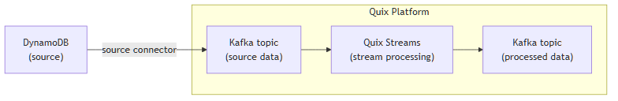

<!--- BEGIN MARKDOWN --->
# Integrate DynamoDB with Kafka using the source DynamoDB Kafka connector

Quix enables you to publish data from DynamoDB to Apache Kafka and then process it. All of this in real time, using pure Python, and at any scale.

[Book a demo](https://share.hsforms.com/1iW0TmZzKQMChk0lxd_tGiw4yjw2)

## Move DynamoDB data to Kafka and process it in two simple steps

1. ### Ingest data from DynamoDB into Kafka

Use the Quix-made DynamoDB Kafka source connector to publish data from DynamoDB into Quix-managed Apache Kafka topics. The connector enables you to stream data in a scalable, fault-tolerant manner, with consistently low latencies.

2. ### Process and transform data with Python

After data is ingested from AWS DynamoDB, process and transform it on the fly with Quix Streams, an open-source, Kafka-based Python library. Quix Streams offers an intuitive Streaming DataFrame API (similar to pandas DataFrame) for real-time data processing. It supports aggregations, windowing, filtering, group-by operations, branching, merging, serialization, and more, allowing you to shape your streaming data to fit your needs.

## Quix Kafka connectors — a simpler, better alternative to Kafka Connect

Quix offers a Python-native, developer-friendly approach to data integration that eliminates the complexity associated with Kafka Connect deployment, configuration, and management, including schema registry setup.

With Quix Kafka connectors, there's no need to wrestle with complex connector configurations, worker scaling, or infrastructure management that typically come with Kafka Connect.

Quix fully manages the entire Kafka connectors lifecycle, from deployment to monitoring. This means faster development, easier debugging, and lower operational overhead compared to traditional Kafka Connect implementations.

## Quix, your solution to simplify real-time data integration

As a Kafka-based platform, Quix streamlines real-time data integration across your entire tech stack, empowering you to effortlessly collect data from disparate sources, including DynamoDB tables, into Kafka, transform and process it with Python, and send it to your chosen destination(s).

By using Quix as your central data hub, you can:

* Accelerate time to insights from your data to drive informed business decisions  
* Ensure data accuracy, quality, and consistency across your organization  
* Automate data integration pipelines and eliminate manual tasks  
* Manage and protect sensitive data with robust security measures  
* Handle data in a scalable, fault-tolerant way, with sub-second latencies, and exactly-once processing guarantees  
* Reduce your data integration TCO to a fraction of the typical cost  
* Benefit from fully managed connectors for data integration infrastructure, thus reducing complexity and operational burden  
* Use a flexible, comprehensive toolkit to build data integration pipelines, including CI/CD and IaC support, environment management features, observability and monitoring capabilities, an online code editor, Python code templates, a CLI tool, and 130+ Kafka source and sink connectors

[Explore the Quix platform](https://portal.demo.quix.io/?workspace=demo-dataintegrationdemo-prod) | [Book a demo](https://share.hsforms.com/1iW0TmZzKQMChk0lxd_tGiw4yjw2)

## FAQs

### What is DynamoDB?

Amazon DynamoDB is a fully managed NoSQL database service that provides fast and predictable performance with seamless scalability. It is ideal for serverless applications, real-time analytics, IoT, and mobile apps. Amazon DynamoDB excels in use cases requiring high-speed transactions, low latency, and strong consistency for schema-less data storage.

### What is Apache Kafka?

Apache Kafka is a scalable, reliable, and fault-tolerant event streaming platform that enables real-time integration and data exchange between different systems. Kafka’s publish-subscribe model ensures that any source system can write streaming data to a central pipeline, while destination systems can read that data instantly as it arrives. In essence, Kafka acts as a central nervous system for data. It helps organizations unify their data architecture and provide a continuous, real-time flow of information across disparate components.

### What are Kafka connectors?

Kafka connectors are pre-built components that help integrate Apache Kafka with external systems. They allow you to reliably move data and records in and out of a Kafka cluster without writing custom integration code. There are two main types of Kafka connectors:

* **Source connectors**: These are used to pull data from source systems into Kafka topics using a Kafka record key.

* **Sink connectors**: These are used to push data from Kafka topics to destination systems.

### What is real-time data, and why is it important?

Real-time data is information that’s made available for use as soon as it's generated. It’s passed from source to destination systems with minimal latency, enabling rapid decision-making, immediate insights, and instant actions. Real-time data is crucial for industries like finance, logistics, manufacturing, healthcare, game development, information technology, and e-commerce. It empowers businesses to improve operational efficiency, increase revenue, enhance customer satisfaction, quickly respond to changing conditions, and gain a competitive advantage.

### What data can you publish from DynamoDB to Kafka in real time?

* Table updates, e.g., item insertions, modifications, and deletions along with timestamps and source table names  
* Operational metrics, covering read and write throughput, latency measurements, and error counts  
* Change stream data, capturing modifications from DynamoDB tables in real time  
* Audit logs, detailing user activities and IAM roles interactions both in DynamoDB tables and connected services  
* Transaction data, representing financial operations, inventory changes, or e-commerce transactions  
* Metadata, such as schema mapping details, real-time index changes, and global table replication updates  
* Analytics data, including computed aggregations, trend analyses, and query results from DynamoDB table names

### What are key factors to consider when publishing DynamoDB data to Kafka in real time?

* Continuous DynamoDB stream processing can impact database performance, particularly during high-read/write activity periods when queries are intensive.  
* Designing effective IAM roles and permissions is crucial for secure and efficient data flow between DynamoDB and Kafka.  
* Managing environment variables effectively ensures that connectors operate reliably across different settings without manual reconfiguration.  
* Consistency between DynamoDB schema changes and Kafka consumer configurations is essential to prevent data loss or processing lags.  
* Handling batch record sizes and artificial throttling during high-load periods is necessary to maintain performance across Kafka connectors.  
* Implementing reliable key-based mapping from source tables in DynamoDB to Kafka topics can prevent data imbalances and ensure efficient streaming.  
* Safeguarding and masking sensitive data fields require robust strategies, especially when sourcing from Amazon DynamoDB to an open data platform.

### How does the DynamoDB Kafka source connector offered by Quix work?

The source DynamoDB Kafka connector provided by Quix is fully managed and written in Python.

The connector continuously retrieves data from DynamoDB and publishes it to designated Quix-managed Kafka topics.

The connector provides strong data delivery guarantees (ordering and exactly-once semantics) to ensure data is reliably ingested into Kafka. You can customize its write performance and choose between several serialization formats (such as JSON, Avro, and Protobuf).

To find out more about the DynamoDB connector for Kafka offered by Quix, [book a demo](https://share.hsforms.com/1iW0TmZzKQMChk0lxd_tGiw4yjw2).

### Does Quix offer a sink DynamoDB Kafka connector too?

Yes, Quix also provides a DynamoDB sink connector for Kafka.

[Learn more about it](../../../quix-streams/sinks/coming-soon/DynamoDB-sink.md).

In fact, Quix offers 130+ Kafka sink and source connectors, enabling you to move data from a variety of sources into Kafka, process it, and then send it to your desired destination(s). All in real time.

[Explore the library of Quix Kafka connectors](https://quix.io/connectors)
<!--- END MARKDOWN --->