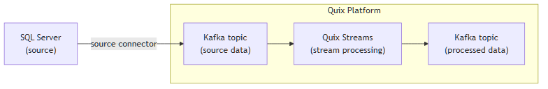

<!--- BEGIN MARKDOWN --->
"
# Integrate SQL Server with Kafka using the source SQL Server Kafka connector

Quix enables you to publish data from a SQL Server database to Apache Kafka and then process it. All of this in real time, using pure Python, and at any scale. 

[Book a demo](https://share.hsforms.com/1iW0TmZzKQMChk0lxd_tGiw4yjw2)

## Move SQL Server data to Kafka and process it in two simple steps

1. ### Ingest data from SQL Server into Kafka

Use the Quix-made SQL Server Kafka source connector to publish data from SQL Server into Quix-managed Apache Kafka topics. The connector enables you to stream data in a scalable, fault-tolerant manner, with consistently low latencies. 

2. ### Process and transform data with Python

After data is ingested from SQL Server tables, process and transform it on the fly with Quix Streams, an open-source, Kafka-based Python library. Quix Streams offers an intuitive Streaming DataFrame API (similar to pandas DataFrame) for real-time data processing. It supports aggregations, windowing, filtering, group-by operations, branching, merging, serialization, and more, allowing you to shape your data to fit your needs.

## Quix Kafka connectors — a simpler, better alternative to Kafka Connect

Quix offers a Python-native, developer-friendly approach to data integration that eliminates the complexity associated with Kafka Connect deployment, configuration, and management. 

With Quix Kafka connectors, there's no need to wrestle with complex connector configurations, worker scaling, or infrastructure management that typically come with Kafka Connect.

Quix fully manages the entire Kafka connectors lifecycle, from deployment to monitoring. This means faster development, easier debugging, and lower operational overhead compared to traditional Kafka Connect implementations.

## Quix, your solution to simplify real-time data integration

As a Kafka-based platform, Quix streamlines real-time data integration across your entire tech stack, empowering you to effortlessly collect data from disparate sources into Kafka, transform and process it with Python, and send it to your chosen destination(s).

By using Quix as your central data hub, you can:

* Accelerate time to insights from your data to drive informed business decisions  
* Ensure data accuracy, quality, and data integrity across your organization  
* Automate data integration pipelines and eliminate manual tasks  
* Manage and protect sensitive data with robust security measures  
* Handle data in a scalable, fault-tolerant way, with sub-second latencies and exactly-once processing guarantees  
* Reduce your data integration TCO to a fraction of the typical cost  
* Benefit from managed data integration infrastructure, thus reducing complexity and operational burden  
* Use a flexible, comprehensive toolkit to build real-time data pipelines, including CI/CD and IaC support, environment management features, observability and monitoring capabilities, an online code editor, Python code templates, a CLI tool, and 130+ Kafka source and sink connectors

[Explore the Quix platform](https://portal.demo.quix.io/pipeline?workspace=demo-gametelemetrytemplate-prod)          |           [Book a demo](https://share.hsforms.com/1iW0TmZzKQMChk0lxd_tGiw4yjw2)

## FAQs

### What is SQL Server?

Microsoft SQL Server is a relational database management system that supports a wide range of data processing operations. Known for its robustness, SQL Server is well-suited for transaction processing, business intelligence, and analytics applications. It provides comprehensive support for SQL Server databases, offering integrated query processing and data analysis capabilities, as well as features like SQL Server agent for automation.

### What is Apache Kafka?

Apache Kafka is a scalable, reliable, and fault-tolerant event streaming platform that enables real-time integration and data exchange between different systems. Kafka’s publish-subscribe model ensures that any source system can write data to a central pipeline, while destination systems can read that data instantly as it arrives. In essence, Kafka acts as a central nervous system for data. It helps organizations unify their data architecture and provide a continuous, real-time flow of information across disparate components.

### What are Kafka connectors?

Kafka connectors are pre-built components that help integrate Apache Kafka with external systems. They allow you to reliably move data in and out of a Kafka cluster without writing custom integration code. There are two main types of Kafka connectors:

* **Source connectors**: These are used to pull data from source systems into Kafka topics.

* **Sink connectors**: These are used to push data from Kafka topics to destination systems.

### What is real-time data, and why is it important?

Real-time data is information that’s made available for use as soon as it's generated. It’s passed from source to destination systems with minimal latency, enabling rapid decision-making, immediate insights, and instant actions. Real-time data is crucial for industries like finance, logistics, manufacturing, healthcare, game development, information technology, and e-commerce. It empowers businesses to improve operational efficiency, increase revenue, enhance customer satisfaction, quickly respond to changing conditions, and gain a competitive advantage.

### What data can you publish from SQL Server to Kafka in real time?

* Transaction logs, including inserts, updates, and deletes from SQL Server tables with details  
* Performance metrics such as CPU usage, memory stats, and disk activity from a SQL Server instance  
* Change data capture (CDC) data showcasing row-level changes within source tables  
* Audit logs with user activity, login attempts, and security role changes  
* Unstructured blob data types stored as varbinary(max), XML, or JSON format  
* Structured data views or materialized views based on complex queries and calculations  
* Search indexes generated through full-text searches or spatial queries

### What are key factors to consider when publishing SQL Server data to Kafka in real time?

* Implementing SQL Server CDC requires careful planning of SQL Server instance performance impact and the transformation of transactional operations on the source table into streaming data  
* Configuring network connections between SQL Server and Kafka clusters can be prone to errors; it needs precise firewall rules and network topology understanding  
* Maintaining distributed mode data consistency poses challenges when partitioning SQL Server tables across Kafka topics and requires a well-thought-out partitioning strategy  
* Data transformations and schema registry maintenance are necessary to ensure SQL Server data compatibility with Kafka consumers  
* Running SQL Server agent jobs for data replication requires careful scheduling and monitoring, avoiding conflicts with other jobs or maintenance tasks  
* Large-volume data transfers can challenge the network and demand optimization of streaming batch sizes and parallel processes  
* Ensuring data integrity is critical, particularly when combining multiple data sources and dynamic data loading mechanisms

### How does the SQL Server Kafka source connector offered by Quix work?

The source SQL Server Kafka connector provided by Quix is fully managed and written in Python. 

The connector continuously retrieves data from a SQL Server database and publishes it to designated Quix-managed Kafka topics.  

The connector provides strong data delivery guarantees (ordering and exactly-once semantics) to ensure data is reliably ingested into Kafka. You can customize its write performance and choose between several serialization formats (such as JSON, Avro, and Protobuf).  

To find out more about the source SQL Server Kafka connector offered by Quix, [book a demo](https://share.hsforms.com/1iW0TmZzKQMChk0lxd_tGiw4yjw2).

### Does Quix offer a sink SQL Server Kafka connector too?

Yes, Quix also provides a SQL Server Kafka sink connector.

[Learn more about it](../../../quix-streams/sinks/coming-soon/MicrosoftSQL-sink.md).

In fact, Quix offers 130+ Kafka sink and source connectors, enabling you to move data from a variety of sources into Kafka, process it, and then send it to your desired destination(s). All in real time.

[Explore the library of Quix Kafka connectors](https://quix.io/connectors)
<!--- END MARKDOWN --->