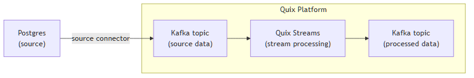

<!--- BEGIN MARKDOWN --->
# Integrate Postgres with Kafka using the source Postgres Kafka connector

Quix enables you to publish data from Postgres to Apache Kafka and then process it. All of this in real time, using pure Python, and at any scale.

[Book a demo](https://share.hsforms.com/1iW0TmZzKQMChk0lxd_tGiw4yjw2)

## Move Postgres data to Kafka and process it in two simple steps

1. ### Ingest data from Postgres into Kafka

Use the Quix-made Postgres Kafka source connector to publish data from a PostgreSQL database into Quix-managed Apache Kafka topics. The connector enables you to stream data in a scalable, fault-tolerant manner, with consistently low latencies.

2. ### Process and transform data with Python

After data is ingested from your Postgres database, process and transform it on the fly with Quix Streams, an open-source, Kafka-based Python library. Quix Streams offers an intuitive Streaming DataFrame API (similar to pandas DataFrame) for real-time data processing. It supports aggregations, windowing, filtering, group-by operations, branching, merging, serialization, and more, allowing you to shape your data to fit your needs and ensure data consistency.

## Quix Kafka connectors — a simpler, better alternative to Kafka Connect

Quix offers a Python-native, developer-friendly approach to data integration that eliminates the complexity associated with Kafka Connect deployment, configuration, and management. This makes it easier than ever to integrate Kafka and PostgreSQL in your real-time data pipelines.

With Quix Kafka connectors, there's no need to wrestle with complex connector configurations, worker scaling, or infrastructure management that typically come with Kafka Connect.

Quix fully manages the entire Kafka connectors lifecycle, from deployment to monitoring. This means faster development, easier debugging, and lower operational overhead compared to traditional Kafka Connect implementations.

## Quix, your solution to simplify real-time data integration

As a Kafka-based platform, Quix streamlines real-time data integration across your entire tech stack, empowering you to effortlessly collect streaming data from disparate sources into Kafka, transform and process it with Python, and send it to your chosen destination(s).

By using Quix as your central data hub, you can:

* Accelerate time to insights from your data to drive informed business decisions  
* Ensure data accuracy, quality, and consistency across your organization  
* Automate data integration pipelines and eliminate manual tasks  
* Manage and protect sensitive data with robust security measures  
* Handle data in a scalable, fault-tolerant way, with sub-second latencies, and exactly-once processing guarantees  
* Reduce your data integration TCO to a fraction of the typical cost  
* Benefit from managed data integration infrastructure, thus reducing complexity and operational burden  
* Use a flexible, comprehensive toolkit to build data integration pipelines, including CI/CD and IaC support, environment management features, observability and monitoring capabilities, an online code editor, Python code templates, a CLI tool, and 130+ Kafka source and sink connectors

[Explore the Quix platform](https://portal.demo.quix.io/pipeline?workspace=demo-gametelemetrytemplate-prod) | [Book a demo](https://share.hsforms.com/1iW0TmZzKQMChk0lxd_tGiw4yjw2)

## FAQs

### What is Postgres?

Postgres, also known as PostgreSQL, is an advanced open-source relational database management system. It supports both SQL and JSON querying, allowing for versatile data management. With features like ACID compliance, powerful indexing, and support for various data types, it is widely used for complex applications that require high reliability and robustness across data engineering and data analysis tasks.

### What is Apache Kafka?

Apache Kafka is a scalable, reliable, and fault-tolerant event streaming platform that enables real time data streaming and data exchange between different systems. Kafka’s publish-subscribe model ensures that any source system can write data to a central pipeline, while destination systems can read that data instantly as it arrives. In essence, Kafka acts as a central nervous system for data. It helps organizations unify their data architecture and provide a continuous, real-time flow of information across disparate components.

### What are Kafka connectors?

Kafka connectors are pre-built components that help integrate Apache Kafka with external systems. They allow you to reliably move data in and out of a Kafka cluster without writing custom integration code. There are two main types of Kafka connectors:

* **Source connectors**: These are used to pull data from source systems into Kafka topics.

* **Sink connectors**: These are used to push data from Kafka topics to destination systems, for example, moving data from Kafka to PostgreSQL.

### What is real-time data, and why is it important?

Real-time data is information that’s made available for use as soon as it's generated. It’s passed from source to destination systems with minimal latency, enabling rapid decision-making, immediate insights, and instant actions. Real-time data is crucial for industries like finance, logistics, manufacturing, healthcare, game development, information technology, and e-commerce. It empowers businesses to improve operational efficiency, increase revenue, enhance customer satisfaction, quickly respond to changing conditions, and gain a competitive advantage.

### What data can you publish from Postgres to Kafka in real time?

* Transactional records, e.g., sales orders, invoices, and payments  
* Analytical query results, including aggregate reports and trend analyses  
* Changes to PostgreSQL tables, such as row inserts, updates, and deletions  
* Real-time logs containing user interactions, system events, and security monitoring alerts  
* Financial metrics like revenue streams, expense tracking, and profit calculations  
* Geospatial data such as mapping coordinates, route optimizations, and distance calculations  
* IoT sensor readings including temperature, humidity, and movement rates

### What are key factors to consider when publishing Postgres data to Kafka in real time?

* Ensuring data integrity when streaming from Postgres requires careful handling of ACID transactions and constraints within real-time data pipelines.  
* The load data transformation phase can introduce latency, especially with complex queries, necessitating optimization for low-latency processing.  
* Managing connector configuration is crucial for maintaining consistent streaming data flow, as incorrect settings can cause batch failures or overwrites.  
* Integrating Kafka and PostgreSQL for data warehouses can lead to performance bottlenecks if ETL processes aren’t optimized to handle large-scale data streams.  
* Network reliability between Postgres and Kafka clusters is vital to avoid data loss or inconsistencies during stream processing.  
* Handling schema evolution and compatibility requires proper versioning and migration strategies to maintain data consistency.  
* Real time data streaming setup must accommodate varying data loads to prevent backlogs or resource starvation in event of peak data volumes.

### How does the Postgres Kafka source connector offered by Quix work?

The source PostgreSQL Kafka connector provided by Quix is fully managed and written in Python.

The connector continuously retrieves data from your Postgres database and publishes it to designated Quix-managed Kafka topics.

The connector provides strong data delivery guarantees (ordering and exactly-once semantics) to ensure data is reliably ingested into Kafka. You can customize its write performance and choose between several serialization formats (such as JSON, Avro, and Protobuf).

To find out more about the source PostgreSQL Kafka connector offered by Quix, [book a demo](https://share.hsforms.com/1iW0TmZzKQMChk0lxd_tGiw4yjw2).

### Does Quix offer a sink Postgres Kafka connector too?

Yes, Quix also provides a Postgres Kafka sink connector.

[Learn more about it](../../../quix-streams/sinks/coming-soon/Postgres-sink.md).

This enables you to write data from Kafka back to your PostgreSQL database, ensuring seamless integration of your streaming data with your existing PostgreSQL data.

In fact, Quix offers 130+ Kafka sink and source connectors, enabling you to move streaming data from a variety of sources into Kafka, process it, and then send it to your desired destination(s), all through real time data streaming.

[Explore the library of Quix Kafka connectors](https://quix.io/connectors)
<!--- END MARKDOWN --->