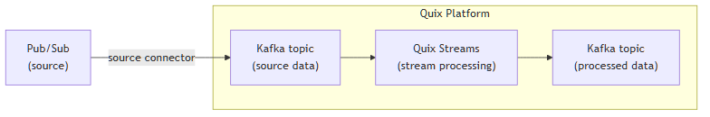

<!--- BEGIN MARKDOWN --->
# Integrate Pub/Sub with Kafka using the source Pub/Sub Kafka connector

Quix enables you to publish data from Pub/Sub to Apache Kafka and then process it. All of this in real time, using pure Python, and at any scale. 

[Book a demo](https://share.hsforms.com/1iW0TmZzKQMChk0lxd_tGiw4yjw2)

## Move Pub/Sub data to Kafka and process it in two simple steps

1. ### Ingest data from Pub/Sub into Kafka

Use the Quix-made Pub/Sub Kafka source connector to publish messages from Pub/Sub into Quix-managed Apache Kafka topics. The connector enables you to stream data in a scalable, fault-tolerant manner, with consistently low latencies.

2. ### Process and transform data with Python

After data is ingested from Pub/Sub, process and transform it on the fly with Quix Streams, an open-source, Kafka-based Python library. Quix Streams offers an intuitive Streaming DataFrame API (similar to pandas DataFrame) for real-time data processing. It supports aggregations, windowing, filtering, group-by operations, branching, merging, serialization, and more, allowing you to shape your data to fit your needs.  

## Quix Kafka connectors — a simpler, better alternative to Kafka Connect

Quix offers a Python-native, developer-friendly approach to data integration that eliminates the complexity associated with Kafka Connect deployment, configuration, and management. 

With Quix Kafka connectors, there's no need to wrestle with complex connector configurations, worker scaling, or infrastructure management that typically come with Kafka Connect.

Quix fully manages the entire Kafka connectors lifecycle, from deployment to monitoring. This means faster development, easier debugging, and lower operational overhead compared to traditional Kafka Connect implementations.

## Quix, your solution to simplify real-time data integration

As a Kafka-based platform, Quix streamlines real-time data integration across your entire tech stack, empowering you to effortlessly collect data from disparate sources into Kafka, transform and process it with Python, and send it to your chosen destination(s).

By using Quix as your central data hub, you can:

* Accelerate time to insights from your data to drive informed business decisions  
* Ensure data accuracy, quality, and consistency across your organization  
* Automate data integration pipelines and eliminate manual tasks  
* Manage and protect sensitive data with robust security measures  
* Handle data in a scalable, fault-tolerant way, with sub-second latencies, and exactly-once processing guarantees  
* Reduce your data integration TCO to a fraction of the typical cost  
* Benefit from managed data integration infrastructure, thus reducing complexity and operational burden  
* Use a flexible, comprehensive toolkit to build data integration pipelines, including CI/CD and IaC support, environment management features, observability and monitoring capabilities, an online code editor, Python code templates, a CLI tool, and 130+ Kafka source and sink connectors

[Explore the Quix platform](https://portal.demo.quix.io/?workspace=demo-dataintegrationdemo-prod) | [Book a demo](https://share.hsforms.com/1iW0TmZzKQMChk0lxd_tGiw4yjw2)

## FAQs

### What is Pub/Sub?

Pub/Sub is a managed service for real-time messaging that allows asynchronous communication between applications. It is designed for stream processing, reliable message delivery, and scalable systems across multiple environments. Google Cloud Pub Sub serves well in use cases like messaging analytics, event ingestion from IoT devices, and sending notifications.

### What is Apache Kafka?

Apache Kafka is a scalable, reliable, and fault-tolerant event streaming platform that enables real-time integration and data exchange between different systems. Kafka’s publish-subscribe model ensures that any source system can write data to a central pipeline, while destination systems can read each Kafka message instantly as it arrives. In essence, Kafka acts as a central nervous system for data. It helps organizations unify their data architecture and provide a continuous, real-time flow of information across disparate components.

### What are Kafka connectors?

Kafka connectors are pre-built components that help integrate Apache Kafka with external systems. They allow you to reliably move data in and out of a Kafka cluster without writing custom integration code. There are two main types of Kafka connectors:

* **Source connectors**: These are used to pull data from source systems into Kafka topics.

* **Sink connectors**: These are used to push data from Kafka topics to destination systems.

### What is real-time data, and why is it important?

Real-time data is information that’s made available for use as soon as it's generated. It’s passed from source to destination systems with minimal latency, enabling rapid decision-making, immediate insights, and instant actions. Real-time data is crucial for industries like finance, logistics, manufacturing, healthcare, game development, information technology, and e-commerce. It empowers businesses to improve operational efficiency, increase revenue, enhance customer satisfaction, quickly respond to changing conditions, and gain a competitive advantage.

### What data can you publish from Pub/Sub to Kafka in real time?

* Gcloud Pub/Sub topics for decoupled communication, i.e., sending messages between distributed applications  
* Event streams, like session starts, clicks, and navigation events with timestamps  
* Sensor readings, for IoT devices or real-time location tracking  
* Transaction events capturing financial or retail activities including purchase confirmations  
* Log entries detailing system operations, exceptions, and transaction outcomes  
* Message attributes for context-rich data, including user session data and metadata  
* Transform and publish messages for immediate insights and actions based on event processing pipelines

### What are key factors to consider when publishing Pub/Sub data to Kafka in real time?

* Compatibility challenges when mapping Cloud Pub Sub data types to Kafka records need thoughtful configuration in managed service setup  
* Network latency can affect synchronization of Gcloud Pub/Sub subscriptions, making data continuity a consideration  
* Scalability when dealing with large-scale streaming between both Kafka and Pub/Sub pipelines  
* Data reliability and ensuring that message attributes remain consistent, especially when dealing with real-time updates  
* Handling acknowledgments efficiently to maintain the integrity and on-time delivery of Kafka messages  
* Optimizing Kafka record headers for metadata retention within streaming pipelines  
* Assimilating different processing logics as Pub/Sub produces primitive data types that interact with Kafka's framework

### How does the Pub/Sub Kafka source connector offered by Quix work?

The source Pub/Sub Kafka connector provided by Quix is fully managed and written in Python. 

The connector continuously retrieves data from Pub/Sub and publishes it to designated Quix-managed Kafka topics.  

The connector provides strong data delivery guarantees (ordering and exactly-once semantics) to ensure data is reliably ingested into Kafka. You can customize its write performance and choose between several serialization formats (such as JSON, Avro, and Protobuf).  

To find out more about the source Pub/Sub Kafka connector offered by Quix, [book a demo](https://share.hsforms.com/1iW0TmZzKQMChk0lxd_tGiw4yjw2).

### Does Quix offer a sink Pub/Sub Kafka connector too?

Yes, Quix also provides a Pub/Sub Kafka sink connector.

[Learn more about it](../../../quix-streams/sinks/coming-soon/PubSub-sink.md).

In fact, Quix offers 130+ Kafka sink and source connectors, enabling you to move data from a variety of sources into Kafka, process it, and then send it to your desired destination(s). All in real time.

[Explore the library of Quix Kafka connectors](https://quix.io/connectors)
<!--- END MARKDOWN --->