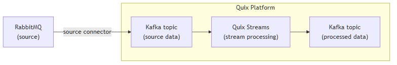

<!--- BEGIN MARKDOWN --->
"
# Integrate RabbitMQ with Kafka using the source RabbitMQ Kafka connector

Quix enables you to publish data from RabbitMQ to Apache Kafka and then process data. All of this in real time, using pure Python, and at any scale. 

[Book a demo](https://share.hsforms.com/1iW0TmZzKQMChk0lxd_tGiw4yjw2)

## Move RabbitMQ data to Kafka and process it in two simple steps

1. ### Ingest data from RabbitMQ into Kafka

Use the Quix-made RabbitMQ Kafka source connector to publish messages from RabbitMQ into Quix-managed Apache Kafka topics. The connector enables you to stream data in a scalable, fault-tolerant manner, with consistently low latencies. 

2. ### Process and transform data with Python

After data is ingested from RabbitMQ, process and transform it on the fly with Quix Streams, an open-source, Kafka-based Python library. Quix Streams offers an intuitive Streaming DataFrame API (similar to pandas DataFrame) for real-time data processing and stream processing, suitable for building streaming applications. It supports aggregations, windowing, filtering, group-by operations, branching, merging, serialization, and more, allowing you to shape your data to fit your needs.

## Quix Kafka connectors — a simpler, better alternative to Kafka Connect

Quix offers a Python-native, developer-friendly approach to data integration that eliminates the complexity associated with Kafka Connect deployment, configuration, and management. 

With Quix Kafka connectors, there's no need to wrestle with complex connector configurations, worker scaling, or infrastructure management that typically come with Kafka Connect.

Quix fully manages the entire Kafka connectors lifecycle, from deployment to monitoring. This means faster development, easier debugging, and lower operational overhead compared to traditional Kafka Connect implementations.

## Quix, your solution to simplify real-time data integration

As a Kafka-based platform, Quix streamlines real-time data integration across your entire tech stack, empowering you to effortlessly collect data from disparate sources into Kafka, transform and process streaming data with Python, and send it to your chosen destination(s). By integrating RabbitMQ and Kafka, you can build robust messaging solutions.

By using Quix as your central data hub, you can:

* Accelerate time to insights from your data to drive informed business decisions  
* Ensure data accuracy, quality, and consistency across your organization  
* Automate data integration pipelines and eliminate manual tasks  
* Manage and protect sensitive data with robust security measures  
* Handle data in a scalable, fault-tolerant way, with sub-second latencies, and exactly-once processing guarantees  
* Reduce your data integration TCO to a fraction of the typical cost  
* Benefit from managed data integration infrastructure, thus reducing complexity and operational burden  
* Use a flexible, comprehensive toolkit to build data integration pipelines, including CI/CD and IaC support, environment management features, observability and monitoring capabilities, an online code editor, Python code templates, a CLI tool, and 130+ Kafka source and sink connectors

[Explore the Quix platform](https://portal.demo.quix.io/pipeline?workspace=demo-gametelemetrytemplate-prod)           |           [Book a demo](https://share.hsforms.com/1iW0TmZzKQMChk0lxd_tGiw4yjw2)

## FAQs

### What is RabbitMQ?

RabbitMQ is a general purpose message broker and distributed event streaming platform using the Advanced Message Queuing Protocol. When used in conjunction, Kafka and RabbitMQ can create robust messaging and streaming solutions, enabling systems to publish, route messages, and process messages efficiently. RabbitMQ is ideal for complex routing scenarios, priority queues, and real time data pipelines, making it perfect for messaging system applications like stream history, analyzing data, or streaming applications.

### What is Apache Kafka?

Apache Kafka is a scalable, reliable, and fault-tolerant event streaming and distributed message broker platform that enables real-time integration and data exchange between different systems. Kafka’s publish-subscribe model ensures that any source system can write data to a central pipeline, while destination systems can read that data instantly as it arrives. In essence, Kafka acts as a central nervous system for data. It helps organizations unify their data architecture and provide a continuous, real-time flow of information across disparate components.

### What are Kafka connectors?

Kafka connectors are pre-built components that help integrate Apache Kafka with external systems. They allow you to reliably move data in and out of a Kafka cluster without writing custom integration code. There are two main types of Kafka connectors:

* **Source connectors**: These are used to pull data from source systems into Kafka topics.

* **Sink connectors**: These are used to push data from Kafka topics to destination systems.

### What is real-time data, and why is it important?

Real-time data is information that’s made available for use as soon as it's generated. It’s passed from source to destination systems with minimal latency, enabling rapid decision-making, immediate insights, and instant actions. Real-time data is crucial for industries like finance, logistics, manufacturing, healthcare, information technology, and e-commerce. It empowers businesses to improve operational efficiency, increase revenue, enhance customer satisfaction, quickly respond to changing conditions, and gain a competitive advantage.

### What data can you publish from RabbitMQ to Kafka in real time?

* Message queue data, including messages from RabbitMQ queues such as consumer delivery tags, message properties, and routing keys  
* Collect log files related to RabbitMQ server events and operations  
* Application event notifications for RabbitMQ broker state changes and RabbitMQ clusters configurations 
* Consumer metrics, e.g., message consumption rates, ack-to-nack ratios, and redelivery counts  
* Custom app data, such as RabbitMQ messages with user-defined properties, payloads, and message priority

### What are key factors to consider when publishing RabbitMQ data to Kafka in real time?

* Handling message priorities from a RabbitMQ queue requires careful consideration of Kafka topic partitioning to retain priority levels.  
* Real-time streaming of RabbitMQ messages, particularly those in a priority queue, can introduce latency if RabbitMQ server and Kafka clusters are not properly synchronized.  
* Managing RabbitMQ broker state during message storms or spikes in message publish rates necessitates robust connector configuration strategies.  
* Efficiently using RabbitMQ streams for message archival purposes within Kafka requires understanding RabbitMQ and Kafka's distinct retention policies.   
* When processing streaming data with RabbitMQ connector, ensure compatibility with both RabbitMQ's message queuing model and Kafka's streaming paradigm, which may involve adjustments in routing mechanisms.  
* Collecting and processing distributed logs from RabbitMQ server logs requires integrating log aggregation solutions that can feed into Kafka.  
* Complex routing of RabbitMQ messages to Kafka topics might introduce challenges with message duplication or ordering, especially in distributed message broker environments.

### How does the RabbitMQ Kafka source connector offered by Quix work?

The RabbitMQ source connector for Kafka provided by Quix is fully managed and written in Python. 

The connector continuously retrieves data from RabbitMQ and publishes it to designated Quix-managed Kafka topics.  

The connector provides strong data delivery guarantees (ordering and exactly-once semantics) to ensure data is reliably ingested into Kafka. You can customize its write performance and choose between several serialization formats (such as JSON, Avro, and Protobuf).  

To find out more about the source RabbitMQ Kafka connector offered by Quix, [book a demo](https://share.hsforms.com/1iW0TmZzKQMChk0lxd_tGiw4yjw2).

### Does Quix offer a sink RabbitMQ Kafka connector too?

Yes, Quix also provides a RabbitMQ sink connector for Kafka.

[Learn more about it](../../../quix-streams/sinks/coming-soon/RabbitMQ-sink.md).

In fact, Quix offers 130+ Kafka sink and source connectors, including the RabbitMQ connector, enabling you to move data from a variety of sources, including RabbitMQ and Kafka, into Kafka, process it, and then send it to your desired destination(s). All in real time.

[Explore the library of Quix Kafka connectors](https://quix.io/connectors)
<!--- END MARKDOWN --->