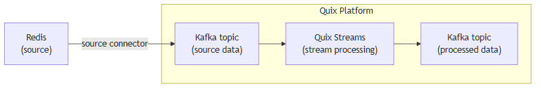

<!--- BEGIN MARKDOWN --->
<!------------- BEGIN TEMPLATE --------------------->

# Integrate Redis with Kafka using the source Redis Kafka connector

Quix enables you to publish data from Redis to Apache Kafka and then process it. All of this in real time, using pure Python, and at any scale. 

[Book a demo](https://share.hsforms.com/1iW0TmZzKQMChk0lxd_tGiw4yjw2)

## Move Redis data to Kafka and process it in two simple steps

1. ### Ingest data from Redis into Kafka

Use the Quix-made Redis Kafka source connector to publish data from Redis into Quix-managed Apache Kafka topics. The connector enables you to stream data in a scalable, fault-tolerant manner, with consistently low latencies. 

2. ### Process and transform data with Python

After data is ingested from Redis, process and transform it on the fly with Quix Streams, an open-source, Kafka-based Python library. Quix Streams offers an intuitive Streaming DataFrame API (similar to pandas DataFrame) for real-time data processing. It supports aggregations, windowing, filtering, group-by operations, branching, merging, serialization, and more, allowing you to shape your data to fit your needs.

## Quix Kafka connectors — a simpler, better alternative to Kafka Connect

Quix offers a Python-native, developer-friendly approach to data integration that eliminates the complexity associated with Redis kafka connect deployment, configuration, and management. 

With Quix Kafka connectors, there's no need to wrestle with complex connector configurations, worker scaling, or infrastructure management that typically come with Kafka Connect.

Quix fully manages the entire Kafka connectors lifecycle, from deployment to monitoring. This means faster development, easier debugging, and lower operational overhead compared to traditional Kafka Connect implementations.

## Quix, your solution to simplify real-time data integration

As a Kafka-based platform, Quix streamlines real-time data integration across your entire tech stack, empowering you to effortlessly collect data from disparate sources into Kafka, process and transform it with Python, and send it to your chosen destination(s).

By using Quix as your central data hub, you can:

* Accelerate time to insights from your data to drive informed business decisions  
* Ensure data accuracy, quality, and consistency across your organization  
* Automate data integration pipelines and eliminate manual tasks  
* Manage and protect sensitive data with robust security measures  
* Handle data in a scalable, fault-tolerant way, with sub-second latencies, and exactly-once processing guarantees  
* Reduce your data integration TCO to a fraction of the typical cost  
* Benefit from managed data integration infrastructure, thus reducing complexity and operational burden  
* Use a flexible, comprehensive toolkit to build data integration pipelines, including CI/CD and IaC support, environment management features, observability and monitoring capabilities, an online code editor, Python code templates, a CLI tool, and 130+ Kafka source and sink connectors

[Explore the Quix platform](https://portal.demo.quix.io/?workspace=demo-iotphonedemo-prod)  |  [Book a demo](https://share.hsforms.com/1iW0TmZzKQMChk0lxd_tGiw4yjw2)

## FAQs

### What is Redis?

Redis is an open-source, in-memory data structure store used as a database, cache, and message broker. It supports data structures such as strings, hashes, lists, sets, sorted sets, bitmaps, and hyperloglogs. Redis is known for its high performance, flexibility, and its capabilities for handling real-time data use cases like caching, session management, real-time analytics, and pub/sub.

### What is Apache Kafka?

Apache Kafka is a scalable, reliable, and fault-tolerant event streaming platform that enables real-time integration and data exchange between different systems. Kafka’s publish-subscribe model ensures that any source system can write data to a central pipeline, while destination systems can read that data instantly as it arrives. In essence, Kafka acts as a central nervous system for data. It helps organizations unify their data architecture and provide a continuous, real-time flow of information across disparate components.

### What are Kafka connectors?

Kafka connectors are pre-built components that help integrate Apache Kafka with external systems. They allow you to reliably move data in and out of a Kafka cluster without writing custom connectors. There are two main types of Kafka connectors:

* **Source connectors**: These are used to pull data from source systems into Kafka topics.

* **Sink connectors**: These are used to push data from Kafka topics to destination systems.

### What is real-time data, and why is it important?

Real-time data is information that’s made available for use as soon as it's generated. It’s passed from source to destination systems with minimal latency, enabling rapid decision-making, immediate insights, and instant actions. Real-time data is crucial for industries like finance, logistics, manufacturing, healthcare, game development, information technology, and e-commerce. It empowers businesses to improve operational efficiency, increase revenue, enhance customer satisfaction, quickly respond to changing conditions, and gain a competitive advantage.

### What data can you publish from Redis to Kafka in real time?

* Key-value pairs representing configuration settings, user profiles, application states with metadata  
* Redis cache hits and misses statistics, providing insights into memory usage and retrieval performance  
* Pub/Sub messages sent to specific channels containing event notifications, alerts, or updates  
* Lua script executions and output details for complex data manipulations and atomic operations  
* Keyspace events for monitoring key expirations, evictions, and modifications  
* Sorted sets with rankings, scores, and leaderboard details for gaming or priority-based queues  
* Hash data structures with nested field-value pairs for session data, cart items, and content attributes 

### What are key factors to consider when publishing Redis data to Kafka in real time?

* Ensuring Redis replica consistency in a highly distributed environment to prevent data anomalies  
* Adapting Redis's single-threaded model with Kafka's parallel processing to ensure optimal throughput and latency  
* Monitoring Redis's memory consumption, especially in high-traffic write operations, to prevent out-of-memory errors when streaming records  
* Handling keyspace events effectively to prevent excessive traffic on the network and Redis client load  
* Managing the dynamic nature of Redis caching and eviction policies, which can affect the continuity of data streams to Kafka  
* Designing efficient mapping strategies between Redis data types and Kafka messages, including careful handling of the record key, to maintain data integrity across systems  
* Integrating Redis data for real-time analytics in Kafka while ensuring minimal impact on Redis's primary role as a low-latency data store

### How does the Redis Kafka source connector offered by Quix work?

The source Redis Kafka connector provided by Quix is fully managed and written in Python. 

The connector continuously retrieves data from Redis and publishes it to designated Quix-managed Kafka topics.  

The connector provides strong data delivery guarantees (ordering and exactly-once semantics) to ensure data is reliably ingested into Kafka. You can customize its write performance and choose between several serialization formats (such as JSON, Avro, and Protobuf).  

To find out more about the source Redis Kafka connector offered by Quix, [book a demo](https://share.hsforms.com/1iW0TmZzKQMChk0lxd_tGiw4yjw2).

### Does Quix offer a sink Redis Kafka connector too?

Yes, Quix also provides a Redis sink connector for moving data from Kafka to Redis.

[Learn more about it](../../../quix-streams/sinks/coming-soon/Redis-sink.md).

In fact, Quix offers 130+ Kafka sink and source connectors, enabling you to move data from a variety of sources into Kafka, process it, and then send it to your desired destination(s). All in real time.

[Explore the library of Quix Kafka connectors](https://quix.io/connectors) 

<!------------- END TEMPLATE --------------------->
<!--- END MARKDOWN --->