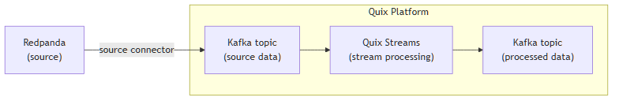

<!--- BEGIN MARKDOWN --->
# Integrate Redpanda with Kafka using the source Redpanda Kafka connector

Quix enables you to publish data from Redpanda to Apache Kafka and then process it. All of this in real time, using pure Python, and at any scale. 

[Book a demo](https://share.hsforms.com/1iW0TmZzKQMChk0lxd_tGiw4yjw2)

## Move Redpanda data to Kafka and process it in two simple steps

1. ### Ingest data from Redpanda into Kafka

Use the Quix-made Redpanda Kafka source connector to publish data from Redpanda into Quix-managed Apache Kafka topics. The connector enables you to stream **topic data** in a scalable, fault-tolerant manner, with consistently low latencies. 

2. ### Process and transform data with Python

After data is ingested from Redpanda, process and transform it on the fly with Quix Streams, an open-source, Kafka-based Python library. Quix Streams offers an intuitive Streaming DataFrame API (similar to pandas DataFrame) for real-time data processing. It supports aggregations, windowing, filtering, group-by operations, branching, merging, serialization, and more, allowing you to shape your data to fit your needs.

## Quix Kafka connectors — a simpler, better alternative to Kafka Connect

Quix offers a Python-native, developer-friendly approach to data integration that eliminates the complexity associated with Kafka Connect deployment, configuration, and management in cloud infrastructure. 

With Quix Kafka connectors, there's no need to wrestle with complex connector configurations, worker scaling, or infrastructure management that typically come with Kafka Connect.

Quix fully manages the entire Kafka connectors lifecycle, from deployment to monitoring. This means faster development, easier debugging, and lower operational overhead compared to traditional Kafka Connect implementations.

## Quix, your solution to simplify real-time data integration

As a Kafka-based platform, Quix streamlines real-time data integration across your entire tech stack, empowering you to effortlessly collect data from disparate **data sources** into Kafka, transform and process your **streaming data** with Python, and send it to your chosen destination(s).

By using Quix as your central data hub, you can:

* Accelerate time to insights from your data to drive informed business decisions.  
* Ensure data accuracy, quality, and consistency across your organization with a schema registry.  
* Automate data integration pipelines and eliminate manual tasks.  
* Manage and protect sensitive data with robust security measures.  
* Handle data in a scalable, fault-tolerant way, with sub-second latencies and exactly-once processing guarantees.  
* Reduce your data integration TCO to a fraction of the typical cost.  
* Benefit from managed data integration infrastructure, thus reducing complexity and operational burden.  
* Use a flexible, comprehensive toolkit to build data integration pipelines, including CI/CD and IaC support, environment management features, observability and monitoring capabilities, an online code editor, Python code templates, a CLI tool, and 130+ Kafka source and sink connectors.

[Explore the Quix platform](https://portal.demo.quix.io/pipeline?workspace=demo-gametelemetrytemplate-prod) | [Book a demo](https://share.hsforms.com/1iW0TmZzKQMChk0lxd_tGiw4yjw2)

## FAQs

### What is Redpanda?

Redpanda is an event streaming platform designed to deliver high performance and ease of use. It offers compatibility with Kafka APIs without the need for a large Kafka cluster infrastructure. Redpanda is particularly suitable for workloads that require low latency and are sensitive to performance, such as gaming, financial services, and IoT.

### What is Apache Kafka?

Apache Kafka is a scalable, reliable, and fault-tolerant event streaming platform that enables real-time integration and data exchange between different **data systems**. Kafka’s publish-subscribe model ensures that any source system can write data to a central pipeline, while destination systems can read that data instantly as it arrives. In essence, Kafka acts as a central nervous system for data. It helps organizations unify their data architecture and provide a continuous, real-time flow of information across disparate components.

### What are Kafka connectors?

Kafka connectors are pre-built components that help integrate Apache Kafka with external systems. They allow you to reliably move **messages** in and out of **Kafka clusters** without writing custom integration code. There are two main types of Kafka connectors:

* **Source connectors**: These are used to pull data from source systems into Kafka topics.

* **Sink connectors**: These are used to push data from Kafka topics to destination systems.

### What is real-time data, and why is it important?

Real-time data is information that’s made available for use as soon as it's generated. It’s passed from source to destination systems with minimal latency, enabling rapid decision-making, immediate insights, and instant actions. Real-time data is crucial for industries like finance, logistics, manufacturing, healthcare, game development, information technology, and e-commerce. It empowers businesses to improve operational efficiency, increase revenue, enhance customer satisfaction, quickly respond to changing conditions, and gain a competitive advantage.

### What data can you publish from Redpanda to Kafka in real time?

* Log data, e.g., system logs, access logs, and error logs collected from various services.  
* Metric data, including CPU usage, memory utilization, and disk I/O statistics.  
* Application events like user interactions, transaction start and end events, and workflow progress updates.  
* Operational data such as service health checks, deployment status reports, and cluster activity summaries.  
* Business events, e.g., customer order placements, payment confirmations, and shipment statuses.  
* User behavior data, including clickstream, search queries, and navigation patterns.  
* Sensor data, such as temperature readings, GPS coordinates, and motion detection events.

### What are key factors to consider when publishing Redpanda data to Kafka in real time?

* Ensuring message order and idempotence can be challenging, particularly in cases involving complex transformations or network delays.  
* Configuring the correct data retention policies requires careful tuning to balance storage costs with data availability.  
* Managing consumer groups and partition assignments is important to achieve load balancing and horizontal scalability.  
* Implementing serialization and deserialization standards, such as Avro or Protobuf, supports consistent data formatting across systems.  
* Monitoring the performance metrics of a Redpanda cluster is crucial to identify potential bottlenecks and scaling needs.  
* Network latency can impact the throughput of a data streaming pipeline, so optimizing network configuration is essential.  
* Developing and maintaining reliable streaming data pipelines necessitates robust error handling and retry strategies.

### How does the Redpanda Kafka source connector offered by Quix work?

The source Redpanda Kafka connector provided by Quix is fully managed and written in Python. 

The connector continuously retrieves data from Redpanda and publishes it to designated Quix-managed Kafka topics.

The connector provides strong data delivery guarantees (ordering and exactly-once semantics) to ensure data is reliably ingested into Kafka. You can customize its write performance and choose between several serialization formats (such as JSON, Avro, and Protobuf).  

To find out more about the source Redpanda Kafka connector offered by Quix, [book a demo](https://share.hsforms.com/1iW0TmZzKQMChk0lxd_tGiw4yjw2).

### Does Quix offer a sink Redpanda Kafka connector too?

Yes, Quix also provides a Redpanda sink connector for Kafka.

[Learn more about it](../../../sinks/coming-soon/Redpanda-sink.md).

In fact, Quix offers 130+ Kafka sink and source connectors, enabling you to move data from a variety of **data sources** into Kafka, process it, and then send it to your desired destination(s). All in real time.

[Explore the library of Quix Kafka connectors](https://quix.io/connectors)
<!--- END MARKDOWN --->