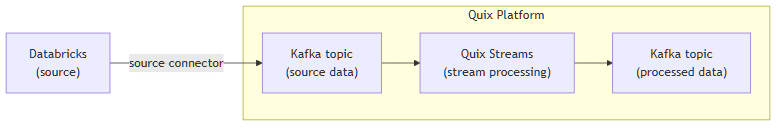

<!--- BEGIN MARKDOWN --->
"
# Integrate Databricks with Kafka using the source Databricks Kafka connector

Quix enables you to publish data from Databricks to Apache Kafka and then process it. All of this in real time, using pure Python, and at any scale. 

[Book a demo](https://share.hsforms.com/1iW0TmZzKQMChk0lxd_tGiw4yjw2)

## Move Databricks data to Kafka and process it in two simple steps

1. ### Ingest data from Databricks into Kafka

Use the Quix-made Databricks Kafka source connector to publish data from Databricks into Quix-managed Apache Kafka topics. The connector enables you to stream data in a scalable, fault-tolerant manner, with consistently low latencies. 

2. ### Process and transform data with Python

After data is ingested from Databricks, process and transform it on the fly with Quix Streams, an open-source, Kafka-based Python library. Quix Streams offers an intuitive Streaming DataFrame API (similar to pandas DataFrame) for real-time data processing. It supports aggregations, windowing, filtering, group-by operations, branching, merging, serialization, and more, allowing you to shape your data to fit your needs, and manage data skew effectively. 

## Quix Kafka connectors — a simpler, better alternative to Kafka Connect

Quix offers a Python-native, developer-friendly approach to data integration that eliminates the complexity associated with Kafka Connect deployment, configuration, and management. 

With Quix Kafka connectors, there's no need to wrestle with complex connector configurations, worker scaling, or infrastructure management that typically come with Kafka Connect.

Quix fully manages the entire Kafka connectors lifecycle, from deployment to monitoring. This means faster development, easier debugging, and lower operational overhead compared to traditional Kafka Connect implementations.

## Quix, your solution to simplify real-time data integration

As a Kafka-based platform, Quix streamlines real-time data integration across your entire tech stack, empowering you to effortlessly collect data from disparate sources into Kafka, transform and process it with Python, and send it to your chosen destination(s).

By using Quix as your central data hub, you can:

* Accelerate time to insights from your data to drive informed business decisions  
* Ensure data accuracy, quality, and consistency across your organization  
* Automate data integration pipelines and eliminate manual tasks  
* Manage and protect sensitive data with robust security measures  
* Handle data in a scalable, fault-tolerant way, with sub-second latencies, and exactly-once processing guarantees  
* Reduce your data integration TCO to a fraction of the typical cost  
* Benefit from managed data integration infrastructure, thus reducing complexity and operational burden  
* Use a flexible, comprehensive toolkit to build data integration pipelines, including CI/CD and IaC support, environment management features, observability and monitoring capabilities, an online code editor, Python code templates, a CLI tool, and 130+ Kafka source and sink connectors

[Explore the Quix platform](https://portal.demo.quix.io/pipeline?workspace=demo-gametelemetrytemplate-prod)  |  [Book a demo](https://share.hsforms.com/1iW0TmZzKQMChk0lxd_tGiw4yjw2)

## FAQs

### What is Databricks?

Databricks is a data platform that combines the best of data warehouses and data lakes into a lakehouse architecture. Built on Apache Spark, it enables big data analytics and data science capabilities for ETL processes, machine learning, and SQL analytics. Its collaborative workspace facilitates seamless interaction among teams, ensuring faster data-driven decisions.

### What is Apache Kafka?

Apache Kafka is a scalable, reliable, and fault-tolerant event streaming platform that enables real-time integration and data exchange between different systems. Kafka’s publish-subscribe model ensures that any source system can write data to a central pipeline, while destination systems can read that data instantly as it arrives. In essence, Kafka acts as a central nervous system for data. It helps organizations unify their data architecture and provide a continuous, real-time flow of information across disparate components.

### What are Kafka connectors?

Kafka connectors are pre-built components that help integrate Apache Kafka with external systems. They allow you to reliably move data in and out of a Kafka cluster without writing custom integration code. There are two main types of Kafka connectors:

* Source connectors. These are used to pull data from source systems into Kafka topics.

* Sink connectors. These are used to push data from Kafka topics to destination systems.

### What is real-time data, and why is it important?

Real-time data is information that’s made available for use as soon as it's generated. It’s passed from source to destination systems with minimal latency, enabling rapid decision-making, immediate insights, and instant actions. Real-time data is crucial for industries like finance, logistics, manufacturing, healthcare, game development, information technology, and e-commerce. It empowers businesses to improve operational efficiency, increase revenue, enhance customer satisfaction, quickly respond to changing conditions, and gain a competitive advantage.

### What data can you publish from Databricks to Kafka in real time?

* Stream processing logs, e.g., job completion times, error messages, and warning notifications  
* Metric events, including processing rate throughput, error counts, and SQL function latencies  
* Data science experiment results with model evaluation metrics and hyperparameter values  
* Transactional method outcomes like data validation, verification reports, and exceptions  
* Query process statistics such as query execution times, stages, and resource utilization  
* Apache Spark analytics including data aggregation results, joins, and window functions  
* User interaction data detailing notebook activities, zone utilization, and collaboration metrics

### What are key factors to consider when publishing Databricks data to Kafka in real time?

* Proper Kafka consumer configuration is crucial to prevent bottlenecks and optimize throughput during ingestion from Databricks.  
* Handling query retry mechanisms in Databricks to guarantee exactly-once delivery in Kafka data sinks requires rigorous testing.  
* Mitigating data skew issues is essential when integrating Databricks with Kafka to maintain consistent processing rates across distributed systems.  
* Network constraints between Databricks and Kafka clusters can lead to elevated latencies and require adjustments in the default Kafka configuration option.  
* Optimizing Kafka consumer group ID setup to access Kafka ensures fair workload distribution during peak loads to avoid bottlenecks.  
* Monitoring Kafka metrics is vital for assessing the health and performance of pipelines connecting Databricks as Kafka data sources.  
* Understanding how Kafka client assumes responsibility for data integrity during failures can prevent data duplication and message loss.

### How does the Databricks Kafka source connector offered by Quix work?

The Databricks source Kafka connector provided by Quix is fully managed and written in Python. 

The connector continuously retrieves data from Databricks and publishes it to designated Quix-managed Kafka topics.  

The connector provides strong data delivery guarantees (ordering and exactly-once semantics) to ensure data is reliably ingested into Kafka. You can customize its write performance and choose between several serialization formats (such as JSON, Avro, and Protobuf).  

To find out more about the source Databricks Kafka connector offered by Quix, [book a demo](https://share.hsforms.com/1iW0TmZzKQMChk0lxd_tGiw4yjw2).

### Does Quix offer a sink Databricks Kafka connector too?

Yes, Quix also provides a Databricks Kafka sink connector.

Learn more about it.

In fact, Quix offers 130+ Kafka sink and source connectors, enabling you to move data from a variety of sources into Kafka, process it, and then send it to your desired destination(s). All in real time.

[Explore the library of Quix Kafka connectors](https://quix.io/connectors)
<!--- END MARKDOWN --->