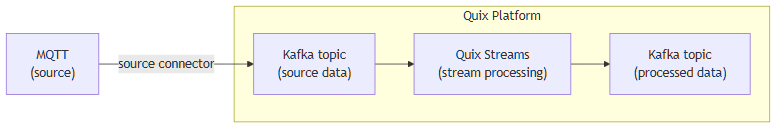

<!--- BEGIN MARKDOWN --->
# Integrate MQTT with Kafka using the source MQTT Kafka connector

Quix enables you to publish messages from MQTT to Apache Kafka and then process them. All of this in real time, using pure Python, and at any scale.

[Book a demo](https://share.hsforms.com/1iW0TmZzKQMChk0lxd_tGiw4yjw2)

## Move MQTT data to Kafka and process it in two simple steps

1. ### Ingest data from MQTT into Kafka

Use the Quix-made MQTT Kafka source connector to ingest data from an MQTT source and publish MQTT messages into Quix-managed Apache Kafka topics. The connector enables you to transmit data in a scalable, fault-tolerant manner, with consistently low latencies.

2. ### Process and transform data with Python

After data is ingested from MQTT, process and transform it on the fly with Quix Streams, an open-source, Kafka-based Python library. Quix Streams offers an intuitive Streaming DataFrame API (similar to pandas DataFrame) for real-time data processing. It supports aggregations, windowing, filtering, group-by operations, branching, merging, serialization, and more, allowing you to shape your data to fit your needs.

## Quix Kafka connectors — a simpler, better alternative to Kafka Connect

Quix offers a Python-native, developer-friendly approach to data integration that eliminates the complexity associated with Kafka Connect deployment, configuration, and management.

With Quix Kafka connectors, there's no need to wrestle with complex connector configurations, worker scaling, or infrastructure management that typically come with Kafka Connect.

Quix fully manages the entire Kafka connectors lifecycle, including the Kafka MQTT connector, from deployment to monitoring. This means faster development, easier debugging, and lower operational overhead compared to traditional Kafka Connect implementations.

## Quix, your solution to simplify real-time data integration

As a Kafka-based platform, Quix streamlines real-time data integration across your entire tech stack, empowering you to effortlessly collect data from disparate sources into Kafka, transform and process it with Python, and send it to your chosen destination(s).

By using Quix as your central data hub, you can:

* Accelerate time to insights from your data to drive informed business decisions  
* Ensure data accuracy, quality, and consistency across your organization  
* Automate data integration pipelines and eliminate manual tasks  
* Manage and protect sensitive data with robust security measures  
* Handle data in a scalable, fault-tolerant way, with sub-second latencies, and exactly-once processing guarantees  
* Reduce your data integration TCO to a fraction of the typical cost  
* Benefit from managed data integration infrastructure, thus reducing complexity and operational burden  
* Use a flexible, comprehensive toolkit to build data integration pipelines, including CI/CD and IaC support, environment management features, observability and monitoring capabilities, an online code editor, Python code templates, a CLI tool, and 130+ Kafka source and sink connectors

[Explore the Quix platform](https://portal.demo.quix.io/pipeline?workspace=demo-gametelemetrytemplate-prod)  |  [Book a demo](https://share.hsforms.com/1iW0TmZzKQMChk0lxd_tGiw4yjw2)

## FAQs

### What is MQTT?

MQTT is a lightweight messaging protocol designed for high-latency, unreliable, or low-bandwidth networks. Known for its efficiency, MQTT is ideal for IoT applications such as predictive maintenance, anomaly detection, and traffic sensors, where data generated by an MQTT client needs to be transmitted with minimal overhead and maximum reliability.

### What is Apache Kafka?

Apache Kafka is a scalable, reliable, and fault-tolerant distributed streaming platform that enables real-time integration and data exchange between different systems. Kafka’s publish-subscribe model ensures that any source system can write data to a central pipeline, while destination systems can read Kafka messages instantly as they arrive. In essence, Kafka acts as a central nervous system for data. It helps organizations unify their data architecture and provide a continuous, real-time flow of information across disparate components.

### What are Kafka connectors?

Kafka connectors are pre-built components that help integrate Apache Kafka with external systems. They allow you to reliably move data in and out of a Kafka cluster without writing custom integration code. There are two main types of Kafka connectors:

* Source connectors. These are used to pull data from source systems into Kafka topics.

* Sink connectors. These are used to push data from Kafka topics to destination systems.

### What is real-time data, and why is it important?

Real-time data is information that’s made available for use as soon as it's generated. It’s passed from source to destination systems with minimal latency, enabling rapid decision-making, immediate insights, and instant actions. Real-time data is crucial for industries like finance, logistics, manufacturing, healthcare, game development, information technology, and e-commerce. It empowers businesses to improve operational efficiency, increase revenue, enhance customer satisfaction, quickly respond to changing conditions, and gain a competitive advantage.

### What data can you publish from MQTT to Kafka in real time?

* Telemetry data, e.g., temperature, humidity, and pressure readings  
* Device status updates and configurations for remote management  
* Sensor data like motion, light, and sound intensity levels  
* Geolocation data such as GPS coordinates and movement patterns  
* Wearable health data including heart rate, blood pressure, and activity logs  
* Environmental data like air quality indices and pollution levels  
* System logs and diagnostics messages for troubleshooting and analysis

### What are key factors to consider when publishing MQTT data to Kafka in real time?

* Configuring the MQTT broker for optimal performance requires a thorough understanding of QoS levels and network conditions.  
* Ensuring seamless compatibility between MQTT and Kafka involves careful MQTT topic mapping and protocol conversions to prevent message loss.  
* Handling data bursts or spikes, especially in busy IoT environments, requires dynamic scaling and load balancing across MQTT topics.  
* Integrating MQTT clients with Kafka's real time data streaming architecture can demand advanced data processing and message serialization strategies.  
* Monitoring traffic from numerous MQTT clients while keeping latency low can become complex due to varying client capabilities and network conditions.  
* Handling retained messages and clean session settings in MQTT broker configurations is crucial to maintain data consistency in Kafka.  
* Implementing robust security measures, including encryption and authentication, is needed to protect sensitive IoT data during transmission.

### How does the MQTT Kafka source connector offered by Quix work?

The source MQTT Kafka connector provided by Quix is fully managed and written in Python.

The connector continuously retrieves MQTT data from MQTT brokers and publishes it to designated Quix-managed Kafka topics.

The connector provides strong data delivery guarantees (ordering and exactly-once semantics) to ensure data is reliably ingested into Kafka. You can customize its write performance and choose between several serialization formats (such as JSON, Avro, and Protobuf).

To find out more about the source MQTT Kafka connector offered by Quix, [book a demo](https://share.hsforms.com/1iW0TmZzKQMChk0lxd_tGiw4yjw2).

### Does Quix offer a sink MQTT Kafka connector too?

Yes, Quix also provides an MQTT sink connector for Kafka.

Learn more about it.

In fact, Quix offers 130+ Kafka sink and source connectors, enabling you to move data from a variety of sources into Kafka, process it, and then send it to your desired destination(s). All in real time.

[Explore the library of Quix Kafka connectors](https://quix.io/connectors)
<!--- END MARKDOWN --->