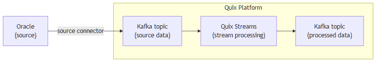

<!--- BEGIN MARKDOWN --->
# Integrate Oracle with Kafka using the source Oracle Kafka connector

Quix enables you to publish data from Oracle databases to Apache Kafka and then process it. All of this in real time, using pure Python, and at any scale.

[Book a demo](https://share.hsforms.com/1iW0TmZzKQMChk0lxd_tGiw4yjw2)

## Move Oracle data to Kafka and process it in two simple steps

1. ### Ingest data from Oracle into Kafka

Use the Quix-made Oracle Kafka source connector to publish data from Oracle databases into Quix-managed Apache Kafka topics. The connector enables you to stream data in a scalable, fault-tolerant manner, with consistently low latencies.

2. ### Process and transform data with Python

After data is ingested from Oracle, process and transform it on the fly with Quix Streams, an open-source, Kafka-based Python library. Quix Streams offers an intuitive Streaming DataFrame API (similar to pandas DataFrame) for real-time data processing. It supports aggregations, windowing, filtering, group-by operations, branching, merging, serialization, and more, allowing you to shape your data to fit your needs.

## Quix Kafka connectors — a simpler, better alternative to Kafka Connect

Quix offers a Python-native, developer-friendly approach to data integration that eliminates the complexity associated with Kafka Connect deployment, configuration, and management.

With Quix Kafka connectors, there's no need to wrestle with complex connector configurations, worker scaling, or infrastructure management that typically come with Kafka Connect.

Quix fully manages the entire Kafka connectors lifecycle, from deployment to monitoring. This means faster development, easier debugging, and lower operational overhead compared to traditional Kafka Connect implementations.

## Quix, your solution to simplify real-time data integration

As a Kafka-based platform, Quix streamlines real time streaming data integration across your entire tech stack, empowering you to effortlessly collect data from disparate data sources into Kafka, transform and process it with Python, and send it to your chosen destination(s).

By using Quix as your central data hub, you can:

* Accelerate time to insights from your data to drive informed business decisions  
* Ensure data accuracy, quality, and consistency across your organization  
* Automate data integration pipelines and eliminate manual tasks  
* Manage and protect sensitive data with robust security measures  
* Handle data in a scalable, fault-tolerant way, with sub-second latencies, and exactly-once processing guarantees  
* Reduce your data integration TCO to a fraction of the typical cost  
* Benefit from managed data integration infrastructure, thus reducing complexity and operational burden  
* Use a flexible, comprehensive toolkit to build data integration pipelines, including CI/CD and IaC support, environment management features, observability and monitoring capabilities, an online code editor, Python code templates, a CLI tool, and 130+ Kafka source and sink connectors

[Explore the Quix platform](https://portal.demo.quix.io/pipeline?workspace=demo-gametelemetrytemplate-prod)  |  [Book a demo](https://share.hsforms.com/1iW0TmZzKQMChk0lxd_tGiw4yjw2)

## FAQs

### What is Oracle?

Oracle is a robust relational database management system (RDBMS) designed for efficient information management and data processing. It provides comprehensive features for real time streaming data, high availability, and scalability, making it suitable for enterprise environments that require handling large volumes of transactional and analytical workloads.

### What is Apache Kafka?

Apache Kafka is a scalable, reliable, and fault-tolerant event streaming platform that enables real-time integration and data exchange between different systems. Kafka’s publish-subscribe model ensures that any source system can write data to a central pipeline, while destination systems can read that data instantly as it arrives. In essence, Kafka acts as a central nervous system for data. It helps organizations unify their data architecture and provide a continuous, real-time flow of information across disparate components.

### What are Kafka connectors?

Kafka connectors are pre-built components that help integrate Apache Kafka with external systems. They allow you to reliably replicate data in and out of a Kafka cluster without writing custom integration code. There are two main types of Kafka connectors:

* Source connectors. These are used to pull data from source systems into Kafka topics.

* Sink connectors. These are used to push data from Kafka topics to destination systems.

### What is real-time data, and why is it important?

Real-time data is information that’s made available for use as soon as it's generated. It’s passed from source to destination systems with minimal latency, enabling rapid decision-making, immediate insights, and instant actions. Real-time data is crucial for industries like finance, logistics, manufacturing, healthcare, game development, information technology, and e-commerce. It empowers businesses to improve operational efficiency, increase revenue, enhance customer satisfaction, quickly respond to changing conditions, and gain a competitive advantage.

### What data can you publish from Oracle to Kafka in real time?

* Transactional data, e.g., account transfers, sales orders, and payment receipts with timestamps  
* System performance metrics including CPU usage, memory consumption, and disk I/O rates  
* Audit logs for database access, schema changes, and SQL statements execution  
* Change logs with information on data insertions, updates, and deletions  
* Aggregated data from materialized views and complex queries  
* Time-series data capturing sensor readings, stock prices, or usage metrics  
* Geospatial data such as location tracking, mapping routes, and area analyses

### What are key factors to consider when publishing Oracle data to Kafka in real time?

* Implementing change data capture logic in Oracle can be complex and must be carefully configured to ensure accurate and efficient tracking of data modifications.  
* Real-time streaming of large volumes of Oracle data can affect the performance of the database server, requiring fine-tuning to minimize impact.  
* Synchronizing Oracle database tables with Kafka messages requires careful design to ensure data consistency and coherence.  
* Network latency and disruption can impact the replication process from Oracle databases to Kafka, necessitating robust fallbacks and retries to maintain data integrity.  
* Configuring secure data pipelines between Oracle and Kafka is critical, especially when dealing with sensitive data that requires encryption and strict access controls.  
* Balancing load between Oracle's processing capabilities and Kafka's streaming model can present challenges, requiring strategic partitioning and resource management.  
* Ensuring compatibility between Oracle CDC requirements and Kafka’s event-driven architecture involves thorough testing and planning.

### How does the Oracle Kafka source connector offered by Quix work?

The source Oracle connector for Kafka provided by Quix is fully managed and written in Python.

The connector continuously retrieves data from an Oracle database and publishes it to designated Quix-managed Kafka topics.

The connector provides strong data delivery guarantees (ordering and exactly-once semantics) to ensure data is reliably ingested into Kafka. You can customize its write performance and choose between several serialization formats (such as JSON, Avro, and Protobuf).

To find out more about the source Oracle Kafka connector offered by Quix, [book a demo](https://share.hsforms.com/1iW0TmZzKQMChk0lxd_tGiw4yjw2).

### Does Quix offer a sink Oracle Kafka connector too?

Yes, Quix also provides a sink Oracle connector for Kafka.

Learn more about it.

In fact, Quix offers 130+ Kafka sink and source connectors, enabling you to move data from a variety of sources into Kafka, process it, and then send it to your desired destination(s). All in real time.

[Explore the library of Quix Kafka connectors](https://quix.io/connectors)
<!--- END MARKDOWN --->