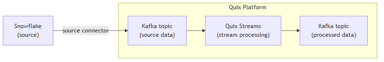

<!--- BEGIN MARKDOWN --->
# Integrate Snowflake with Kafka using the source Snowflake Kafka connector

Quix enables you to publish data from Snowflake to Apache Kafka and then process it. All of this in real time, using pure Python, and at any scale. 

[Book a demo](https://share.hsforms.com/1iW0TmZzKQMChk0lxd_tGiw4yjw2)

## Move Snowflake data to Kafka and process it in two simple steps

1. ### Ingest data from Snowflake into Kafka

Use the Quix-made Snowflake Kafka source connector to publish data from Snowflake into Quix-managed Apache Kafka topics. The connector enables you to stream data in a scalable, fault-tolerant manner, with consistently low latencies. 

2. ### Process and transform data with Python

After data is ingested from Snowflake, process and transform it on the fly with Quix Streams, an open-source, Kafka-based Python library. Quix Streams offers an intuitive Streaming DataFrame API (similar to pandas DataFrame) for real-time data processing. It supports aggregations, windowing, filtering, group-by operations, branching, merging, serialization, and more, allowing you to shape your data to fit your needs.  

## Quix Kafka connectors — a simpler, better alternative to Kafka Connect

Quix offers a Python-native, developer-friendly approach to data integration with tools like its Snowflake connector for Kafka that eliminates the complexity associated with Kafka Connect deployment, configuration, and management. 

With Quix Kafka connectors, there's no need to wrestle with complex connector configurations, worker scaling, or infrastructure management that typically come with Kafka Connect.

Quix fully manages the entire Kafka connectors lifecycle, from deployment to monitoring. This means faster development, easier debugging, and lower operational overhead compared to traditional Kafka Connect implementations.

## Quix, your solution to simplify real-time data integration

As a Kafka-based platform, Quix streamlines real-time data integration across your entire tech stack, empowering you to effortlessly collect data from disparate sources and storage into Kafka, transform and process it with Python, and send it to your chosen destination(s).

By using Quix as your central data hub, you can:

* Accelerate time to insights from your data to drive informed business decisions  
* Ensure data accuracy, quality, and consistency across your organization  
* Automate data integration pipelines and eliminate manual tasks  
* Manage and protect sensitive data with robust security measures  
* Handle data in a scalable, fault-tolerant way, with sub-second latencies, and exactly-once processing guarantees  
* Reduce your data integration TCO to a fraction of the typical cost  
* Benefit from managed data integration infrastructure, thus reducing complexity and operational burden  
* Use a flexible, comprehensive toolkit to build data integration pipelines, including CI/CD and IaC support, environment management features, observability and monitoring capabilities, an online code editor, Python code templates, a CLI tool, and 130+ Kafka source and sink connectors

[Explore the Quix platform](https://portal.demo.quix.io/pipeline?workspace=demo-gametelemetrytemplate-prod)  |  [Book a demo](https://share.hsforms.com/1iW0TmZzKQMChk0lxd_tGiw4yjw2)

## FAQs

### What is Snowflake?

Snowflake is a cloud-based data warehousing service known for its scalability, concurrency, and seamless integration with various data sources and storage. It allows for complex queries on massive datasets stored across multiple Snowflake tables and provides features like automatic scaling, data sharing, and support for semi-structured data. Snowflake is ideal for analytics, data warehousing, and dynamic data workloads.

### What is Apache Kafka?

Apache Kafka is a scalable, reliable, and fault-tolerant event streaming platform that enables real-time integration and data exchange between different systems. Kafka’s publish-subscribe model ensures that any source system can write data to a central pipeline, while destination systems can read that data instantly as it arrives. In essence, Kafka acts as a central nervous system for data. It helps organizations unify their data architecture and provide a continuous, real-time flow of information across disparate components.

### What are Kafka connectors?

Kafka connectors are pre-built components that help integrate Apache Kafka with external systems. They allow you to reliably move data in and out of a Kafka cluster without writing custom integration code. There are two main types of Kafka connectors:

* Source connectors. These are used to pull data from source systems into Kafka topics.

* Sink connectors. These are used to push data from Kafka topics to destination systems.

### What is real-time data, and why is it important?

Real-time data is information that’s made available for use as soon as it's generated. It’s passed from source to destination systems with minimal latency, enabling rapid decision-making, immediate insights, and instant actions. Real-time data is crucial for industries like finance, logistics, manufacturing, healthcare, game development, information technology, and e-commerce. It empowers businesses to improve operational efficiency, increase revenue, enhance customer satisfaction, quickly respond to changing conditions, and gain a competitive advantage.

### What data can you publish from Snowflake to Kafka in real time?

* Load events, e.g., data imported via Snowpipe Streaming from JSON, CSV, or Avro files  
* Query results, including complex analytical queries and aggregated metrics  
* Table change notifications for Snowflake table alterations, inserts, updates, and deletions  
* Real-time log data for audit trails, performance monitoring, and security compliance  
* Temporal data from time-series analyses, monitoring systems, and ELT tool outputs  
* Schema evolution details while handling incoming data in Snowflake tables  
* Data sharing and replication data streams for collaboration with external partners

### What are key factors to consider when publishing Snowflake data to Kafka in real time?

* High throughput is essential when transferring large datasets from Snowflake to Kafka, necessitating careful planning of batch sizes and ELT tool performance tuning.  
* Managing schema evolution with Snowflake tables can be challenging, especially when dealing with semi-structured and rapidly changing datasets.  
* Network latencies and bandwidth limitations can affect real-time data transfer between Snowflake and Kafka, requiring robust error handling and connection management.  
* Data load optimization through the Snowflake Ingest SDK must be configured to balance processing speed with resource usage in a given partition.  
* Data storage and retrieval mechanisms need to be evaluated to minimize delays, especially when dealing with large-scale data transfers in dynamic environments.  
* Ensuring redundancy and fault tolerance in the Kafka connector for Snowflake services is crucial to prevent data loss and maintain data integrity.

### How does the Snowflake Kafka source connector offered by Quix work?

The source Snowflake Kafka connector provided by Quix is fully managed and written in Python. 

The connector continuously retrieves data from Snowflake and publishes it to designated Quix-managed Kafka topics.  

The connector provides strong data delivery guarantees (ordering and exactly-once semantics) to ensure data is reliably ingested into Kafka. You can customize its write performance and choose between several serialization formats (such as JSON, Avro, and Protobuf).  

To find out more about the source Snowflake Kafka connector offered by Quix, [book a demo](https://share.hsforms.com/1iW0TmZzKQMChk0lxd_tGiw4yjw2).

### Does Quix offer a sink Snowflake Kafka connector too?

Yes, Quix also provides a Snowflake Kafka sink connector.

Learn more about it.

In fact, Quix offers 130+ Kafka sink and source connectors, enabling you to move data from a variety of sources into Kafka, process it, and then send it to your desired destination(s). All in real time.

[Explore the library of Quix Kafka connectors](https://quix.io/connectors)
<!--- END MARKDOWN --->