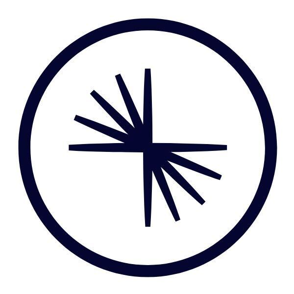
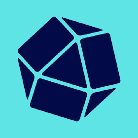
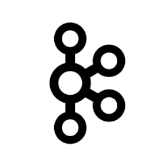

# Quix Cloud Templates

Templates are part of our [open source](https://github.com/quixio/quix-samples){target="_blank"} repository of templates, examples and integrations.

Templates help our users connect with other vendors such as AWS and Kafka.

You can explore the README files here in Quix Docs. When you are ready to start using them, head over to the Quix Code Samples [GitHub](https://github.com/quixio/quix-samples){target="_blank"} repository, or get a Quix Cloud account.

??? info "Start for free"
    [Book a session](https://meetings.hubspot.com/mike-rosam/product-demo) with us to start for free.
    
    We will create a time-limited free account for you, and our experts will help you get started with your specific use case. 

## Sources

<ul>
<li>

<strong style='margin-left:9px;border-radius: 8px;'>Confluent Kafka Source</strong>

Consume data from a Kafka topic in Confluent Cloud and publish it to a topic in Quix

<a href='confluentkafkasource-source.html'><svg viewBox='0 0 24 24' xmlns='http://www.w3.org/2000/svg'><path d='M13.22 19.03a.75.75 0 0 0 1.06 0l6.25-6.25a.75.75 0 0 0 0-1.06l-6.25-6.25a.75.75 0 1 0-1.06 1.06l4.97 4.97H3.75a.75.75 0 0 0 0 1.5h14.44l-4.97 4.97a.75.75 0 0 0 0 1.06z' fill-rule='evenodd'></path></svg> Confluent Kafka Source</a>

</li>
<li>

<strong style='margin-left:9px;border-radius: 8px;'>Environment Source</strong>

Consume data from a Kafka topic in another environment. Useful to mirror production data to dev environments.

<a href='environmentsource-source.html'><svg viewBox='0 0 24 24' xmlns='http://www.w3.org/2000/svg'><path d='M13.22 19.03a.75.75 0 0 0 1.06 0l6.25-6.25a.75.75 0 0 0 0-1.06l-6.25-6.25a.75.75 0 1 0-1.06 1.06l4.97 4.97H3.75a.75.75 0 0 0 0 1.5h14.44l-4.97 4.97a.75.75 0 0 0 0 1.06z' fill-rule='evenodd'></path></svg> Environment Source</a>

</li>
<li>

<strong style='margin-left:9px;border-radius: 8px;'>InfluxDB 2.0 Source</strong>

Periodically query InfluxDB 2.0 and publish the results to a Kafka topic.

<a href='influxdb20source-source.html'><svg viewBox='0 0 24 24' xmlns='http://www.w3.org/2000/svg'><path d='M13.22 19.03a.75.75 0 0 0 1.06 0l6.25-6.25a.75.75 0 0 0 0-1.06l-6.25-6.25a.75.75 0 1 0-1.06 1.06l4.97 4.97H3.75a.75.75 0 0 0 0 1.5h14.44l-4.97 4.97a.75.75 0 0 0 0 1.06z' fill-rule='evenodd'></path></svg> InfluxDB 2.0 Source</a>

</li>
<li>

<strong style='margin-left:9px;border-radius: 8px;'>InfluxDB 3.0 Source</strong>

Use the InfluxDB 3.0 query API to periodically query InfluxDB and publish the results to a Kafka topic.

<a href='influxdb30source-source.html'><svg viewBox='0 0 24 24' xmlns='http://www.w3.org/2000/svg'><path d='M13.22 19.03a.75.75 0 0 0 1.06 0l6.25-6.25a.75.75 0 0 0 0-1.06l-6.25-6.25a.75.75 0 1 0-1.06 1.06l4.97 4.97H3.75a.75.75 0 0 0 0 1.5h14.44l-4.97 4.97a.75.75 0 0 0 0 1.06z' fill-rule='evenodd'></path></svg> InfluxDB 3.0 Source</a>

</li>
<li>

<strong style='margin-left:9px;border-radius: 8px;'>Kafka Connect Source</strong>

Use a Kafka Connect source template in the Quix platform

<a href='kafkaconnectsource-source.html'><svg viewBox='0 0 24 24' xmlns='http://www.w3.org/2000/svg'><path d='M13.22 19.03a.75.75 0 0 0 1.06 0l6.25-6.25a.75.75 0 0 0 0-1.06l-6.25-6.25a.75.75 0 1 0-1.06 1.06l4.97 4.97H3.75a.75.75 0 0 0 0 1.5h14.44l-4.97 4.97a.75.75 0 0 0 0 1.06z' fill-rule='evenodd'></path></svg> Kafka Connect Source</a>

</li>
<li>

<strong style='margin-left:9px;border-radius: 8px;'>MQTT Source</strong>

Consume data from an MQTT broker and publish it to a Kafka topic.

<a href='mqttsource-source.html'><svg viewBox='0 0 24 24' xmlns='http://www.w3.org/2000/svg'><path d='M13.22 19.03a.75.75 0 0 0 1.06 0l6.25-6.25a.75.75 0 0 0 0-1.06l-6.25-6.25a.75.75 0 1 0-1.06 1.06l4.97 4.97H3.75a.75.75 0 0 0 0 1.5h14.44l-4.97 4.97a.75.75 0 0 0 0 1.06z' fill-rule='evenodd'></path></svg> MQTT Source</a>

</li>
<li>

<strong style='margin-left:9px;border-radius: 8px;'>Postgres CDC Source</strong>

Capture changes to a Postgres database table and publish the change events to a Kafka topic.

<a href='postgrescdcsource-source.html'><svg viewBox='0 0 24 24' xmlns='http://www.w3.org/2000/svg'><path d='M13.22 19.03a.75.75 0 0 0 1.06 0l6.25-6.25a.75.75 0 0 0 0-1.06l-6.25-6.25a.75.75 0 1 0-1.06 1.06l4.97 4.97H3.75a.75.75 0 0 0 0 1.5h14.44l-4.97 4.97a.75.75 0 0 0 0 1.06z' fill-rule='evenodd'></path></svg> Postgres CDC Source</a>

</li>
<li>

<strong style='margin-left:9px;border-radius: 8px;'>Redis Source</strong>

Periodically query a Redis database and publish the results to a Kafka topic.

<a href='redissource-source.html'><svg viewBox='0 0 24 24' xmlns='http://www.w3.org/2000/svg'><path d='M13.22 19.03a.75.75 0 0 0 1.06 0l6.25-6.25a.75.75 0 0 0 0-1.06l-6.25-6.25a.75.75 0 1 0-1.06 1.06l4.97 4.97H3.75a.75.75 0 0 0 0 1.5h14.44l-4.97 4.97a.75.75 0 0 0 0 1.06z' fill-rule='evenodd'></path></svg> Redis Source</a>

</li>
<li>

<strong style='margin-left:9px;border-radius: 8px;'>SQL Change Data Capture Source</strong>

Capture changes to an SQL database table and publish the change events to a Kafka topic.

<a href='sqlchangedatacapturesource-source.html'><svg viewBox='0 0 24 24' xmlns='http://www.w3.org/2000/svg'><path d='M13.22 19.03a.75.75 0 0 0 1.06 0l6.25-6.25a.75.75 0 0 0 0-1.06l-6.25-6.25a.75.75 0 1 0-1.06 1.06l4.97 4.97H3.75a.75.75 0 0 0 0 1.5h14.44l-4.97 4.97a.75.75 0 0 0 0 1.06z' fill-rule='evenodd'></path></svg> SQL Change Data Capture Source</a>

</li>
<li>

<strong style='margin-left:9px;border-radius: 8px;'>Segment Source</strong>

Read event data from Segment and publish it to a Kafka topic.

<a href='segmentsource-source.html'><svg viewBox='0 0 24 24' xmlns='http://www.w3.org/2000/svg'><path d='M13.22 19.03a.75.75 0 0 0 1.06 0l6.25-6.25a.75.75 0 0 0 0-1.06l-6.25-6.25a.75.75 0 1 0-1.06 1.06l4.97 4.97H3.75a.75.75 0 0 0 0 1.5h14.44l-4.97 4.97a.75.75 0 0 0 0 1.06z' fill-rule='evenodd'></path></svg> Segment Source</a>

</li>
<li>

<strong style='margin-left:9px;border-radius: 8px;'>Snowplow Source</strong>

Read data from Snowplow and publish it to a Kafka topic.

<a href='snowplowsource-source.html'><svg viewBox='0 0 24 24' xmlns='http://www.w3.org/2000/svg'><path d='M13.22 19.03a.75.75 0 0 0 1.06 0l6.25-6.25a.75.75 0 0 0 0-1.06l-6.25-6.25a.75.75 0 1 0-1.06 1.06l4.97 4.97H3.75a.75.75 0 0 0 0 1.5h14.44l-4.97 4.97a.75.75 0 0 0 0 1.06z' fill-rule='evenodd'></path></svg> Snowplow Source</a>

</li>
</ul>

## Destinations

<ul>
<li>

<strong style='margin-left:9px;border-radius: 8px;'>AWS S3 Iceberg Sink</strong>

Consume data from a Kafka topic and write it to an Apache Iceberg table stored in AWS S3 using the AWS Glue Data Catalog.

<a href='awss3icebergsink-destination.html'><svg viewBox='0 0 24 24' xmlns='http://www.w3.org/2000/svg'><path d='M13.22 19.03a.75.75 0 0 0 1.06 0l6.25-6.25a.75.75 0 0 0 0-1.06l-6.25-6.25a.75.75 0 1 0-1.06 1.06l4.97 4.97H3.75a.75.75 0 0 0 0 1.5h14.44l-4.97 4.97a.75.75 0 0 0 0 1.06z' fill-rule='evenodd'></path></svg> AWS S3 Iceberg Sink</a>

</li>
<li>

<strong style='margin-left:9px;border-radius: 8px;'>BigQuery Sink</strong>

Persist data from Quix to BigQuery

<a href='bigquerysink-destination.html'><svg viewBox='0 0 24 24' xmlns='http://www.w3.org/2000/svg'><path d='M13.22 19.03a.75.75 0 0 0 1.06 0l6.25-6.25a.75.75 0 0 0 0-1.06l-6.25-6.25a.75.75 0 1 0-1.06 1.06l4.97 4.97H3.75a.75.75 0 0 0 0 1.5h14.44l-4.97 4.97a.75.75 0 0 0 0 1.06z' fill-rule='evenodd'></path></svg> BigQuery Sink</a>

</li>
<li>

<strong style='margin-left:9px;border-radius: 8px;'>Confluent Kafka Sink</strong>

Consume data from a Kafka topic in Quix and publish it to a topic in Confluent Cloud

<a href='confluentkafkasink-destination.html'><svg viewBox='0 0 24 24' xmlns='http://www.w3.org/2000/svg'><path d='M13.22 19.03a.75.75 0 0 0 1.06 0l6.25-6.25a.75.75 0 0 0 0-1.06l-6.25-6.25a.75.75 0 1 0-1.06 1.06l4.97 4.97H3.75a.75.75 0 0 0 0 1.5h14.44l-4.97 4.97a.75.75 0 0 0 0 1.06z' fill-rule='evenodd'></path></svg> Confluent Kafka Sink</a>

</li>
<li>

<strong style='margin-left:9px;border-radius: 8px;'>InfluxDB 3.0 Sink</strong>

Consume data from a Kafka topic in Quix and persist the data to an InfluxDB 3.0 database.

<a href='influxdb30sink-destination.html'><svg viewBox='0 0 24 24' xmlns='http://www.w3.org/2000/svg'><path d='M13.22 19.03a.75.75 0 0 0 1.06 0l6.25-6.25a.75.75 0 0 0 0-1.06l-6.25-6.25a.75.75 0 1 0-1.06 1.06l4.97 4.97H3.75a.75.75 0 0 0 0 1.5h14.44l-4.97 4.97a.75.75 0 0 0 0 1.06z' fill-rule='evenodd'></path></svg> InfluxDB 3.0 Sink</a>

</li>
<li>

<strong style='margin-left:9px;border-radius: 8px;'>Kafka Connect Sink</strong>

Use a Kafka Connect sink template in the Quix platform

<a href='kafkaconnectsink-destination.html'><svg viewBox='0 0 24 24' xmlns='http://www.w3.org/2000/svg'><path d='M13.22 19.03a.75.75 0 0 0 1.06 0l6.25-6.25a.75.75 0 0 0 0-1.06l-6.25-6.25a.75.75 0 1 0-1.06 1.06l4.97 4.97H3.75a.75.75 0 0 0 0 1.5h14.44l-4.97 4.97a.75.75 0 0 0 0 1.06z' fill-rule='evenodd'></path></svg> Kafka Connect Sink</a>

</li>
<li>

<strong style='margin-left:9px;border-radius: 8px;'>MQTT Sink</strong>

Consume data from a Kafka topic and publish it to an MQTT broker

<a href='mqttsink-destination.html'><svg viewBox='0 0 24 24' xmlns='http://www.w3.org/2000/svg'><path d='M13.22 19.03a.75.75 0 0 0 1.06 0l6.25-6.25a.75.75 0 0 0 0-1.06l-6.25-6.25a.75.75 0 1 0-1.06 1.06l4.97 4.97H3.75a.75.75 0 0 0 0 1.5h14.44l-4.97 4.97a.75.75 0 0 0 0 1.06z' fill-rule='evenodd'></path></svg> MQTT Sink</a>

</li>
<li>

<strong style='margin-left:9px;border-radius: 8px;'>Redis Sink</strong>

Consume data from a Kafka topic and persist it to Redis.

<a href='redissink-destination.html'><svg viewBox='0 0 24 24' xmlns='http://www.w3.org/2000/svg'><path d='M13.22 19.03a.75.75 0 0 0 1.06 0l6.25-6.25a.75.75 0 0 0 0-1.06l-6.25-6.25a.75.75 0 1 0-1.06 1.06l4.97 4.97H3.75a.75.75 0 0 0 0 1.5h14.44l-4.97 4.97a.75.75 0 0 0 0 1.06z' fill-rule='evenodd'></path></svg> Redis Sink</a>

</li>
<li>

<strong style='margin-left:9px;border-radius: 8px;'>Slack Sink</strong>

Consume data from a Kafka topic and send Slack notifications based on your matching criteria.

<a href='slacksink-destination.html'><svg viewBox='0 0 24 24' xmlns='http://www.w3.org/2000/svg'><path d='M13.22 19.03a.75.75 0 0 0 1.06 0l6.25-6.25a.75.75 0 0 0 0-1.06l-6.25-6.25a.75.75 0 1 0-1.06 1.06l4.97 4.97H3.75a.75.75 0 0 0 0 1.5h14.44l-4.97 4.97a.75.75 0 0 0 0 1.06z' fill-rule='evenodd'></path></svg> Slack Sink</a>

</li>
<li>

<strong style='margin-left:9px;border-radius: 8px;'>Websocket Destination</strong>

Send data from Kafka to a client connected to this websocket server

<a href='websocketdestination-destination.html'><svg viewBox='0 0 24 24' xmlns='http://www.w3.org/2000/svg'><path d='M13.22 19.03a.75.75 0 0 0 1.06 0l6.25-6.25a.75.75 0 0 0 0-1.06l-6.25-6.25a.75.75 0 1 0-1.06 1.06l4.97 4.97H3.75a.75.75 0 0 0 0 1.5h14.44l-4.97 4.97a.75.75 0 0 0 0 1.06z' fill-rule='evenodd'></path></svg> Websocket Destination</a>

</li>
</ul>
