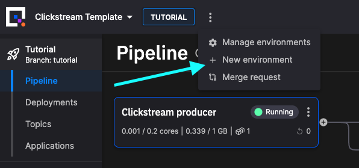
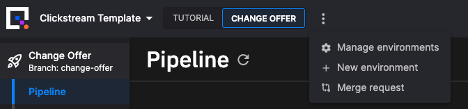

# 👩‍🔬 Lab - Change the offer

!!! danger

    This tutorial is out of date. Please check the [tutorials overview](../overview.md) for our latest tutorials.

In this lab you use what you've learned so far, to modify the offer. You develop this change on a feature branch, and then you create a PR to merge your new feature into the `tutorial` branch after testing. This is a common pattern for development - you can test your new service on the feature branch, and then test again, before final integration into the production `main` branch.

## Create an environment

To create a new environment (and branch):

1. Click `+ New environment` to create a new environment (note, your screen will look slightly different to the one shown here):

    

2. Create a new environment called `Change Offer`.

3. Create a new branch called `change-offer`. To do this, from the branch dropdown click `+ New branch` which displays the New branch dialog.

    !!! important

        Make sure you branch from the `tutorial` branch, not `main`, as you are going to merge your changes back to the `tutorial` branch.

4. Complete creation of the environment using the default options.

5. On the projects screen, click your newly created environment, `Change Offer`.

## Sync the environment

You now see that the Quix environment is out of sync with the Git repository. You need to synchronize the Quix view of the environment, with that stored in the repository. 

To synchronize Quix with the repository:

1. Click `Sync environment`:

    

    The sync environment dialog is displayed, showing you the changes that are to be made to the `quix.yaml` file, which is the configuration file that defines the pipeline.

2. Click `Sync environment`, and then `Go to pipeline`. 

    In the pipeline view, you see the services building. Ensure all services are "Running" before continuing.

## Modify the code

You now modify the code for the `Event detection` service. Currently the offer is triggered for the age ranges configured, and then by visiting Clothing -> Shoes -> Clothing. In this task you change the offer to be for a slightly different demographic (60 to 65 for both genders), and then get triggered by Shoes -> Clothing -> Shoes.

In `behaviour_detector.py` modify the `transitions` dictionary as follows:

``` python
transitions = {
    "init": [
        {
            "condition": lambda row, current_state: row["category"] == "shoes"
                                                    and ((row["gender"] == "M" and 60 <= row["age"] <= 65)
                                                            or (row["gender"] == "F" and 60 <= row["age"] <= 65)),
            "next_state": "shoes_visited",
        }
    ],
    "shoes_visited": [
        {
            "condition": lambda row, current_state: row["category"] == "clothing",
            "next_state": "clothes_visited"
        },
        {
            "condition": lambda row, current_state: row["category"] == "shoes",
            "next_state": "shoes_visited"
        }
    ],
    "clothes_visited": [
        {
            "condition": lambda row, current_state: row["category"] == "shoes"
                                                    and row["productId"] != current_state["rows"][0]["productId"],
            "next_state": "offer"
        },
        {
            "condition": lambda row, current_state: row["category"] == "shoes"
                                                    and row["productId"] == current_state["rows"][0]["productId"],
            "next_state": "shoes_visited"
        }
    ]
}
```

Now that you've modified the code, you'll now test your changes:

1. Tag your changes, for example as `change-offer-v1`.

2. Click the `Redeploy` button and select your changed version from the `Version tag` dropdown.

3. Once the `Event detection` service is running again, reload the web shop. 

4. Select an gender and age in the new range, for example, 65 and female.

5. Now view shoes, clothing and shoes again in that order, and the offer is displayed.

## Merge the feature

Once you are sure that the changes on your feature branch are tested, you can then merge your changes onto the `tutorial` branch. Here your changes undergo further tests before finally being merged into production. 

To merge your feature branch, `change-offer` into `tutorial`:

1. Select `Merge request` from the menu as shown:

    

2. In the `Merge request` dialog, set the `change-offer` branch to merge into the `tutorial` branch.

You are going to create a pull request, rather than perform a direct merge. This enables you to have the PR reviewed in GitHub (or other Git provider). You are also going to do a squash and merge, as much of the feature branch history is not required.

To create the pull request:

1. Click `Create pull request`. You are taken to your Git provider, in this case GitHub.

2. Click the `Pull request` button.

3. Add your description, and then click `Create pull request`.

4. Get your PR reviewed and approved. Then squash and merge the commits:

    

    You can replace the prefilled description by something more succinct. Then click `Confirm squash and merge`.

    !!! tip

        You can just merge, you don't have to squash and merge. You would then retain the complete commit history for your service while it was being developed. Squash and merge is used in this case by way of example, as the commit messages generated while the service was being developed were deemed to be not useful in this case.

## Resync the environment

You have now merged your new feature into the `tutorial` branch in the Git repository. Your Quix view in the Tutorial environment is now out of sync with the Git repository. If you click on your Tutorial environment in Quix, you'll see it is now a commit (the merge commit) behind.

You now need to make sure your Tutorial environment in Quix is synchronized with the Git repository. To do this:

1. Click on `Sync environment`. The `Sync environment` dialog is displayed.

2. Review the changes and click `Sync environment`.

3. Click `Go to pipeline`.

Your modified event detection service builds and starts in the Tutorial environment, where you can now carry out further testing. When you are satisfied this feature can be released to production, you would then repeat the previous process to merge your changes to Production `main`.

## 🏃‍♀️ Next step

[Part 10 - Summary :material-arrow-right-circle:{ align=right }](summary.md)
 


