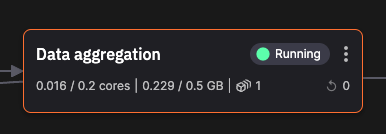

# Data aggregation

!!! warning

    This tutorial is out of date. Please check the [tutorials overview](../overview.md) for our latest tutorials.

This service subscribes to the `enriched-click-data` topic. Any data received is aggregated, and the results written to Redis Cloud. These aggregations are then consumed by a Streamlit dashboard (Real-time dashboard) for visualization and analysis. [RocksDB](https://rocksdb.org/) is used to hold state for the aggregation calculations.

The real-time dashboard displays:

* Visitors in the last 15 minutes
* Sessions in the last 8 hours
* Devices connected right now (number and type)
* Top 10 viewed pages in the last hour
* Latest visitor details
* Category popularity in the last hour
* State machine log (useful for troubleshooting)
* Raw data view



## Last hour of data

For the last hour of data the data format is:

``` python
columns = {
    "timestamp": pd.Series(dtype='datetime64[ns]'),
    "original_timestamp": pd.Series(dtype='int'),
    "userId": pd.Series(dtype='str'),
    "ip": pd.Series(dtype='str'),
    "userAgent": pd.Series(dtype='str'),
    "productId": pd.Series(dtype='str'),
    "category": pd.Series(dtype='str'),
    "title": pd.Series(dtype='str'),
    "gender": pd.Series(dtype='str'),
    "country": pd.Series(dtype='str'),
    "deviceType": pd.Series(dtype='str'),
    "age": pd.Series(dtype='int'),
    "birthdate": pd.Series(dtype='datetime64[ns]'),
    "datetime": pd.Series(dtype='datetime64[ns]')
}

initial_df = pd.DataFrame(columns)
```

For each new dataframe received, the following is performed in the data handler routine:

1. `last_hour_read` is read from the database (RocksDB).
2. Dataframe is concatenated on the accumulated data in `last_hour_data`. 
3. `last_hour_read` is written back to the database (RocksDB).

``` python
def on_dataframe_handler(stream_consumer: qx.StreamConsumer, df: pd.DataFrame):
    ...
    # Append data to last_hour_data and save to database
    last_hour_data = db["last_hour_data"]
    last_hour_data = pd.concat([last_hour_data, df], ignore_index=True)
    db["last_hour_data"] = last_hour_data
```

## Last eight hours

For the last eight hours of data, the data format is:

``` python
db["eight_hours_aggregation"] = pd.DataFrame(columns=["datetime", "userId", "count"])
```

For each new dataframe received, the following is performed in the data handler routine:

1. `eight_hours_aggregation` is read from then database (RocksDB).
2. Data is aggregated (every 30 minutes based on datetime and userId) to give a count of sessions for each datetime, for example, Datetime: 15:00, Count: 159.
3. Concatenated onto `eight_hours_aggregation`.
4. `eight_hours_aggregation` is written back to the database (RocksDB).

``` python
def on_dataframe_handler(stream_consumer: qx.StreamConsumer, df: pd.DataFrame):
    ...
    eight_hours_aggregation = db["eight_hours_aggregation"]
    aggregated = df.groupby([pd.Grouper(key='datetime', freq='30min'), 'userId']).size().reset_index(name='count')

    # Add df_copy to eight_hours_aggregation. If the datetime is the same, add both counts
    eight_hours_aggregation = (pd.concat([eight_hours_aggregation, aggregated])
                               .groupby(['datetime', 'userId']).sum().reset_index())
    db["eight_hours_aggregation"] = eight_hours_aggregation
```

## Writing aggregations to Redis Cloud

Aggregations are sent to Redis Cloud using a background Thread that runs every one second. The data written to Redis Cloud is:

* Last hour of data
* Eight hours aggregation
* Visits in last fifteen minutes
* Products viewed in last hour
* Visitor details for the last ten minutes
* Popularity by category
* Device popularity

This is done by the following code:

``` python
def send_data_to_redis():
    while True:
        try:
            # Append data and discard data older than 1 hour
            last_hour_data = db["last_hour_data"]
            one_hour = pd.to_datetime(pd.Timestamp.now()) - pd.Timedelta(hours=1)
            updated_last_hour_data = last_hour_data[last_hour_data["datetime"] > one_hour]

            if not updated_last_hour_data.equals(last_hour_data):
                last_hour_data = updated_last_hour_data
                db["last_hour_data"] = last_hour_data

            # This method uses its own rolling window, so we only have to pass the buffer
            aggregate_eight_hours(db["eight_hours_aggregation"].copy())

            # Get average visits in the last 15 minutes
            calculate_visits_last_15min(last_hour_data.copy())

            # Get top viewed productId in the last hour, keep only productId, category and count
            calculate_products_last_hour(last_hour_data.copy())

            # Get latest 10 visitors details (date and time, ip and country)
            calculate_10_last_visitors(last_hour_data.copy())

            # Get category popularity in the last hour
            calculate_category_popularity(last_hour_data.copy())

            # Get device type popularity in the last 10 minutes
            calculate_device_popularity(last_hour_data.copy())

            # Send all data
            sorted_data = last_hour_data.sort_values(by='datetime', ascending=False)
            r.set("raw_data", sorted_data.head(100).to_json())

            # Sleep for 1 second
            time.sleep(1)
        except Exception as e:
            print("Error in sender thread", e)
```

Note, there a simple Python function to calculate each of these items (see the code for more details).

## 🏃‍♀️ Next step

[Part 6 - Event detection :material-arrow-right-circle:{ align=right }](./event-detection.md)
