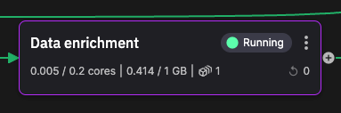

# Data enrichment

This service is used to enrich the clickstream data with the product category, and the visitor's gender, birthday, and age. This data is obtained from Redis Cloud, which is populated by the data ingestion job.



The service subscribes to the `click-data` topic, enriches the data, and then publishes it to  the `enriched-click-data` topic.

The enriched data format:

``` json
{
  "Epoch": 0,
  "Timestamps": [
    1700147866722586000
  ],
  "NumericValues": {
    "original_timestamp": [
      1331800486
    ],
    "age": [
      42
    ]
  },
  "StringValues": {
    "userId": [
      "8D0E437E-9249-4DDA-BC4F-C1E5409E3A3B"
    ],
    "ip": [
      "69.76.12.213"
    ],
    "userAgent": [
      "Mozilla/5.0 (Windows NT 6.1; WOW64; rv:10.0.2) Gecko/20100101 Firefox/10.0.2"
    ],
    "productId": [
      "VD55177927"
    ],
    "category": [
      "clothing"
    ],
    "title": [
      "Deluxe Cashmere Sweater"
    ],
    "birthdate": [
      "1981-11-14"
    ],
    "country": [
      "United States"
    ],
    "deviceType": [
      "Desktop"
    ],
    "gender": [
      "F"
    ]
  },
  "BinaryValues": {},
  "TagValues": {}
}
```

You can see that the data format from `click-data` has been enriched with the following additional items read from Redis Cloud:

* `category`
* `gender`
* `birthday`
* `age`

## Main dataframe handler

For each dataframe received by the service, the dataframe handler is invoked:

``` python
# Callback triggered for each new timeseries data. This method will enrich the data
def on_dataframe_handler(stream_consumer: qx.StreamConsumer, df: pd.DataFrame):
    # Enrich data
    df['category'] = df['productId'].apply(get_product_category)
    df['title'] = df['productId'].apply(get_product_title)
    df['birthdate'] = df['userId'].apply(get_visitor_birthdate)
    df['country'] = df['ip'].apply(get_country_from_ip)
    df['deviceType'] = df['userAgent'].apply(get_device_type)

    # For synthetic data (from csv) we don't have age. For data generated from our live web, we have age and gender
    if 'age' not in df.columns:
        df['age'] = df['birthdate'].apply(calculate_age)
    else:
        df['age'] = df['age'].apply(convert_age_to_int)

    if 'gender' not in df.columns:
        df['gender'] = df['userId'].apply(get_visitor_gender)
    else:
        df['gender'] = df['gender'].apply(get_first_letter_of_gender)

    # Create a new stream (or reuse it if it was already created).
    # We will be using one stream per visitor id, so we can parallelise the processing
    # because the partitioning key will be the stream id
    producer_stream = producer_topic.get_or_create_stream(stream_consumer.stream_id)
    producer_stream.properties.parents.append(stream_consumer.stream_id)
    producer_stream.timeseries.buffer.publish(df)
```

The process is to enrich the data and build an enriched dataframe, and then publish the dataframe to the output topic, containing multiple streams - one for each visitor.

## 🏃‍♀️ Next step

[Part 5 - Data aggregation :material-arrow-right-circle:{ align=right }](./data-aggregation.md)
