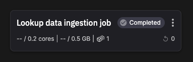
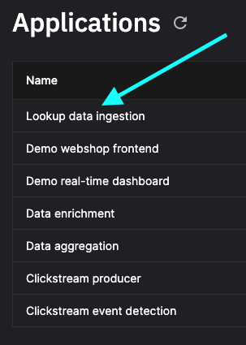

# Data ingestion

!!! danger

    This tutorial is out of date. Please check the [tutorials overview](../overview.md) for our latest tutorials.

This application runs as a job and loads product and user data from JSON files and writes the information to Redis Cloud. The product data is used to populate the online store. User data is used later to trigger special offers targeting a specific demographic.



## Data format

You'll now investigate the format for the data ingested by the job.

1. Click `Applications` in the main left-hand navigation. You'll see a list of Applications in the environment:

    

2. Click `Data ingestion` to load the code view.

3. In the `Application files` panel you can see all the files for the application. There are the two data files that are loaded: `users.json` and `products.json`.

4. Click on a data file to investigate the format.

Each product data item has the following format:

``` json
{
    "id": "VD55181667",
    "category": "books",
    "title": "Chronicles of the Ancient Forest by John Smith",
    "description": "Immerse yourself in the captivating world created by John Smith. Chronicles of the Ancient Forest takes you on a journey through an ancient forest filled with mystery and wonder. A must-read for fans of fantasy and adventure.",
    "image": "VD55181667.png",
    "price": 92.04
}
```

Each user data item has the following format:

``` json
{
    "userId":"0001BDD9-EABF-4D0D-81BD-D9EABFCD0D7D",
    "gender":"F",
    "birthDate":"1984-04-08"
}
```

The additional user data of gender and birthday is used later to trigger a special offer tailored to a specific demographic.

Users are identified by a UUID.

The code is relatively simple for this application. For example, here's the code to load the product data and write it to Redis:

``` python
# Read products from products.tsv and store the category in Redis
def load_products():
    products = pd.read_json('products.json')
    pipe = r.pipeline()

    for index, row in products.iterrows():
        key = f'product:{row["id"]}'
        pipe.hset(key, 'cat', row['category'])
        pipe.hset(key, 'title', row['title'])

    pipe.execute()
    print(f"Imported {len(products)} products")
```

## 🏃‍♀️ Next step

[Part 4 - Data enrichment :material-arrow-right-circle:{ align=right }](./data-enrichment.md)
