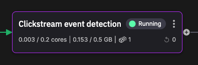

# Event detection

!!! danger

    This tutorial is out of date. Please check the [tutorials overview](../overview.md) for our latest tutorials.

This service monitors the user behavior in real time, using a simple state machine. The idea is the state machine detects when conditions for a offer should be triggered. The offer is tailored to the user demographic.



## Offer logic

The offer logic is implemented in the `process_dataframe` method, and first of all cleans data to avoid storing unnecessary data in memory - it cleans page refreshes and ignores all actions that are not considered for the offers.

The conditions for triggering the offer are as follows:

1. If, in the last 5 minutes, a female between 25 and 35, or a male between 36 and 45:
2. Views any item in the clothing category and then,
3. Views any item in the shoes category and then,
4. Views a different item in the clothing category then,
5. Show a special offer for that demographic

These transitions need to occur within a 30 minute window.

## Topics

The service subscribes to the `enriched-click-data` topic. When an offer is detected an offer data message is published to `special-offers` - this is then used by the webshop frontend to display the tailored offer.

## Offer data format

For the male demographic `offer1` is generated:

``` json
[
  {
    "Timestamp": 1700221907989992000,
    "Tags": {},
    "Id": "offer",
    "Value": "offer1"
  }
]
```

For the female demographic `offer2` is generated:

``` json
[
  {
    "Timestamp": 1700222075422209000,
    "Tags": {},
    "Id": "offer",
    "Value": "offer2"
  }
]
```

These can then be used by the UI to display the correct offer popup.

## State machine logs

The service uses the Redis Cloud logging facility. The state machine code logs out state to Redis Cloud. From there the log messages can also be displayed in the UI, for example:

```
2023-11-17 11:54:35: [User sad-music-boxing triggered offer offer2]
2023-11-17 11:54:35: [User sad-music-boxing entered state offer][Event: clicked VD55177927][Category: clothing]
2023-11-17 11:54:32: [User sad-music-boxing entered state shoes_visited][Event: clicked VD55147564][Category: shoes]
2023-11-17 11:54:29: [User sad-music-boxing entered state clothes_visited][Event: clicked VD55129406][Category: clothing]
```

If the user falls within the age range for each gender, and transitions through the states clothes_visited -> shoes_visited -> clothing_visited within 30 minutes, then the tailored offer is triggered.

## 🏃‍♀️ Next step

[Part 7 - Webshop frontend :material-arrow-right-circle:{ align=right }](./webshop-frontend.md)
