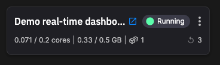
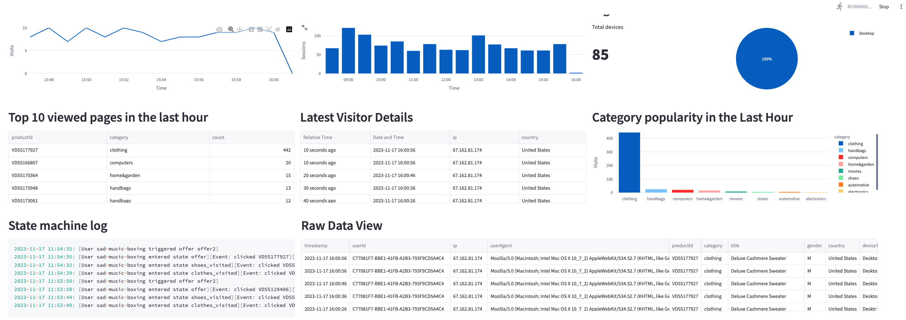

# Real-time dashboard

!!! warning

    This tutorial is out of date. Please check the [tutorials overview](../overview.md) for our latest tutorials.

This service implements a real-time dashboard using [Streamlit](https://streamlit.io/){target=_blank}. 

It reads data from Redis Cloud and displays it in real time. The data displayed is primarily generated by the data aggregation service.

The code in this service is entirely in Python. 

Once the charts are laid out, they are updated every one second in real time by reading the data from Redis Cloud, and then using it to populate the charts.

## 🏃‍♀️ Next step

[Part 9 - Lab :material-arrow-right-circle:{ align=right }](./change-offer.md)
