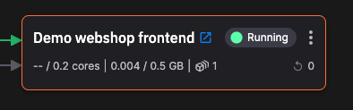
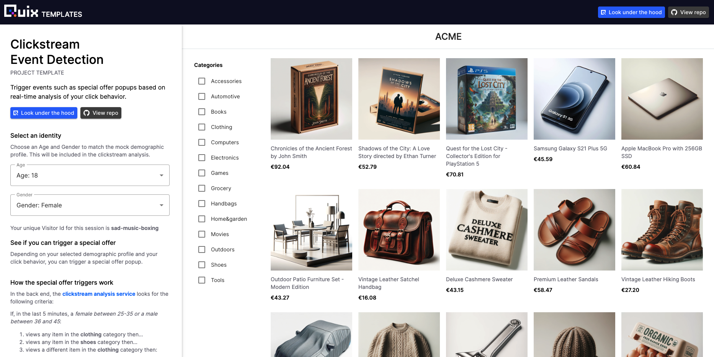

# Webshop frontend

!!! warning

    This tutorial is out of date. Please check the [tutorials overview](../overview.md) for our latest tutorials.

This service implements the webshop frontend. 

You can select age and gender, and browse various products in the online shop. The UI is shown here:

## Topics

This service subscribes to the following topics:

* `click-data` - the raw clickstream data
* `special-offers` - the special offer to be applied (used to display tailored offer to user)

It also publishes data back to the `click-data` topic - this is data about a user's real-time interaction with the webshop frontend (selection of products), it is published to this topic so that the data can be enriched and passed to the data aggregator and event detection service. The event detection service then publishes a suitable offer to the `special-offers` topic. As the webshop frontend subscribes to `special-offers`, it can present the correct offer popup when it receives the offer data.

## Streaming Reader and Writer APIs

Note because this service is a web app (running in your browser) it communicates with Quix topics using the [Streaming Reader API](../../apis/streaming-reader-api/overview.md) and the [Streaming Writer API](../../apis/streaming-writer-api/overview.md). Streaming Writer API enables a web app to publish data to a topic, and the Streaming reader API enables the web app to subscribe to a topic.

These APIs need to be authenticated, and so for this service you need to configure a [PAT](../../develop/authentication/personal-access-token.md), referred to as a bearer token in this service.

## 🏃‍♀️ Next step

[Part 8 - Real-time dashboard :material-arrow-right-circle:{ align=right }](./realtime-dashboard.md)
