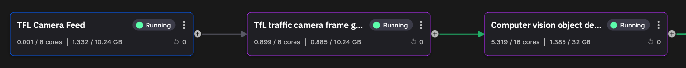

# TfL frame grabber

In this part of the tutorial you learn about the TfL frame grabber service. The main job of the frame grabber is to grab frames from the TfL video feed file, and then pass this on to the object detection service.



## 💡 Key ideas

The key ideas on this page:

* Using computer vision library to extract frames from a video file
* Publishing time series data
* Publishing binary data
* Using the Quix Data Explorer to examine raw message format

## What it does

The key thing this service does is extract frames from the TfL video file. By default the frame grabber grabs one frame in every 100 frames, which is typically one per five seconds of video. This is done using the [OpenCV](https://opencv.org/){target=_blank} Python library. 

The frame grabber needs to obtain the video URL, as that is where it's going to grab frames from. Much of the other information can be ignored, so this is filtered by the following code:

``` python
camera_video_feed = list(filter(lambda x: x["key"] == "videoUrl", camera["additionalProperties"]))[0]
```

This create the `camera_video_feed`, which consists of the following data:

``` json
{
    "$type": "Tfl.Api.Presentation.Entities.AdditionalProperties, Tfl.Api.Presentation.Entities",
    "category": "payload",
    "key": "videoUrl",
    "sourceSystemKey": "JamCams",
    "value": "https://s3-eu-west-1.amazonaws.com/jamcams.tfl.gov.uk/00001.03766.mp4",
    "modified": "2023-08-31T15:46:06.093Z"
},
```

The code then publishes the frames as binary data:

``` python
self.stream_producer.timeseries.buffer.add_timestamp_nanoseconds(time.time_ns()) \
    .add_value("image", bytearray(frame_bytes)) \
    .add_value("lon", lon) \
    .add_value("lat", lat) \
    .publish()
```

Notice the data is now sent as time series data, rather than event data, with addition of a timestamp. 

Geolocation information from the camera data is also added to the message. The message then has the format:

``` json
{
  "Epoch": 0,
  "Timestamps": [
    1693998068342837200
  ],
  "NumericValues": {
    "lon": [
      0.22112
    ],
    "lat": [
      51.50047
    ]
  },
  "StringValues": {},
  "BinaryValues": {
    "image": [
      "(Binary of 31.67 KB)"
    ]
  },
  "TagValues": {}
}
```

This can be used by later stages of the pipeline to locate the capacity information, and frame thumbnail, on the map.

## 👩‍🔬 Lab - Examine the data 

In this section, you learn how to use the Quix Data Explorer to examine data output from this service. The Data Explorer enables you to view data in real time. This is very useful when debugging a pipeline, or ensuring the data you are receiving is what you expect.

To examine the data published by the service:

1. In the pipeline view, click on the arrow (representing the output topic) on the right side of the frame grabber service tile, and select `Explore live data`. This opens a new tab and displays the Data Explorer. 

2. In the Data Explorer, ensure that live data is selected (it should be selected by default), and then click on messages to see all raw messages.

3. Click on a message to see its data structure in JSON format. 

    !!! tip

        There are actually two types of message here: stream metadata messages and actually data messages. The messages you're interested in have `timestamp` in them. You can ignore the metadata messages in this tutorial, as they are not used.

4. Examine the data format that is being sent to the next stage of the pipeline, the object detection service. It should be similar to the following:

``` json
{
  "Epoch": 0,
  "Timestamps": [
    1693998068342837200
  ],
  "NumericValues": {
    "lon": [
      0.22112
    ],
    "lat": [
      51.50047
    ]
  },
  "StringValues": {},
  "BinaryValues": {
    "image": [
      "(Binary of 31.67 KB)"
    ]
  },
  "TagValues": {}
}
```

Here you see the timestamp, geolocation information, and the binary data of the frame sent.

## See also

For more information refer to:

* [Quix Streams](../../quix-streams-intro.md) - More about streams, publishing, consuming, event data, time series data, and much more. 
* [OpenCV](https://opencv.org/){target=_blank} - More on how to use the OpenCV library.

## 🏃‍♀️ Next step

[Part 4 - Object detection :material-arrow-right-circle:{ align=right }](object-detection.md)
