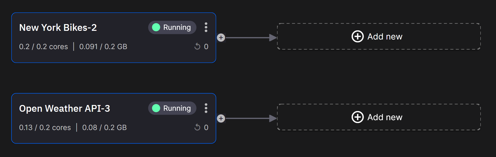

# Weather data

!!! warning

    This tutorial is out of date. Please check the [tutorials overview](../overview.md) for our latest tutorials.

You now have a working real-time stream of bicycle data. Next, you will integrate the data from a free weather API, adding current and forecasted weather data. 

## Create a free Visual Crossing account

!!! info

	[Visual Crossing](https://www.visualcrossing.com/){target=_blank} is a leading provider of weather data and enterprise analysis tools to data scientists, business analysts, professionals, and academics.
	
1. Go to the [Visual Crossing sign up page](https://www.visualcrossing.com/sign-up){target=_blank}.

2. Follow the instructions to create your account.

3. Go to the [Account](https://www.visualcrossing.com/account){target=_blank} page to copy your key. 

	Keep it safe for later.

## Weather real-time stream

You can now deploy the VisualCrossing connector from the Quix Code Samples:

1. Search the Code Samples for `weather` and select the `VisualCrossing Weather` tile.

2. Click `Deploy`.

3. Leave the `Name` as it is.
	
4. Ensure the `output` is set to `weather-topic`.

5. Paste your API key into the `api_token` field. This is the API key you obtained from your Visual Crossing account page.

6. Click `Deploy`.

	The precompiled service is deployed to your environment and begins running immediately.

	!!! warning "Visual Crossing usage limitation"

		The Visual Crossing API has limits on how much data you can access for free and the real weather only changes in real-time (this means slowly). 
		
		The free Visual Crossing account is limited to 1000 records per day so in order to prevent your account from being rate limited, the connector is coded to consume data every 2 minutes, however, you can trigger collection of new data by restarting the service as needed. You will do this several times throughout this tutorial.

## Summary

At this stage you have two services running.

One is publishing `New York CitiBike` data to a topic called `bikes-topic` and another is publishing `Visual Crossing` weather data to a topic called `weather-topic`.

[Part 3 - Data views :material-arrow-right-circle:{ align=right }](3-data.md)
