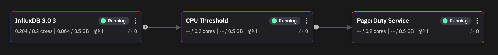
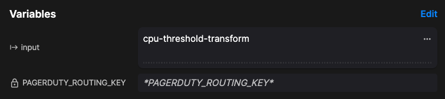
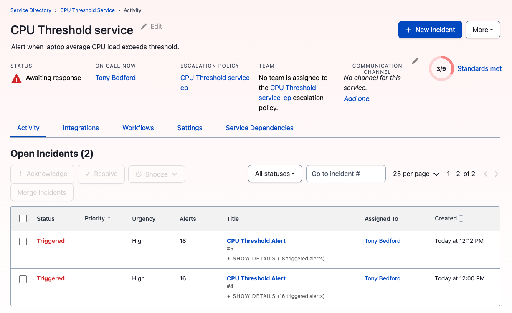

# Add an alerting service using PagerDuty

You'll now add a destination that provides alerting. The following screenshot illustrates what the new service will look like, when added into your pipeline:



To add a PagerDuty alerting destination to your pipeline:

1. Sign up for a free PagerDuty account.

2. In PagerDuty, create a new service, using the Events v2 API as the integration. Make sure you obtain a routing key, also called the integration key, from the `Integrations` tab of the service.

3. In Quix, create a new destination on the output of your CPU Threshold service. Choose the starter destination that uses Streaming Data Frames. 

4. Edit `main.py` and replace the existing code with the following:

    ``` python
    import os
    import json
    from datetime import datetime
    from http.client import HTTPSConnection
    from typing import Any
    from typing import Dict
    from typing import Optional
    from quixstreams import Application
    
    def build_alert(title: str, alert_body: str, dedup: str) -> Dict[str, Any]:
        routing_key = os.environ["PAGERDUTY_ROUTING_KEY"]
        return {
            "routing_key": routing_key,
            "event_action": "trigger",
            "dedup_key": dedup,
            "payload": {
                "summary": title,
                "source": "custom_event",
                "severity": "critical",
                "custom_details": {
                    "alert_body": alert_body,
                },
            },
        }

    def send_alert(title: str, alert_body: str, dedup: Optional[str] = None) -> None:
        # If no dedup is given, use epoch timestamp
        if dedup is None:
            dedup = str(datetime.utcnow().timestamp())
        url = "events.pagerduty.com"
        route = "/v2/enqueue"

        conn = HTTPSConnection(host=url, port=443)
        conn.request("POST", route, json.dumps(build_alert(title, alert_body, dedup)))
        result = conn.getresponse()

        print("Alert status: {}".format(result.status))
        print("Alert response: {}".format(result.read()))

    def pg_message(row):
        alert_title = "CPU Threshold Alert"
        print("Sending PagerDuty alert")
        send_alert(alert_title, row["alert"]["message"])    
        return

    app = Application.Quix("pagerduty-v1", auto_offset_reset="latest")
    input_topic = app.topic(os.environ["input"])

    sdf = app.dataframe(input_topic)
    sdf = sdf.update(pg_message)

    if __name__ == "__main__":
        app.run(sdf)
    ```

    This code is based on the PagerDuty example code.

5. Now create a new secret to store your routing key, `PAGERDUTY_ROUTING_KEY`. You'll also need to create a corresponding environment variable, `PAGERDUTY_ROUTING_KEY`:

    

6. Deploy the service.

When a message, which is in the JSON format, is received by the alerting service, it means the average CPU load has exceeded its specified threshold. An alert is therefore created and sent to PagerDuty. The PagerDuty service then notifies your team of the incident. You can also check your activity in PagerDuty:



## 🏃‍♀️ Next step

[Part 6 - Summary :material-arrow-right-circle:{ align=right }](./summary.md)
