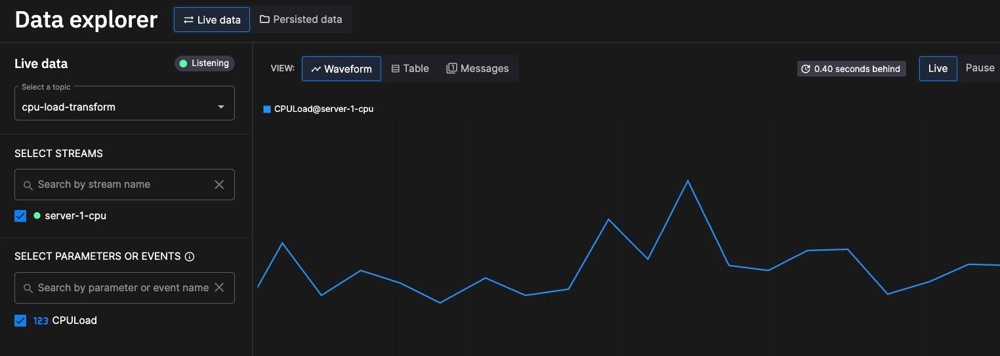
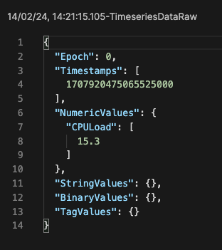

# InfluxDB alerting

Create a CPU overload alerting pipeline with Quix, Quix Streams, InfluxDB and PagerDuty.


## Write the CPU monitoring code

You need to set the following environment variables:

* `Quix__Sdk__Token`
* `Quix__Portal__Api`

Note, these variable use double underscores.

To obtain these values you can go to `Settings` in your environment, and then click on the `APIs and tokens tab`. You can obtain the `Streaming Token` and the Portal API URL from there.

Set the environment variables using the method recommended for your system, for example on macOS or Unix you could set the variables as follows:

```
#!/usr/bin/env bash                                                                          
export Quix__Sdk__Token="sdk-12345"
export Quix__Portal__Api="portal-api.platform.quix.io"
echo $Quix__Sdk__Token
echo $Quix__Portal__Api
```

Using your editor of your choice, create a file called `cpu_load.py`. Add the following code:

```python
import psutil
import time
from quixstreams import Application
from quixstreams.models.serializers.quix import JSONSerializer, SerializationContext

def get_cpu_load():
    cpu_load = psutil.cpu_percent(interval=1)
    return cpu_load

app = Application.Quix(
    consumer_group="cpu_load", 
    auto_create_topics=True,
)

serializer = JSONSerializer()
output_topic = app.topic("cpu-load")
producer = app.get_producer()

def main():
    while True:
        cpu_load = get_cpu_load()
        timestamp = int(time.time_ns()) # Quix timestamp is nano seconds
        message = {"Timestamp": timestamp, "CPULoad": cpu_load}
        with producer:
            serialized_value = serializer(
                value=message, ctx=SerializationContext(topic=output_topic.name)
            )
            producer.produce(
                topic=output_topic.name,
                key="server-1-cpu",
                value=serialized_value
            )

if __name__ == '__main__':
    try:
        main()
    except KeyboardInterrupt:
        print('Exiting due to keyboard interrupt')    
```

Save the file, and run it using a command similar to the following (the exact command you use depends on your Python set up):

```
python3 cpu_load.py
```

When you run this, the topic `cpu-load` is created for you. If your code times out before the topic is created, simply run the code again.

The output of this code is in JSON format.

If you're monitoring lots of CPUs you could use the stream ID to identify the source, in this case the stream ID is set to `server-1-cpu`.

## Convert to Quix format

You'll now add a transform to convert the JSON data to Quix format. There are two reasons for this: to be able to display the CPU load waveform (time series data) in the Quix data explorer, and secondly to be compatible with the Quix InfluxDB destination connector, which expects messages in Quix format at time of writing.

Add a transform as you saw in the Quickstart. Ensure that the input topic is `cpu-load` and the output is `cpu-load-transform`.

Change the code in `main.py` for the transform to the following:

``` python
import os
from quixstreams import Application, State
from quixstreams.models.serializers.quix import JSONDeserializer, QuixTimeseriesSerializer

app = Application.Quix("transformation-v1", auto_offset_reset="latest")

input_topic = app.topic(os.environ["input"], value_deserializer=JSONDeserializer())
output_topic = app.topic(os.environ["output"], value_serializer=QuixTimeseriesSerializer())

sdf = app.dataframe(input_topic)
sdf = sdf.update(lambda row: print(row))
sdf = sdf.to_topic(output_topic)

if __name__ == "__main__":
    app.run(sdf)
```

This reads data from the input topic as JSON, and publishes it to the output topic in Quix format.

## View the output in Quix data explorer

The CPU waveform:



If you examine the format in the `Messages` tab, you'll see the data has the following format:



## Add an InfluxDB destination connector

You saw how to do this in the Quickstart. Make sure the input to the destination is the `cpu-load-transform` topic.


