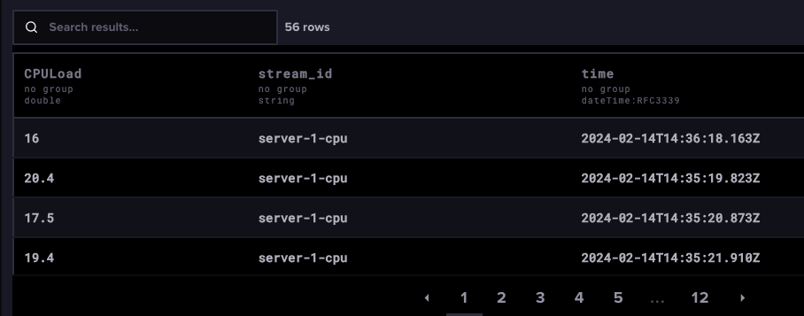
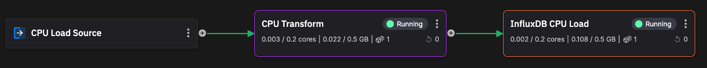

# Add an InfluxDB destination connector

You learned how to do this in the [InfluxDB Quickstart](../../integrations/databases/influxdb/quickstart.md). Make sure the input to the destination is the `cpu-load-transform` topic.

Configure the connector with your InfluxDB credentials. Deploy your connector.

Your pipeline now looks like this:

You can now log into your InfluxDB Cloud account and query your bucket for data. The following screenshot shows the results for a typical query:

You have now concluded the first part of the pipeline, where you learned how to get data into Quix, transform it, and stream that data to InfluxDB. You saw that very little code and configuration was required, and you worked in Python.

In the next part of the tutorial you build a pipline with an InfluxDB source (this queries InfluxDB using polling for new data), add a threshold detection transform, and add an alerting service.

## 🏃‍♀️ Next step

[Part 6 - Add InfluxDB source :material-arrow-right-circle:{ align=right }](./influxdb-source.md)
