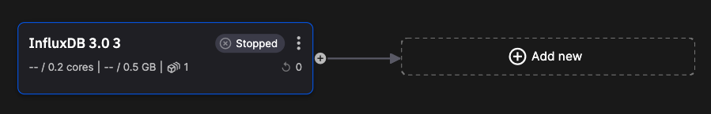

# Add a threshold detection transform

You now add a transform to detect when CPU threshold is exceeded. Click `Add new` and locate the `Starter transformation SDF` again. 



You can use the defaults, or rename your transform to something like `CPU Threshold`. 

Then click on `Edit code`. You can rename the output topic to `cpu-threshold-transform`.

You'll add new code to `main.py`.

``` python
import os
from quixstreams import Application, State
from quixstreams.models.serializers.quix import QuixDeserializer, QuixTimeseriesSerializer

def threshold_detect(row):
    if row['CPULoad'] > 20:
        print ('CPU overload')

app = Application.Quix("transformation-v1", auto_offset_reset="latest")

input_topic = app.topic(os.environ["input"], value_deserializer=QuixDeserializer())
output_topic = app.topic(os.environ["output"], value_serializer=QuixTimeseriesSerializer())

sdf = app.dataframe(input_topic)
sdf = sdf.update(threshold_detect)
sdf = sdf.to_topic(output_topic)

if __name__ == "__main__":
    app.run(sdf)
```

Here, a very simple function checks if the inbound data contains a CPU load above a fixed limit (set to 20 here for ease of testing).

Note the data is unchanged, it is simply published as is to the output for now.

You can test the application is running by loading some CPU intensive apps on your laptop. You'll see messages printed to the console if the threshold is exceeded:

!!! note

    This is a just an example approach. It would perhaps be better to put the threshold detection in the first pipeline, to detect this issue in real time. This code could easily be added to the conversion transform you created earlier. In this case you are querying the database for problematic values, just to show an alternative approach.

## 🏃‍♀️ Next step

[Part 8 - Downsample your data :material-arrow-right-circle:{ align=right }](./downsampling.md)
